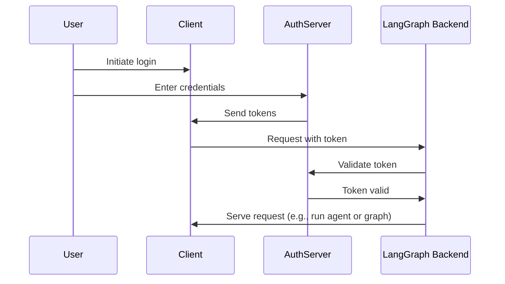

```
> [truncated]

---
https://github.com/langchain-ai/langgraph/blob/main/docs/docs/tutorials/auth/add_auth_server.md
```md
# Connect an authentication provider

In [the last tutorial](resource_auth.md), you added [resource authorization](../../tutorials/auth/resource_auth.md) to give users private conversations. However, you are still using hard-coded tokens for authentication, which is not secure. Now you'll replace those tokens with real user accounts using [OAuth2](../auth/getting_started.md).

:::python
You'll keep the same [`Auth`](../../cloud/reference/sdk/python_sdk_ref.md#langgraph_sdk.auth.Auth) object and [resource-level access control](../../concepts/auth.md#single-owner-resources), but upgrade authentication to use Supabase as your identity provider. While Supabase is used in this tutorial, the concepts apply to any OAuth2 provider. You'll learn how to:
:::

:::js
You'll keep the same [`Auth`](../../cloud/reference/sdk/typescript_sdk_ref.md#auth) object and [resource-level access control](../../concepts/auth.md#single-owner-resources), but upgrade authentication to use Supabase as your identity provider. While Supabase is used in this tutorial, the concepts apply to any OAuth2 provider. You'll learn how to:
:::

1. Replace test tokens with real JWT tokens
2. Integrate with OAuth2 providers for secure user authentication
3. Handle user sessions and metadata while maintaining our existing authorization logic

## Background

OAuth2 involves three main roles:

1. **Authorization server**: The identity provider (e.g., Supabase, Auth0, Google) that handles user authentication and issues tokens
2. **Application backend**: Your LangGraph application. This validates tokens and serves protected resources (conversation data)
3. **Client application**: The web or mobile app where users interact with your service

A standard OAuth2 flow works something like this:



## Prerequisites

Before you start this tutorial, ensure you have:

- The [bot from the second tutorial](resource_auth.md) running without errors.
- A [Supabase project](https://supabase.com/dashboard) to use as your authentication server.

## 1. Install dependencies

Install the required dependencies. Start in your `custom-auth` directory and ensure you have the `langgraph-cli` installed:

:::python

```bash
cd custom-auth
pip install -U "langgraph-cli[inmem]"
```

:::

:::js

```bash
cd custom-auth
npm install -g @langchain/langgraph-cli
```

:::

## 2. Set up the authentication provider {#setup-auth-provider}

Next, fetch the URL of your auth server and the private key for authentication.
Since you're using Supabase for this, you can do this in the Supabase dashboard:

1.  In the left sidebar, click on "⚙️ Project Settings" and then click "API"
2.  Copy your project URL and add it to your `.env` file

    ```shell
    echo "SUPABASE_URL=your-project-url" >> .env
    ```

3.  Copy your service role secret key and add it to your `.env` file:

    ```shell
    echo "SUPABASE_SERVICE_KEY=your-service-role-key" >> .env
    ```

4.  Copy your "anon public" key and note it down. This will be used later when you set up our client code.

    ```bash
    SUPABASE_URL=your-project-url
    SUPABASE_SERVICE_KEY=your-service-role-key
    ```

## 3. Implement token validation

:::python
In the previous tutorials, you used the [`Auth`](../../cloud/reference/sdk/python_sdk_ref.md#langgraph_sdk.auth.Auth) object to [validate hard-coded tokens](getting_started.md) and [add resource ownership](resource_auth.md).

Now you'll upgrade your authentication to validate real JWT tokens from Supabase. The main changes will all be in the [`@auth.authenticate`](../../cloud/reference/sdk/python_sdk_ref.md#langgraph_sdk.auth.Auth.authenticate) decorated function:
:::

:::js
In the previous tutorials, you used the [`Auth`](../../cloud/reference/sdk/typescript_sdk_ref.md#auth) object to [validate hard-coded tokens](getting_started.md) and [add resource ownership](resource_auth.md).

Now you'll upgrade your authentication to validate real JWT tokens from Supabase. The main changes will all be in the [`auth.authenticate`](../../cloud/reference/sdk/typescript_sdk_ref.md#auth) decorated function:
:::

- Instead of checking against a hard-coded list of tokens, you'll make an HTTP request to Supabase to validate the token.
- You'll extract real user information (ID, email) from the validated token.
- The existing resource authorization logic remains unchanged.

:::python
Update `src/security/auth.py` to implement this:

```python hl_lines="8-9 20-30" title="src/security/auth.py"
import os
import httpx
from langgraph_sdk import Auth

auth = Auth()

# This is loaded from the `.env` file you created above
SUPABASE_URL = os.environ["SUPABASE_URL"]
SUPABASE_SERVICE_KEY = os.environ["SUPABASE_SERVICE_KEY"]


@auth.authenticate
async def get_current_user(authorization: str | None):
    """Validate JWT tokens and extract user information."""
    assert authorization
    scheme, token = authorization.split()
    assert scheme.lower() == "bearer"

    try:
        # Verify token with auth provider
        async with httpx.AsyncClient() as client:
            response = await client.get(
                f"{SUPABASE_URL}/auth/v1/user",
                headers={
                    "Authorization": authorization,
                    "apiKey": SUPABASE_SERVICE_KEY,
                },
            )
            assert response.status_code == 200
            user = response.json()
            return {
                "identity": user["id"],  # Unique user identifier
                "email": user["email"],
                "is_authenticated": True,
            }
    except Exception as e:
        raise Auth.exceptions.HTTPException(status_code=401, detail=str(e))

# ... the rest is the same as before

# Keep our resource authorization from the previous tutorial
@auth.on
async def add_owner(ctx, value):
    """Make resources private to their creator using resource metadata."""
    filters = {"owner": ctx.user.identity}
    metadata = value.setdefault("metadata", {})
    metadata.update(filters)
    return filters
```

:::

:::js
Update `src/security/auth.ts` to implement this:

```typescript hl_lines="1-2 9-10 21-31" title="src/security/auth.ts"
import { Auth } from "@langchain/langgraph-sdk";

// This is loaded from the `.env` file you created above
const SUPABASE_URL = process.env.SUPABASE_URL;
const SUPABASE_SERVICE_KEY = process.env.SUPABASE_SERVICE_KEY;

const auth = new Auth()
  .authenticate(async (request) => {
    // Validate JWT tokens and extract user information.
    const apiKey = request.headers.get("x-api-key");
    if (!apiKey || !isValidKey(apiKey)) {
      throw new HTTPException(401, "Invalid API key");
    }

    const [scheme, token] = apiKey.split(" ");
    if (scheme.toLowerCase() !== "bearer") {
      throw new Error("Invalid authorization scheme");
    }

    try {
      // Verify token with auth provider
      const response = await fetch(`${SUPABASE_URL}/auth/v1/user`, {
        headers: {
          Authorization: authorization,
          apiKey: SUPABASE_SERVICE_KEY!,
        },
      });

      if (response.status !== 200) {
        throw new Error("Invalid token");
      }

      const user = await response.json();
      return {
        identity: user.id, // Unique user identifier
        email: user.email,
        is_authenticated: true,
      };
    } catch (e) {
      throw new Auth.HTTPException(401, String(e));
    }
  })
  .on(async ({ user, value }) => {
    // Keep our resource authorization from the previous tutorial
    // Make resources private to their creator using resource metadata.
    const filters = { owner: user.identity };
    const metadata = value.metadata || {};
    Object.assign(metadata, filters);
    value.metadata = metadata;
    return filters;
  });

export { auth };
```

:::

The most important change is that we're now validating tokens with a real authentication server. Our authentication handler has the private key for our Supabase project, which we can use to validate the user's token and extract their information.

## 4. Test authentication flow

Let's test out the new authentication flow. You can run the following code in a file or notebook. You will need to provide:

- A valid email address
- A Supabase project URL (from [above](#setup-auth-provider))
- A Supabase anon **public key** (also from [above](#setup-auth-provider))

:::python

```python
import os
import httpx
from getpass import getpass
from langgraph_sdk import get_client


# Get email from command line
email = getpass("Enter your email: ")
base_email = email.split("@")
password = "secure-password"  # CHANGEME
email1 = f"{base_email[0]}+1@{base_email[1]}"
email2 = f"{base_email[0]}+2@{base_email[1]}"

SUPABASE_URL = os.environ.get("SUPABASE_URL")
if not SUPABASE_URL:
    SUPABASE_URL = getpass("Enter your Supabase project URL: ")

# This is your PUBLIC anon key (which is safe to use client-side)
# Do NOT mistake this for the secret service role key
SUPABASE_ANON_KEY = os.environ.get("SUPABASE_ANON_KEY")
if not SUPABASE_ANON_KEY:
    SUPABASE_ANON_KEY = getpass("Enter your public Supabase anon  key: ")


async def sign_up(email: str, password: str):
    """Create a new user account."""
    async with httpx.AsyncClient() as client:
        response = await client.post(
            f"{SUPABASE_URL}/auth/v1/signup",
            json={"email": email, "password": password},
            headers={"apiKey": SUPABASE_ANON_KEY},
        )
        assert response.status_code == 200
        return response.json()

# Create two test users
print(f"Creating test users: {email1} and {email2}")
await sign_up(email1, password)
await sign_up(email2, password)
```

:::

:::js

```typescript
import { Client } from "@langchain/langgraph-sdk";

// Get email from command line
const email = process.env.TEST_EMAIL || "your-email@example.com";
const baseEmail = email.split("@");
const password = "secure-password"; // CHANGEME
const email1 = `${baseEmail[0]}+1@${baseEmail[1]}`;
const email2 = `${baseEmail[0]}+2@${baseEmail[1]}`;

const SUPABASE_URL = process.env.SUPABASE_URL;
if (!SUPABASE_URL) {
  throw new Error("SUPABASE_URL environment variable is required");
}

// This is your PUBLIC anon key (which is safe to use client-side)
// Do NOT mistake this for the secret service role key
const SUPABASE_ANON_KEY = process.env.SUPABASE_ANON_KEY;
if (!SUPABASE_ANON_KEY) {
  throw new Error("SUPABASE_ANON_KEY environment variable is required");
}

async function signUp(email: string, password: string) {
  /**Create a new user account.*/
  const response = await fetch(`${SUPABASE_URL}/auth/v1/signup`, {
    method: "POST",
    headers: {
      apiKey: SUPABASE_ANON_KEY,
      "Content-Type": "application/json",
    },
    body: JSON.stringify({ email, password }),
  });

  if (response.status !== 200) {
    throw new Error(`Failed to sign up: ${response.statusText}`);
  }

  return response.json();
}

// Create two test users
console.log(`Creating test users: ${email1} and ${email2}`);
await signUp(email1, password);
await signUp(email2, password);
```

:::

⚠️ Before continuing: Check your email and click both confirmation links. Supabase will reject `/login` requests until after you have confirmed your users' email.

Now test that users can only see their own data. Make sure the server is running (run `langgraph dev`) before proceeding. The following snippet requires the "anon public" key that you copied from the Supabase dashboard while [setting up the auth provider](#setup-auth-provider) previously.

:::python

```python
async def login(email: str, password: str):
    """Get an access token for an existing user."""
    async with httpx.AsyncClient() as client:
        response = await client.post(
            f"{SUPABASE_URL}/auth/v1/token?grant_type=password",
            json={
                "email": email,
                "password": password
            },
            headers={
                "apikey": SUPABASE_ANON_KEY,
                "Content-Type": "application/json"
            },
        )
        assert response.status_code == 200
        return response.json()["access_token"]


# Log in as user 1
user1_token = await login(email1, password)
user1_client = get_client(
    url="http://localhost:2024", headers={"Authorization": f"Bearer {user1_token}"}
)

# Create a thread as user 1
thread = await user1_client.threads.create()
print(f"✅ User 1 created thread: {thread['thread_id']}")

# Try to access without a token
unauthenticated_client = get_client(url="http://localhost:2024")
try:
    await unauthenticated_client.threads.create()
    print("❌ Unauthenticated access should fail!")
except Exception as e:
    print("✅ Unauthenticated access blocked:", e)

# Try to access user 1's thread as user 2
user2_token = await login(email2, password)
user2_client = get_client(
    url="http://localhost:2024", headers={"Authorization": f"Bearer {user2_token}"}
)

try:
    await user2_client.threads.get(thread["thread_id"])
    print("❌ User 2 shouldn't see User 1's thread!")
except Exception as e:
    print("✅ User 2 blocked from User 1's thread:", e)
```

:::

:::js

```typescript
async function login(email: string, password: string): Promise<string> {
  /**Get an access token for an existing user.*/
  const response = await fetch(
    `${SUPABASE_URL}/auth/v1/token?grant_type=password`,
    {
      method: "POST",
      headers: {
        apikey: SUPABASE_ANON_KEY,
        "Content-Type": "application/json",
      },
      body: JSON.stringify({ email, password }),
    }
  );

  if (response.status !== 200) {
    throw new Error(`Failed to login: ${response.statusText}`);
  }

  const data = await response.json();
  return data.access_token;
}

// Log in as user 1
const user1Token = await login(email1, password);
const user1Client = new Client({
  apiUrl: "http://localhost:2024",
  headers: { Authorization: `Bearer ${user1Token}` },
});

// Create a thread as user 1
const thread = await user1Client.threads.create();
console.log(`✅ User 1 created thread: ${thread.thread_id}`);

// Try to access without a token
const unauthenticatedClient = new Client({ apiUrl: "http://localhost:2024" });
try {
  await unauthenticatedClient.threads.create();
  console.log("❌ Unauthenticated access should fail!");
} catch (e) {
  console.log("✅ Unauthenticated access blocked:", e.message);
}

// Try to access user 1's thread as user 2
const user2Token = await login(email2, password);
const user2Client = new Client({
  apiUrl: "http://localhost:2024",
  headers: { Authorization: `Bearer ${user2Token}` },
});

try {
  await user2Client.threads.get(thread.thread_id);
  console.log("❌ User 2 shouldn't see User 1's thread!");
} catch (e) {
  console.log("✅ User 2 blocked from User 1's thread:", e.message);
}
```

:::

The output should look like this:

```shell
✅ User 1 created thread: d6af3754-95df-4176-aa10-dbd8dca40f1a
✅ Unauthenticated access blocked: Client error '403 Forbidden' for url 'http://localhost:2024/threads'
✅ User 2 blocked from User 1's thread: Client error '404 Not Found' for url 'http://localhost:2024/threads/d6af3754-95df-4176-aa10-dbd8dca40f1a'
```

Your authentication and authorization are working together:

1. Users must log in to access the bot
2. Each user can only see their own threads

All users are managed by the Supabase auth provider, so you don't need to implement any additional user management logic.

## Next steps

You've successfully built a production-ready authentication system for your LangGraph application! Let's review what you've accomplished:

1. Set up an authentication provider (Supabase in this case)
2. Added real user accounts with email/password authentication
3. Integrated JWT token validation into your LangGraph server
4. Implemented proper authorization to ensure users can only access their own data
5. Created a foundation that's ready to handle your next authentication challenge 🚀

Now that you have production authentication, consider:

1. Building a web UI with your preferred framework (see the [Custom Auth](https://github.com/langchain-ai/custom-auth) template for an example)
2. Learn more about the other aspects of authentication and authorization in the [conceptual guide on authentication](../../concepts/auth.md).

:::python
3. Customize your handlers and setup further after reading the [reference docs](../../cloud/reference/sdk/python_sdk_ref.md#langgraph_sdk.auth.Auth).
:::

:::js
3. Customize your handlers and setup further after reading the [reference docs](../../cloud/reference/sdk/typescript_sdk_ref.md#auth).
:::

```
---
https://github.com/langchain-ai/langgraph/blob/main/docs/docs/tutorials/auth/getting_started.md
```md
# Set up custom authentication

In this tutorial, we will build a chatbot that only lets specific users access it. We'll start with the LangGraph template and add token-based security step by step. By the end, you'll have a working chatbot that checks for valid tokens before allowing access.

This is part 1 of our authentication series:

1. Set up custom authentication (you are here) - Control who can access your bot
2. [Make conversations private](resource_auth.md) - Let users have private conversations
3. [Connect an authentication provider](add_auth_server.md) - Add real user accounts and validate using OAuth2 for production

This guide assumes basic familiarity with the following concepts:

- [**Authentication & Access Control**](../../concepts/auth.md)
- [**LangGraph Platform**](../../concepts/langgraph_platform.md)

!!! note

    Custom auth is only available for LangGraph Platform SaaS deployments or Enterprise Self-Hosted deployments.

## 1. Create your app

Create a new chatbot using the LangGraph starter template:

:::python

```bash
pip install -U "langgraph-cli[inmem]"
langgraph new --template=new-langgraph-project-python custom-auth
cd custom-auth
```

:::

:::js

```bash
npx @langchain/langgraph-cli new --template=new-langgraph-project-typescript custom-auth
cd custom-auth
```

:::

The template gives us a placeholder LangGraph app. Try it out by installing the local dependencies and running the development server:

:::python

```shell
pip install -e .
langgraph dev
```

:::

:::js

```shell
npm install
npm run langgraph dev
```

:::

The server will start and open the studio in your browser:

```
> - 🚀 API: http://127.0.0.1:2024
> - 🎨 Studio UI: https://smith.langchain.com/studio/?baseUrl=http://127.0.0.1:2024
> - 📚 API Docs: http://127.0.0.1:2024/docs
>
> This in-memory server is designed for development and testing.
> For production use, please use LangSmith Deployment.
```

If you were to self-host this on the public internet, anyone could access it!


## 2. Add authentication

Now that you have a base LangGraph app, add authentication to it.

!!! note

    In this tutorial, you will start with a hard-coded token for example purposes. You will get to a "production-ready" authentication scheme in the third tutorial.

:::python
The [`Auth`](../../cloud/reference/sdk/python_sdk_ref.md#langgraph_sdk.auth.Auth) object lets you register an authentication function that the LangGraph platform will run on every request. This function receives each request and decides whether to accept or reject.

Create a new file `src/security/auth.py`. This is where your code will live to check if users are allowed to access your bot:

```python hl_lines="10 15-16" title="src/security/auth.py"
from langgraph_sdk import Auth

# This is our toy user database. Do not do this in production
VALID_TOKENS = {
    "user1-token": {"id": "user1", "name": "Alice"},
    "user2-token": {"id": "user2", "name": "Bob"},
}

# The "Auth" object is a container that LangGraph will use to mark our authentication function
auth = Auth()


# The `authenticate` decorator tells LangGraph to call this function as middleware
# for every request. This will determine whether the request is allowed or not
@auth.authenticate
async def get_current_user(authorization: str | None) -> Auth.types.MinimalUserDict:
    """Check if the user's token is valid."""
    assert authorization
    scheme, token = authorization.split()
    assert scheme.lower() == "bearer"
    # Check if token is valid
    if token not in VALID_TOKENS:
        raise Auth.exceptions.HTTPException(status_code=401, detail="Invalid token")

    # Return user info if valid
    user_data = VALID_TOKENS[token]
    return {
        "identity": user_data["id"],
    }
```

Notice that your [authentication](../../cloud/reference/sdk/python_sdk_ref.md#langgraph_sdk.auth.Auth.authenticate) handler does two important things:

1. Checks if a valid token is provided in the request's [Authorization header](https://developer.mozilla.org/en-US/docs/Web/HTTP/Headers/Authorization)
2. Returns the user's [identity](../../cloud/reference/sdk/python_sdk_ref.md#langgraph_sdk.auth.types.MinimalUserDict)
   :::

:::js
The [`Auth`](../../cloud/reference/sdk/js_sdk_ref.md#Auth) object lets you register an authentication function that the LangGraph platform will run on every request. This function receives each request and decides whether to accept or reject.

Create a new file `src/security/auth.ts`. This is where your code will live to check if users are allowed to access your bot:

```typescript title="src/security/auth.ts"
import { Auth } from "@langchain/langgraph-sdk";

// This is our toy user database. Do not do this in production
const VALID_TOKENS: Record<string, { id: string; name: string }> = {
  "user1-token": { id: "user1", name: "Alice" },
  "user2-token": { id: "user2", name: "Bob" },
};

// The "Auth" object is a container that LangGraph will use to mark our authentication function
const auth = new Auth();
  // The `authenticate` method tells LangGraph to call this function as middleware
  // for every request. This will determine whether the request is allowed or not
  .authenticate((request) => {
    // Our authentication handler from the previous tutorial.
    const apiKey = request.headers.get("x-api-key");
    if (!apiKey || !isValidKey(apiKey)) {
      throw new HTTPException(401, "Invalid API key");
    }

    const [scheme, token] = apiKey.split(" ");
    if (scheme.toLowerCase() !== "bearer") {
      throw new Error("Bearer token required");
    }

    if (!VALID_TOKENS[token]) {
      throw new HTTPException(401, "Invalid token");
    }

    const userData = VALID_TOKENS[token];
    return {
      identity: userData.id,
    };
  });

export { auth };
```

Notice that your [authentication](../../cloud/reference/sdk/js_sdk_ref.md#Auth) handler does two important things:

1. Checks if a valid token is provided in the request's [Authorization header](https://developer.mozilla.org/en-US/docs/Web/HTTP/Headers/Authorization)
2. Returns the user's [identity](../../cloud/reference/sdk/js_sdk_ref.md#Auth.types.MinimalUserDict)
   :::

Now tell LangGraph to use authentication by adding the following to the [`langgraph.json`](../../cloud/reference/cli.md#configuration-file) configuration:

:::python

```json hl_lines="7-9" title="langgraph.json"
{
  "dependencies": ["."],
  "graphs": {
    "agent": "./src/agent/graph.py:graph"
  },
  "env": ".env",
  "auth": {
    "path": "src/security/auth.py:auth"
  }
}
```

:::

:::js

```json hl_lines="7-9" title="langgraph.json"
{
  "dependencies": ["."],
  "graphs": {
    "agent": "./src/agent/graph.ts:graph"
  },
  "env": ".env",
  "auth": {
    "path": "src/security/auth.ts:auth"
  }
}
```

:::

## 3. Test your bot

Start the server again to test everything out:

```bash
langgraph dev --no-browser
```

If you didn't add the `--no-browser`, the studio UI will open in the browser. You may wonder, how is the studio able to still connect to our server? By default, we also permit access from the LangGraph studio, even when using custom auth. This makes it easier to develop and test your bot in the studio. You can remove this alternative authentication option by setting `disable_studio_auth: "true"` in your auth configuration:

:::python

```json
{
  "auth": {
    "path": "src/security/auth.py:auth",
    "disable_studio_auth": "true"
  }
}
```

:::

:::js

```json
{
  "auth": {
    "path": "src/security/auth.ts:auth",
    "disable_studio_auth": "true"
  }
}
```

:::

## 4. Chat with your bot

You should now only be able to access the bot if you provide a valid token in the request header. Users will still, however, be able to access each other's resources until you add [resource authorization handlers](../../concepts/auth.md#resource-specific-handlers) in the next section of the tutorial.


:::python
Run the following code in a file or notebook:

```python
from langgraph_sdk import get_client

# Try without a token (should fail)
client = get_client(url="http://localhost:2024")
try:
    thread = await client.threads.create()
    print("❌ Should have failed without token!")
except Exception as e:
    print("✅ Correctly blocked access:", e)

# Try with a valid token
client = get_client(
    url="http://localhost:2024", headers={"Authorization": "Bearer user1-token"}
)

# Create a thread and chat
thread = await client.threads.create()
print(f"✅ Created thread as Alice: {thread['thread_id']}")

response = await client.runs.create(
    thread_id=thread["thread_id"],
    assistant_id="agent",
    input={"messages": [{"role": "user", "content": "Hello!"}]},
)
print("✅ Bot responded:")
print(response)
```

:::

:::js
Run the following code in a TypeScript file:

```typescript
import { Client } from "@langchain/langgraph-sdk";

async function testAuth() {
  // Try without a token (should fail)
  const clientWithoutToken = new Client({ apiUrl: "http://localhost:2024" });
  try {
    const thread = await clientWithoutToken.threads.create();
    console.log("❌ Should have failed without token!");
  } catch (e) {
    console.log("✅ Correctly blocked access:", e);
  }

  // Try with a valid token
  const client = new Client({
    apiUrl: "http://localhost:2024",
    headers: { Authorization: "Bearer user1-token" },
  });

  // Create a thread and chat
  const thread = await client.threads.create();
  console.log(`✅ Created thread as Alice: ${thread.thread_id}`);

  const response = await client.runs.create(thread.thread_id, "agent", {
    input: { messages: [{ role: "user", content: "Hello!" }] },
  });
  console.log("✅ Bot responded:");
  console.log(response);
}

testAuth().catch(console.error);
```

:::

You should see that:

1. Without a valid token, we can't access the bot
2. With a valid token, we can create threads and chat

Congratulations! You've built a chatbot that only lets "authenticated" users access it. While this system doesn't (yet) implement a production-ready security scheme, we've learned the basic mechanics of how to control access to our bot. In the next tutorial, we'll learn how to give each user their own private conversations.

## Next steps

Now that you can control who accesses your bot, you might want to:

1. Continue the tutorial by going to [Make conversations private](resource_auth.md) to learn about resource authorization.
2. Read more about [authentication concepts](../../concepts/auth.md).

:::python
3. Check out the [API reference](../../cloud/reference/sdk/python_sdk_ref.md) for more authentication details.
:::

:::js
3. Check out the [API reference](../../cloud/reference/sdk/js_sdk_ref.md) for more authentication details.
:::

```
---
https://github.com/langchain-ai/langgraph/blob/main/docs/docs/tutorials/auth/resource_auth.md
```md
# Make conversations private

In this tutorial, you will extend [the chatbot created in the last tutorial](getting_started.md) to give each user their own private conversations. You'll add [resource-level access control](../../concepts/auth.md#single-owner-resources) so users can only see their own threads.


## Prerequisites

Before you start this tutorial, ensure you have the [bot from the first tutorial](getting_started.md) running without errors.

## 1. Add resource authorization

:::python
Recall that in the last tutorial, the [`Auth`](../../cloud/reference/sdk/python_sdk_ref.md#langgraph_sdk.auth.Auth) object lets you register an [authentication function](../../concepts/auth.md#authentication), which LangGraph Platform uses to validate the bearer tokens in incoming requests. Now you'll use it to register an **authorization** handler.
:::

:::js
Recall that in the last tutorial, the @[`Auth`][Auth] object lets you register an [authentication function](../../concepts/auth.md#authentication), which LangGraph Platform uses to validate the bearer tokens in incoming requests. Now you'll use it to register an **authorization** handler.
:::

Authorization handlers are functions that run **after** authentication succeeds. These handlers can add [metadata](../../concepts/auth.md#filter-operations) to resources (like who owns them) and filter what each user can see.

:::python
Update your `src/security/auth.py` and add one authorization handler to run on every request:

```python hl_lines="29-39" title="src/security/auth.py"
from langgraph_sdk import Auth

# Keep our test users from the previous tutorial
VALID_TOKENS = {
    "user1-token": {"id": "user1", "name": "Alice"},
    "user2-token": {"id": "user2", "name": "Bob"},
}

auth = Auth()


@auth.authenticate
async def get_current_user(authorization: str | None) -> Auth.types.MinimalUserDict:
    """Our authentication handler from the previous tutorial."""
    assert authorization
    scheme, token = authorization.split()
    assert scheme.lower() == "bearer"

    if token not in VALID_TOKENS:
        raise Auth.exceptions.HTTPException(status_code=401, detail="Invalid token")

    user_data = VALID_TOKENS[token]
    return {
        "identity": user_data["id"],
    }


@auth.on
async def add_owner(
    ctx: Auth.types.AuthContext,  # Contains info about the current user
    value: dict,  # The resource being created/accessed
):
    """Make resources private to their creator."""
    # Examples:
    # ctx: AuthContext(
    #     permissions=[],
    #     user=ProxyUser(
    #         identity='user1',
    #         is_authenticated=True,
    #         display_name='user1'
    #     ),
    #     resource='threads',
    #     action='create_run'
    # )
    # value:
    # {
    #     'thread_id': UUID('1e1b2733-303f-4dcd-9620-02d370287d72'),
    #     'assistant_id': UUID('fe096781-5601-53d2-b2f6-0d3403f7e9ca'),
    #     'run_id': UUID('1efbe268-1627-66d4-aa8d-b956b0f02a41'),
    #     'status': 'pending',
    #     'metadata': {},
    #     'prevent_insert_if_inflight': True,
    #     'multitask_strategy': 'reject',
    #     'if_not_exists': 'reject',
    #     'after_seconds': 0,
    #     'kwargs': {
    #         'input': {'messages': [{'role': 'user', 'content': 'Hello!'}]},
    #         'command': None,
    #         'config': {
    #             'configurable': {
    #                 'langgraph_auth_user': ... Your user object...
    #                 'langgraph_auth_user_id': 'user1'
    #             }
    #         },
    #         'stream_mode': ['values'],
    #         'interrupt_before': None,
    #         'interrupt_after': None,
    #         'webhook': None,
    #         'feedback_keys': None,
    #         'temporary': False,
    #         'subgraphs': False
    #     }
    # }

    # Does 2 things:
    # 1. Add the user's ID to the resource's metadata. Each LangGraph resource has a `metadata` dict that persists with the resource.
    # this metadata is useful for filtering in read and update operations
    # 2. Return a filter that lets users only see their own resources
    filters = {"owner": ctx.user.identity}
    metadata = value.setdefault("metadata", {})
    metadata.update(filters)

    # Only let users see their own resources
    return filters
```

:::

:::js
Update your `src/security/auth.ts` and add one authorization handler to run on every request:

```typescript hl_lines="29-39" title="src/security/auth.ts"
import { Auth, HTTPException } from "@langchain/langgraph-sdk";

// Keep our test users from the previous tutorial
const VALID_TOKENS: Record<string, { id: string; name: string }> = {
  "user1-token": { id: "user1", name: "Alice" },
  "user2-token": { id: "user2", name: "Bob" },
};

const auth = new Auth()
  .authenticate(async (request) => {
    // Our authentication handler from the previous tutorial.
    const apiKey = request.headers.get("x-api-key");
    if (!apiKey || !isValidKey(apiKey)) {
      throw new HTTPException(401, "Invalid API key");
    }

    const [scheme, token] = apiKey.split(" ");
    if (scheme.toLowerCase() !== "bearer") {
      throw new Error("Bearer token required");
    }

    if (!VALID_TOKENS[token]) {
      throw new HTTPException(401, "Invalid token");
    }

    const userData = VALID_TOKENS[token];
    return {
      identity: userData.id,
    };
  })
  .on("*", ({ value, user }) => {
    // This handler makes resources private to their creator by doing 2 things:
    // 1. Add the user's ID to the resource's metadata. Each LangGraph resource has a `metadata` object that persists with the resource.
    // this metadata is useful for filtering in read and update operations
    // 2. Return a filter that lets users only see their own resources
    // Examples:
    // {
    //   user: ProxyUser {
    //     identity: 'user1',
    //     is_authenticated: true,
    //     display_name: 'user1'
    //   },
    //   value: {
    //     'thread_id': UUID('1e1b2733-303f-4dcd-9620-02d370287d72'),
    //     'assistant_id': UUID('fe096781-5601-53d2-b2f6-0d3403f7e9ca'),
    //     'run_id': UUID('1efbe268-1627-66d4-aa8d-b956b0f02a41'),
    //     'status': 'pending',
    //     'metadata': {},
    //     'prevent_insert_if_inflight': true,
    //     'multitask_strategy': 'reject',
    //     'if_not_exists': 'reject',
    //     'after_seconds': 0,
    //     'kwargs': {
    //         'input': {'messages': [{'role': 'user', 'content': 'Hello!'}]},
    //         'command': null,
    //         'config': {
    //             'configurable': {
    //                 'langgraph_auth_user': ... Your user object...
    //                 'langgraph_auth_user_id': 'user1'
    //             }
    //         },
    //         'stream_mode': ['values'],
    //         'interrupt_before': null,
    //         'interrupt_after': null,
    //         'webhook': null,
    //         'feedback_keys': null,
    //         'temporary': false,
    //         'subgraphs': false
    //     }
    //   }
    // }

    const filters = { owner: user.identity };
    const metadata = value.metadata || {};
    Object.assign(metadata, filters);
    value.metadata = metadata;

    // Only let users see their own resources
    return filters;
  });

export { auth };
```

:::

:::python
The handler receives two parameters:

1. `ctx` ([AuthContext](../../cloud/reference/sdk/python_sdk_ref.md#langgraph_sdk.auth.types.AuthContext)): contains info about the current `user`, the user's `permissions`, the `resource` ("threads", "crons", "assistants"), and the `action` being taken ("create", "read", "update", "delete", "search", "create_run")
2. `value` (`dict`): data that is being created or accessed. The contents of this dict depend on the resource and action being accessed. See [adding scoped authorization handlers](#scoped-authorization) below for information on how to get more tightly scoped access control.
   :::

:::js
The handler receives an object with the following properties:

1. `user` contains info about the current `user`, the user's `permissions`, the `resource` ("threads", "crons", "assistants")
2. `action` contains information about the action being taken ("create", "read", "update", "delete", "search", "create_run")
3. `value` (`Record<string, any>`): data that is being created or accessed. The contents of this object depend on the resource and action being accessed. See [adding scoped authorization handlers](#scoped-authorization) below for information on how to get more tightly scoped access control.
   :::

Notice that the simple handler does two things:

1. Adds the user's ID to the resource's metadata.
2. Returns a metadata filter so users only see resources they own.

## 2. Test private conversations

Test your authorization. If you have set things up correctly, you will see all ✅ messages. Be sure to have your development server running (run `langgraph dev`):

:::python

```python
from langgraph_sdk import get_client

# Create clients for both users
alice = get_client(
    url="http://localhost:2024",
    headers={"Authorization": "Bearer user1-token"}
)

bob = get_client(
    url="http://localhost:2024",
    headers={"Authorization": "Bearer user2-token"}
)

# Alice creates an assistant
alice_assistant = await alice.assistants.create()
print(f"✅ Alice created assistant: {alice_assistant['assistant_id']}")

# Alice creates a thread and chats
alice_thread = await alice.threads.create()
print(f"✅ Alice created thread: {alice_thread['thread_id']}")

await alice.runs.create(
    thread_id=alice_thread["thread_id"],
    assistant_id="agent",
    input={"messages": [{"role": "user", "content": "Hi, this is Alice's private chat"}]}
)

# Bob tries to access Alice's thread
try:
    await bob.threads.get(alice_thread["thread_id"])
    print("❌ Bob shouldn't see Alice's thread!")
except Exception as e:
    print("✅ Bob correctly denied access:", e)

# Bob creates his own thread
bob_thread = await bob.threads.create()
await bob.runs.create(
    thread_id=bob_thread["thread_id"],
    assistant_id="agent",
    input={"messages": [{"role": "user", "content": "Hi, this is Bob's private chat"}]}
)
print(f"✅ Bob created his own thread: {bob_thread['thread_id']}")

# List threads - each user only sees their own
alice_threads = await alice.threads.search()
bob_threads = await bob.threads.search()
print(f"✅ Alice sees {len(alice_threads)} thread")
print(f"✅ Bob sees {len(bob_threads)} thread")
```

:::

:::js

```typescript
import { getClient } from "@langgraph/sdk";

// Create clients for both users
const alice = getClient({
  url: "http://localhost:2024",
  headers: { Authorization: "Bearer user1-token" },
});

const bob = getClient({
  url: "http://localhost:2024",
  headers: { Authorization: "Bearer user2-token" },
});

// Alice creates an assistant
const aliceAssistant = await alice.assistants.create();
console.log(`✅ Alice created assistant: ${aliceAssistant.assistant_id}`);

// Alice creates a thread and chats
const aliceThread = await alice.threads.create();
console.log(`✅ Alice created thread: ${aliceThread.thread_id}`);

await alice.runs.create(aliceThread.thread_id, "agent", {
  input: {
    messages: [{ role: "user", content: "Hi, this is Alice's private chat" }],
  },
});

// Bob tries to access Alice's thread
try {
  await bob.threads.get(aliceThread.thread_id);
  console.log("❌ Bob shouldn't see Alice's thread!");
} catch (error) {
  console.log("✅ Bob correctly denied access:", error);
}

// Bob creates his own thread
const bobThread = await bob.threads.create();
await bob.runs.create(bobThread.thread_id, "agent", {
  input: {
    messages: [{ role: "user", content: "Hi, this is Bob's private chat" }],
  },
});
console.log(`✅ Bob created his own thread: ${bobThread.thread_id}`);

// List threads - each user only sees their own
const aliceThreads = await alice.threads.search();
const bobThreads = await bob.threads.search();
console.log(`✅ Alice sees ${aliceThreads.length} thread`);
console.log(`✅ Bob sees ${bobThreads.length} thread`);
```

:::

Output:

```bash
✅ Alice created assistant: fc50fb08-78da-45a9-93cc-1d3928a3fc37
✅ Alice created thread: 533179b7-05bc-4d48-b47a-a83cbdb5781d
✅ Bob correctly denied access: Client error '404 Not Found' for url 'http://localhost:2024/threads/533179b7-05bc-4d48-b47a-a83cbdb5781d'
For more information check: https://developer.mozilla.org/en-US/docs/Web/HTTP/Status/404
✅ Bob created his own thread: 437c36ed-dd45-4a1e-b484-28ba6eca8819
✅ Alice sees 1 thread
✅ Bob sees 1 thread
```

This means:

1. Each user can create and chat in their own threads
2. Users can't see each other's threads
3. Listing threads only shows your own

## 3. Add scoped authorization handlers {#scoped-authorization}

:::python
The broad `@auth.on` handler matches on all [authorization events](../../concepts/auth.md#supported-resources). This is concise, but it means the contents of the `value` dict are not well-scoped, and the same user-level access control is applied to every resource. If you want to be more fine-grained, you can also control specific actions on resources.

Update `src/security/auth.py` to add handlers for specific resource types:

```python
# Keep our previous handlers...

from langgraph_sdk import Auth

@auth.on.threads.create
async def on_thread_create(
    ctx: Auth.types.AuthContext,
    value: Auth.types.on.threads.create.value,
):
    """Add owner when creating threads.

    This handler runs when creating new threads and does two things:
    1. Sets metadata on the thread being created to track ownership
    2. Returns a filter that ensures only the creator can access it
    """
    # Example value:
    #  {'thread_id': UUID('99b045bc-b90b-41a8-b882-dabc541cf740'), 'metadata': {}, 'if_exists': 'raise'}

    # Add owner metadata to the thread being created
    # This metadata is stored with the thread and persists
    metadata = value.setdefault("metadata", {})
    metadata["owner"] = ctx.user.identity

    # Return filter to restrict access to just the creator
    return {"owner": ctx.user.identity}

@auth.on.threads.read
async def on_thread_read(
    ctx: Auth.types.AuthContext,
    value: Auth.types.on.threads.read.value,
):
    """Only let users read their own threads.

    This handler runs on read operations. We don't need to set
    metadata since the thread already exists - we just need to
    return a filter to ensure users can only see their own threads.
    """
    return {"owner": ctx.user.identity}

@auth.on.assistants
async def on_assistants(
    ctx: Auth.types.AuthContext,
    value: Auth.types.on.assistants.value,
):
    # For illustration purposes, we will deny all requests
    # that touch the assistants resource
    # Example value:
    # {
    #     'assistant_id': UUID('63ba56c3-b074-4212-96e2-cc333bbc4eb4'),
    #     'graph_id': 'agent',
    #     'config': {},
    #     'metadata': {},
    #     'name': 'Untitled'
    # }
    raise Auth.exceptions.HTTPException(
        status_code=403,
        detail="User lacks the required permissions.",
    )

# Assumes you organize information in store like (user_id, resource_type, resource_id)
@auth.on.store()
async def authorize_store(ctx: Auth.types.AuthContext, value: dict):
    # The "namespace" field for each store item is a tuple you can think of as the directory of an item.
    namespace: tuple = value["namespace"]
    assert namespace[0] == ctx.user.identity, "Not authorized"
```

:::

:::js
The broad `auth.on("*")` handler matches on all [authorization events](../../concepts/auth.md#supported-resources). This is concise, but it means the contents of the `value` object are not well-scoped, and the same user-level access control is applied to every resource. If you want to be more fine-grained, you can also control specific actions on resources.

Update `src/security/auth.ts` to add handlers for specific resource types:

```typescript
// Keep our previous handlers...

import { Auth, HTTPException } from "@langchain/langgraph-sdk";

auth.on("threads:create", async ({ user, value }) => {
  // Add owner when creating threads.
  // This handler runs when creating new threads and does two things:
  // 1. Sets metadata on the thread being created to track ownership
  // 2. Returns a filter that ensures only the creator can access it

  // Example value:
  //  {thread_id: UUID('99b045bc-b90b-41a8-b882-dabc541cf740'), metadata: {}, if_exists: 'raise'}

  // Add owner metadata to the thread being created
  // This metadata is stored with the thread and persists
  const metadata = value.metadata || {};
  metadata.owner = user.identity;
  value.metadata = metadata;

  // Return filter to restrict access to just the creator
  return { owner: user.identity };
});

auth.on("threads:read", async ({ user, value }) => {
  // Only let users read their own threads.
  // This handler runs on read operations. We don't need to set
  // metadata since the thread already exists - we just need to
  // return a filter to ensure users can only see their own threads.
  return { owner: user.identity };
});

auth.on("assistants", async ({ user, value }) => {
  // For illustration purposes, we will deny all requests
  // that touch the assistants resource
  // Example value:
  // {
  //     'assistant_id': UUID('63ba56c3-b074-4212-96e2-cc333bbc4eb4'),
  //     'graph_id': 'agent',
  //     'config': {},
  //     'metadata': {},
  //     'name': 'Untitled'
  // }
  throw new HTTPException(403, "User lacks the required permissions.");
});

auth.on("store", async ({ user, value }) => {
  // The "namespace" field for each store item is a tuple you can think of as the directory of an item.
  const namespace: string[] = value.namespace;
  if (namespace[0] !== user.identity) {
    throw new Error("Not authorized");
  }
});
```

:::

Notice that instead of one global handler, you now have specific handlers for:

1. Creating threads
2. Reading threads
3. Accessing assistants

:::python
The first three of these match specific **actions** on each resource (see [resource actions](../../concepts/auth.md#resource-specific-handlers)), while the last one (`@auth.on.assistants`) matches _any_ action on the `assistants` resource. For each request, LangGraph will run the most specific handler that matches the resource and action being accessed. This means that the four handlers above will run rather than the broadly scoped "`@auth.on`" handler.
:::

:::js
The first three of these match specific **actions** on each resource (see [resource actions](../../concepts/auth.md#resource-specific-handlers)), while the last one (`auth.on.assistants`) matches _any_ action on the `assistants` resource. For each request, LangGraph will run the most specific handler that matches the resource and action being accessed. This means that the four handlers above will run rather than the broadly scoped "`auth.on`" handler.
:::

Try adding the following test code to your test file:

:::python

```python
# ... Same as before
# Try creating an assistant. This should fail
try:
    await alice.assistants.create("agent")
    print("❌ Alice shouldn't be able to create assistants!")
except Exception as e:
    print("✅ Alice correctly denied access:", e)

# Try searching for assistants. This also should fail
try:
    await alice.assistants.search()
    print("❌ Alice shouldn't be able to search assistants!")
except Exception as e:
    print("✅ Alice correctly denied access to searching assistants:", e)

# Alice can still create threads
alice_thread = await alice.threads.create()
print(f"✅ Alice created thread: {alice_thread['thread_id']}")
```

:::

:::js

```typescript
// ... Same as before
// Try creating an assistant. This should fail
try {
  await alice.assistants.create("agent");
  console.log("❌ Alice shouldn't be able to create assistants!");
} catch (error) {
  console.log("✅ Alice correctly denied access:", error);
}

// Try searching for assistants. This also should fail
try {
  await alice.assistants.search();
  console.log("❌ Alice shouldn't be able to search assistants!");
} catch (error) {
  console.log(
    "✅ Alice correctly denied access to searching assistants:",
    error
  );
}

// Alice can still create threads
const aliceThread = await alice.threads.create();
console.log(`✅ Alice created thread: ${aliceThread.thread_id}`);
```

:::

Output:

```bash
✅ Alice created thread: dcea5cd8-eb70-4a01-a4b6-643b14e8f754
✅ Bob correctly denied access: Client error '404 Not Found' for url 'http://localhost:2024/threads/dcea5cd8-eb70-4a01-a4b6-643b14e8f754'
For more information check: https://developer.mozilla.org/en-US/docs/Web/HTTP/Status/404
✅ Bob created his own thread: 400f8d41-e946-429f-8f93-4fe395bc3eed
✅ Alice sees 1 thread
✅ Bob sees 1 thread
✅ Alice correctly denied access:
For more information check: https://developer.mozilla.org/en-US/docs/Web/HTTP/Status/50j0
✅ Alice correctly denied access to searching assistants:
```

Congratulations! You've built a chatbot where each user has their own private conversations. While this system uses simple token-based authentication, these authorization patterns will work with implementing any real authentication system. In the next tutorial, you'll replace your test users with real user accounts using OAuth2.

## What's Next?

Now that you can control access to resources, you might want to:

1. Move on to [Connect an authentication provider](add_auth_server.md) to add real user accounts.
2. Read more about [authorization patterns](../../concepts/auth.md#authorization).

:::python

3. Check out the [API reference](../../cloud/reference/sdk/python_sdk_ref.md#langgraph_sdk.auth.Auth) for details about the interfaces and methods used in this tutorial.

:::

:::js

3. Check out the [API reference](../../cloud/reference/sdk/js_sdk_ref.md#langgraph_sdk.auth.Auth) for details about the interfaces and methods used in this tutorial.

:::

```
---
https://github.com/langchain-ai/langgraph/blob/main/docs/docs/tutorials/auth/img/authentication.png
```
Content skipped (binary or ignored type).
```
---
https://github.com/langchain-ai/langgraph/blob/main/docs/docs/tutorials/auth/img/authorization.png
```
Content skipped (binary or ignored type).
```
---
https://github.com/langchain-ai/langgraph/blob/main/docs/docs/tutorials/auth/img/no_auth.png
```
Content skipped (binary or ignored type).
```
---
https://github.com/langchain-ai/langgraph/blob/main/docs/docs/tutorials/extraction/retries.ipynb
```ipynb
{
 "cells": [
  {
   "cell_type": "markdown",
   "id": "e327e9bd-effc-4bee-a875-1c383c17f43d",
   "metadata": {},
   "source": [
    "# Complex data extraction with function calling\n",
    "\n",
    "Function calling is a core primitive for integrating LLMs within your software stack. We use it throughout the LangGraph docs, since developing with function calling (aka tool usage) tends to be much more stress-free than the traditional way of writing custom string parsers.\n",
    "\n",
    "However, even GPT-4, Opus, and other powerful models still struggle with complex functions, especially if your schema involves any nesting or if you have more advanced data validation rules.\n",
    "\n",
    "There are three basic ways to increase reliability: better prompting, constrained decoding, and **validation with re-prompting**.\n",
    "\n",
    "We will cover two approaches to the last technique here, since it is generally applicable across any LLM that supports tool calling.\n",
    "\n",
    "## Setup\n",
    "\n",
    "First, let's install the required packages and set our API keys"
   ]
  },
  {
   "cell_type": "code",
   "execution_count": 1,
   "id": "0ada5e8f-3f2f-459e-83aa-6cd8861770dd",
   "metadata": {},
   "outputs": [],
   "source": [
    "%%capture --no-stderr\n",
    "%pip install -U langchain-anthropic langgraph"
   ]
  },
  {
   "cell_type": "code",
   "execution_count": 2,
   "id": "c0acb818-b6fd-48ab-97e6-fc2de2d03e87",
   "metadata": {},
   "outputs": [],
   "source": [
    "import getpass\n",
    "import os\n",
    "\n",
    "\n",
    "def _set_env(var: str):\n",
    "    if not os.environ.get(var):\n",
    "        os.environ[var] = getpass.getpass(f\"{var}: \")\n",
    "\n",
    "\n",
    "_set_env(\"OPENAI_API_KEY\")"
   ]
  },
  {
   "cell_type": "markdown",
   "id": "f07bc7a6",
   "metadata": {},
   "source": [
    "<div class=\"admonition tip\">\n",
    "    <p class=\"admonition-title\">Set up <a href=\"https://smith.langchain.com\">LangSmith</a> for LangGraph development</p>\n",
    "    <p style=\"padding-top: 5px;\">\n",
    "        Sign up for LangSmith to quickly spot issues and improve the performance of your LangGraph projects. LangSmith lets you use trace data to debug, test, and monitor your LLM apps built with LangGraph — read more about how to get started <a href=\"https://docs.smith.langchain.com\">here</a>. \n",
    "    </p>\n",
    "</div>"
   ]
  },
  {
   "cell_type": "markdown",
   "id": "ba53b3c0",
   "metadata": {},
   "source": [
    "## Regular Extraction with Retries\n",
    "\n",
    "Both examples here invoke a simple looping graph that takes following approach:\n",
    "1. Prompt the LLM to respond.\n",
    "2. If it responds with tool calls, validate those.\n",
    "3. If the calls are correct, return. Otherwise, format the validation error as a new [ToolMessage](https://api.python.langchain.com/en/latest/messages/langchain_core.messages.tool.ToolMessage.html#langchain_core.messages.tool.ToolMessage) and prompt the LLM to fix the errors. Taking us back to step (1).\n",
    "\n",
    "\n",
    "The techniques differ only on step (3). In this first step, we will prompt the original LLM to regenerate the function calls to fix the validation errors. In the next section, we will instead prompt the LLM to generate a **patch** to fix the errors, meaning it doesn't have to re-generate data that is valid."
   ]
  },
  {
   "cell_type": "markdown",
   "id": "a6973d34-561c-410c-9362-25f55eaf2c3e",
   "metadata": {},
   "source": [
    "### Define the Validator + Retry Graph"
   ]
  },
  {
   "cell_type": "code",
   "execution_count": 2,
   "id": "baf669a0-04ee-492d-80d8-8fcb658ed128",
   "metadata": {},
   "outputs": [],
   "source": [
    "import operator\n",
    "import uuid\n",
    "from typing import (\n",
    "    Annotated,\n",
    "    Any,\n",
    "    Callable,\n",
    "    Dict,\n",
    "    List,\n",
    "    Literal,\n",
    "    Optional,\n",
    "    Sequence,\n",
    "    Type,\n",
    "    Union,\n",
    ")\n",
    "\n",
    "from langchain_core.language_models import BaseChatModel\n",
    "from langchain_core.messages import (\n",
    "    AIMessage,\n",
    "    AnyMessage,\n",
    "    BaseMessage,\n",
    "    HumanMessage,\n",
    "    ToolCall,\n",
    ")\n",
    "from langchain_core.prompt_values import PromptValue\n",
    "from langchain_core.runnables import (\n",
    "    Runnable,\n",
    "    RunnableLambda,\n",
    ")\n",
    "from typing_extensions import TypedDict\n",
    "\n",
    "from langgraph.graph import StateGraph, START, END\n",
    "from langgraph.graph.message import add_messages\n",
    "from langgraph.prebuilt import ValidationNode\n",
    "\n",
    "\n",
    "def _default_aggregator(messages: Sequence[AnyMessage]) -> AIMessage:\n",
    "    for m in messages[::-1]:\n",
    "        if m.type == \"ai\":\n",
    "            return m\n",
    "    raise ValueError(\"No AI message found in the sequence.\")\n",
    "\n",
    "\n",
    "class RetryStrategy(TypedDict, total=False):\n",
    "    \"\"\"The retry strategy for a tool call.\"\"\"\n",
    "\n",
    "    max_attempts: int\n",
    "    \"\"\"The maximum number of attempts to make.\"\"\"\n",
    "    fallback: Optional[\n",
    "        Union[\n",
    "            Runnable[Sequence[AnyMessage], AIMessage],\n",
    "            Runnable[Sequence[AnyMessage], BaseMessage],\n",
    "            Callable[[Sequence[AnyMessage]], AIMessage],\n",
    "        ]\n",
    "    ]\n",
    "    \"\"\"The function to use once validation fails.\"\"\"\n",
    "    aggregate_messages: Optional[Callable[[Sequence[AnyMessage]], AIMessage]]\n",
    "\n",
    "\n",
    "def _bind_validator_with_retries(\n",
    "    llm: Union[\n",
    "        Runnable[Sequence[AnyMessage], AIMessage],\n",
    "        Runnable[Sequence[BaseMessage], BaseMessage],\n",
    "    ],\n",
    "    *,\n",
    "    validator: ValidationNode,\n",
    "    retry_strategy: RetryStrategy,\n",
    "    tool_choice: Optional[str] = None,\n",
    ") -> Runnable[Union[List[AnyMessage], PromptValue], AIMessage]:\n",
    "    \"\"\"Binds a tool validators + retry logic to create a runnable validation graph.\n",
    "\n",
    "    LLMs that support tool calling can generate structured JSON. However, they may not always\n",
    "    perfectly follow your requested schema, especially if the schema is nested or has complex\n",
    "    validation rules. This method allows you to bind a validation function to the LLM's output,\n",
    "    so that any time the LLM generates a message, the validation function is run on it. If\n",
    "    the validation fails, the method will retry the LLM with a fallback strategy, the simplest\n",
    "    being just to add a message to the output with the validation errors and a request to fix them.\n",
    "\n",
    "    The resulting runnable expects a list of messages as input and returns a single AI message.\n",
    "    By default, the LLM can optionally NOT invoke tools, making this easier to incorporate into\n",
    "    your existing chat bot. You can specify a tool_choice to force the validator to be run on\n",
    "    the outputs.\n",
    "\n",
    "    Args:\n",
    "        llm (Runnable): The llm that will generate the initial messages (and optionally fallba)\n",
    "        validator (ValidationNode): The validation logic.\n",
    "        retry_strategy (RetryStrategy): The retry strategy to use.\n",
    "            Possible keys:\n",
    "            - max_attempts: The maximum number of attempts to make.\n",
    "            - fallback: The LLM or function to use in case of validation failure.\n",
    "            - aggregate_messages: A function to aggregate the messages over multiple turns.\n",
    "                Defaults to fetching the last AI message.\n",
    "        tool_choice: If provided, always run the validator on the tool output.\n",
    "\n",
    "    Returns:\n",
    "        Runnable: A runnable that can be invoked with a list of messages and returns a single AI message.\n",
    "    \"\"\"\n",
    "\n",
    "    def add_or_overwrite_messages(left: list, right: Union[list, dict]) -> list:\n",
    "        \"\"\"Append messages. If the update is a 'finalized' output, replace the whole list.\"\"\"\n",
    "        if isinstance(right, dict) and \"finalize\" in right:\n",
    "            finalized = right[\"finalize\"]\n",
    "            if not isinstance(finalized, list):\n",
    "                finalized = [finalized]\n",
    "            for m in finalized:\n",
    "                if m.id is None:\n",
    "                    m.id = str(uuid.uuid4())\n",
    "            return finalized\n",
    "        res = add_messages(left, right)\n",
    "        if not isinstance(res, list):\n",
    "            return [res]\n",
    "        return res\n",
    "\n",
    "    class State(TypedDict):\n",
    "        messages: Annotated[list, add_or_overwrite_messages]\n",
    "        attempt_number: Annotated[int, operator.add]\n",
    "        initial_num_messages: int\n",
    "        input_format: Literal[\"list\", \"dict\"]\n",
    "\n",
    "    builder = StateGraph(State)\n",
    "\n",
    "    def dedict(x: State) -> list:\n",
    "        \"\"\"Get the messages from the state.\"\"\"\n",
    "        return x[\"messages\"]\n",
    "\n",
    "    model = dedict | llm | (lambda msg: {\"messages\": [msg], \"attempt_number\": 1})\n",
    "    fbrunnable = retry_strategy.get(\"fallback\")\n",
    "    if fbrunnable is None:\n",
    "        fb_runnable = llm\n",
    "    elif isinstance(fbrunnable, Runnable):\n",
    "        fb_runnable = fbrunnable  # type: ignore\n",
    "    else:\n",
    "        fb_runnable = RunnableLambda(fbrunnable)\n",
    "    fallback = (\n",
    "        dedict | fb_runnable | (lambda msg: {\"messages\": [msg], \"attempt_number\": 1})\n",
    "    )\n",
    "\n",
    "    def count_messages(state: State) -> dict:\n",
    "        return {\"initial_num_messages\": len(state.get(\"messages\", []))}\n",
    "\n",
    "    builder.add_node(\"count_messages\", count_messages)\n",
    "    builder.add_node(\"llm\", model)\n",
    "    builder.add_node(\"fallback\", fallback)\n",
    "\n",
    "    # To support patch-based retries, we need to be able to\n",
    "    # aggregate the messages over multiple turns.\n",
    "    # The next sequence selects only the relevant messages\n",
    "    # and then applies the validator\n",
    "    select_messages = retry_strategy.get(\"aggregate_messages\") or _default_aggregator\n",
    "\n",
    "    def select_generated_messages(state: State) -> list:\n",
    "        \"\"\"Select only the messages generated within this loop.\"\"\"\n",
    "        selected = state[\"messages\"][state[\"initial_num_messages\"] :]\n",
    "        return [select_messages(selected)]\n",
    "\n",
    "    def endict_validator_output(x: Sequence[AnyMessage]) -> dict:\n",
    "        if tool_choice and not x:\n",
    "            return {\n",
    "                \"messages\": [\n",
    "                    HumanMessage(\n",
    "                        content=f\"ValidationError: please respond with a valid tool call [tool_choice={tool_choice}].\",\n",
    "                        additional_kwargs={\"is_error\": True},\n",
    "                    )\n",
    "                ]\n",
    "            }\n",
    "        return {\"messages\": x}\n",
    "\n",
    "    validator_runnable = select_generated_messages | validator | endict_validator_output\n",
    "    builder.add_node(\"validator\", validator_runnable)\n",
    "\n",
    "    class Finalizer:\n",
    "        \"\"\"Pick the final message to return from the retry loop.\"\"\"\n",
    "\n",
    "        def __init__(self, aggregator: Optional[Callable[[list], AIMessage]] = None):\n",
    "            self._aggregator = aggregator or _default_aggregator\n",
    "\n",
    "        def __call__(self, state: State) -> dict:\n",
    "            \"\"\"Return just the AI message.\"\"\"\n",
    "            initial_num_messages = state[\"initial_num_messages\"]\n",
    "            generated_messages = state[\"messages\"][initial_num_messages:]\n",
    "            return {\n",
    "                \"messages\": {\n",
    "                    \"finalize\": self._aggregator(generated_messages),\n",
    "                }\n",
    "            }\n",
    "\n",
    "    # We only want to emit the final message\n",
    "    builder.add_node(\"finalizer\", Finalizer(retry_strategy.get(\"aggregate_messages\")))\n",
    "\n",
    "    # Define the connectivity\n",
    "    builder.add_edge(START, \"count_messages\")\n",
    "    builder.add_edge(\"count_messages\", \"llm\")\n",
    "\n",
    "    def route_validator(state: State):\n",
    "        if state[\"messages\"][-1].tool_calls or tool_choice is not None:\n",
    "            return \"validator\"\n",
    "        return END\n",
    "\n",
    "    builder.add_conditional_edges(\"llm\", route_validator, [\"validator\", END])\n",
    "    builder.add_edge(\"fallback\", \"validator\")\n",
    "    max_attempts = retry_strategy.get(\"max_attempts\", 3)\n",
    "\n",
    "    def route_validation(state: State):\n",
    "        if state[\"attempt_number\"] > max_attempts:\n",
    "            raise ValueError(\n",
    "                f\"Could not extract a valid value in {max_attempts} attempts.\"\n",
    "            )\n",
    "        for m in state[\"messages\"][::-1]:\n",
    "            if m.type == \"ai\":\n",
    "                break\n",
    "            if m.additional_kwargs.get(\"is_error\"):\n",
    "                return \"fallback\"\n",
    "        return \"finalizer\"\n",
    "\n",
    "    builder.add_conditional_edges(\n",
    "        \"validator\", route_validation, [\"finalizer\", \"fallback\"]\n",
    "    )\n",
    "\n",
    "    builder.add_edge(\"finalizer\", END)\n",
    "\n",
    "    # These functions let the step be used in a MessageGraph\n",
    "    # or a StateGraph with 'messages' as the key.\n",
    "    def encode(x: Union[Sequence[AnyMessage], PromptValue]) -> dict:\n",
    "        \"\"\"Ensure the input is the correct format.\"\"\"\n",
    "        if isinstance(x, PromptValue):\n",
    "            return {\"messages\": x.to_messages(), \"input_format\": \"list\"}\n",
    "        if isinstance(x, list):\n",
    "            return {\"messages\": x, \"input_format\": \"list\"}\n",
    "        raise ValueError(f\"Unexpected input type: {type(x)}\")\n",
    "\n",
    "    def decode(x: State) -> AIMessage:\n",
    "        \"\"\"Ensure the output is in the expected format.\"\"\"\n",
    "        return x[\"messages\"][-1]\n",
    "\n",
    "    return (\n",
    "        encode | builder.compile().with_config(run_name=\"ValidationGraph\") | decode\n",
    "    ).with_config(run_name=\"ValidateWithRetries\")\n",
    "\n",
    "\n",
    "def bind_validator_with_retries(\n",
    "    llm: BaseChatModel,\n",
    "    *,\n",
    "    tools: list,\n",
    "    tool_choice: Optional[str] = None,\n",
    "    max_attempts: int = 3,\n",
    ") -> Runnable[Union[List[AnyMessage], PromptValue], AIMessage]:\n",
    "    \"\"\"Binds validators + retry logic ensure validity of generated tool calls.\n",
    "\n",
    "    LLMs that support tool calling are good at generating structured JSON. However, they may\n",
    "    not always perfectly follow your requested schema, especially if the schema is nested or\n",
    "    has complex validation rules. This method allows you to bind a validation function to\n",
    "    the LLM's output, so that any time the LLM generates a message, the validation function\n",
    "    is run on it. If the validation fails, the method will retry the LLM with a fallback\n",
    "    strategy, the simples being just to add a message to the output with the validation\n",
    "    errors and a request to fix them.\n",
    "\n",
    "    The resulting runnable expects a list of messages as input and returns a single AI message.\n",
    "    By default, the LLM can optionally NOT invoke tools, making this easier to incorporate into\n",
    "    your existing chat bot. You can specify a tool_choice to force the validator to be run on\n",
    "    the outputs.\n",
    "\n",
    "    Args:\n",
    "        llm (Runnable): The llm that will generate the initial messages (and optionally fallba)\n",
    "        validator (ValidationNode): The validation logic.\n",
    "        retry_strategy (RetryStrategy): The retry strategy to use.\n",
    "            Possible keys:\n",
    "            - max_attempts: The maximum number of attempts to make.\n",
    "            - fallback: The LLM or function to use in case of validation failure.\n",
    "            - aggregate_messages: A function to aggregate the messages over multiple turns.\n",
    "                Defaults to fetching the last AI message.\n",
    "        tool_choice: If provided, always run the validator on the tool output.\n",
    "\n",
    "    Returns:\n",
    "        Runnable: A runnable that can be invoked with a list of messages and returns a single AI message.\n",
    "    \"\"\"\n",
    "    bound_llm = llm.bind_tools(tools, tool_choice=tool_choice)\n",
    "    retry_strategy = RetryStrategy(max_attempts=max_attempts)\n",
    "    validator = ValidationNode(tools)\n",
    "    return _bind_validator_with_retries(\n",
    "        bound_llm,\n",
    "        validator=validator,\n",
    "        tool_choice=tool_choice,\n",
    "        retry_strategy=retry_strategy,\n",
    "    ).with_config(metadata={\"retry_strategy\": \"default\"})"
   ]
  },
  {
   "cell_type": "markdown",
   "id": "1e140fe4-dd92-43a5-91bb-35758a747121",
   "metadata": {},
   "source": [
    "### Try it out\n",
    "\n",
    "Now we'll ask our model to call a function. We'll add a validator to illustrate how the LLM is able to use the validation error to fix its results."
   ]
  },
  {
   "cell_type": "markdown",
   "id": "0507df47-8780-4caf-863f-3d60bb165721",
   "metadata": {},
   "source": [
    "<div class=\"admonition note\">\n",
    "    <p class=\"admonition-title\">Using Pydantic with LangChain</p>\n",
    "    <p>\n",
    "        This notebook uses Pydantic v2 <code>BaseModel</code>, which requires <code>langchain-core >= 0.3</code>. Using <code>langchain-core < 0.3</code> will result in errors due to mixing of Pydantic v1 and v2 <code>BaseModels</code>.\n",
    "    </p>\n",
    "</div>"
   ]
  },
  {
   "cell_type": "code",
   "execution_count": 3,
   "id": "5df33c17-ee1a-409e-b5ec-f24e116da7d1",
   "metadata": {},
   "outputs": [],
   "source": [
    "from pydantic import BaseModel, Field, field_validator\n",
    "\n",
    "\n",
    "class Respond(BaseModel):\n",
    "    \"\"\"Use to generate the response. Always use when responding to the user\"\"\"\n",
    "\n",
    "    reason: str = Field(description=\"Step-by-step justification for the answer.\")\n",
    "    answer: str\n",
    "\n",
    "    @field_validator(\"answer\")\n",
    "    def reason_contains_apology(cls, answer: str):\n",
    "        if \"llama\" not in answer.lower():\n",
    "            raise ValueError(\n",
    "                \"You MUST start with a gimicky, rhyming advertisement for using a Llama V3 (an LLM) in your **answer** field.\"\n",
    "                \" Must be an instant hit. Must be weaved into the answer.\"\n",
    "            )\n",
    "\n",
    "\n",
    "tools = [Respond]"
   ]
  },
  {
   "cell_type": "markdown",
   "id": "38df0dc2-cad1-4df6-9b82-b74c5a04a6ae",
   "metadata": {},
   "source": [
    "Create the LLM."
   ]
  },
  {
   "cell_type": "code",
   "execution_count": 4,
   "id": "38231a5b-d018-41ee-a92c-2f2248edf417",
   "metadata": {},
   "outputs": [],
   "source": [
    "from langchain_anthropic import ChatAnthropic\n",
    "from langchain_core.prompts import ChatPromptTemplate\n",
    "\n",
    "# Or you can use ChatGroq, ChatOpenAI, ChatGoogleGemini, ChatCohere, etc.\n",
    "# See https://python.langchain.com/docs/integrations/chat/ for more info on tool calling\n",
    "llm = ChatAnthropic(model=\"claude-3-haiku-20240307\")\n",
    "bound_llm = bind_validator_with_retries(llm, tools=tools)\n",
    "prompt = ChatPromptTemplate.from_messages(\n",
    "    [\n",
    "        (\"system\", \"Respond directly by calling the Respond function.\"),\n",
    "        (\"placeholder\", \"{messages}\"),\n",
    "    ]\n",
    ")\n",
    "\n",
    "chain = prompt | bound_llm"
   ]
  },
  {
   "cell_type": "code",
   "execution_count": 8,
   "id": "04e93401-50e2-42d0-8373-326006badebb",
   "metadata": {},
   "outputs": [
    {
     "name": "stdout",
     "output_type": "stream",
     "text": [
      "==================================\u001b[1m Ai Message \u001b[0m==================================\n",
      "\n",
      "[{'text': 'Okay, let me try this again with a fun rhyming advertisement:', 'type': 'text'}, {'id': 'toolu_01ACZEPYEyqmpf3kA4VERXFY', 'input': {'answer': \"With a Llama V3, the answer you'll see,\\nWhether P equals NP is a mystery!\\nThe class P and NP, a puzzle so grand,\\nSolved or unsolved, the future's at hand.\\nThe question remains, unanswered for now,\\nBut with a Llama V3, we'll find out how!\", 'reason': 'The question of whether P = NP is one of the most famous unsolved problems in computer science and mathematics. P and NP are complexity classes that describe how quickly problems can be solved by computers.\\n\\nThe P class contains problems that can be solved in polynomial time, meaning the time to solve the problem scales polynomially with the size of the input. The NP class contains problems where the solution can be verified in polynomial time, but there may not be a polynomial time algorithm to find the solution.  \\n\\nWhether P = NP is an open question - it is not known if every problem in NP can also be solved in polynomial time. If P = NP, it would mean that all problems with quickly verifiable solutions could also be quickly solved, which would have major implications for computing and cryptography. However, most experts believe that P ≠ NP, meaning some problems in NP are harder than P-class problems and cannot be solved efficiently. This is considered one of the hardest unsolved problems in mathematics.'}, 'name': 'Respond', 'type': 'tool_use'}]\n",
      "Tool Calls:\n",
      "  Respond (toolu_01ACZEPYEyqmpf3kA4VERXFY)\n",
      " Call ID: toolu_01ACZEPYEyqmpf3kA4VERXFY\n",
      "  Args:\n",
      "    answer: With a Llama V3, the answer you'll see,\n",
      "Whether P equals NP is a mystery!\n",
      "The class P and NP, a puzzle so grand,\n",
      "Solved or unsolved, the future's at hand.\n",
      "The question remains, unanswered for now,\n",
      "But with a Llama V3, we'll find out how!\n",
      "    reason: The question of whether P = NP is one of the most famous unsolved problems in computer science and mathematics. P and NP are complexity classes that describe how quickly problems can be solved by computers.\n",
      "\n",
      "The P class contains problems that can be solved in polynomial time, meaning the time to solve the problem scales polynomially with the size of the input. The NP class contains problems where the solution can be verified in polynomial time, but there may not be a polynomial time algorithm to find the solution.  \n",
      "\n",
      "Whether P = NP is an open question - it is not known if every problem in NP can also be solved in polynomial time. If P = NP, it would mean that all problems with quickly verifiable solutions could also be quickly solved, which would have major implications for computing and cryptography. However, most experts believe that P ≠ NP, meaning some problems in NP are harder than P-class problems and cannot be solved efficiently. This is considered one of the hardest unsolved problems in mathematics.\n"
     ]
    }
   ],
   "source": [
    "results = chain.invoke({\"messages\": [(\"user\", \"Does P = NP?\")]})\n",
    "results.pretty_print()"
   ]
  },
  {
   "cell_type": "markdown",
   "id": "c9e5bb81-0ee4-4def-b28c-01e84fd2fd68",
   "metadata": {},
   "source": [
    "#### Nested Examples\n",
    "\n",
    "So you can see that it's able to recover when its first generation is incorrect, great! But is it bulletproof?\n",
    "\n",
    "Not so much. Let's try it out on a complex nested schema."
   ]
  },
  {
   "cell_type": "code",
   "execution_count": 5,
   "id": "f4f7438b-b6c1-48fd-b70f-185af7a2f64a",
   "metadata": {},
   "outputs": [],
   "source": [
    "from typing import List, Optional\n",
    "\n",
    "\n",
    "class OutputFormat(BaseModel):\n",
    "    sources: str = Field(\n",
    "        ...,\n",
    "        description=\"The raw transcript / span you could cite to justify the choice.\",\n",
    "    )\n",
    "    content: str = Field(..., description=\"The chosen value.\")\n",
    "\n",
    "\n",
    "class Moment(BaseModel):\n",
    "    quote: str = Field(..., description=\"The relevant quote from the transcript.\")\n",
    "    description: str = Field(..., description=\"A description of the moment.\")\n",
    "    expressed_preference: OutputFormat = Field(\n",
    "        ..., description=\"The preference expressed in the moment.\"\n",
    "    )\n",
    "\n",
    "\n",
    "class BackgroundInfo(BaseModel):\n",
    "    factoid: OutputFormat = Field(\n",
    "        ..., description=\"Important factoid about the member.\"\n",
    "    )\n",
    "    professions: list\n",
    "    why: str = Field(..., description=\"Why this is important.\")\n",
    "\n",
    "\n",
    "class KeyMoments(BaseModel):\n",
    "    topic: str = Field(..., description=\"The topic of the key moments.\")\n",
    "    happy_moments: List[Moment] = Field(\n",
    "        ..., description=\"A list of key moments related to the topic.\"\n",
    "    )\n",
    "    tense_moments: List[Moment] = Field(\n",
    "        ..., description=\"Moments where things were a bit tense.\"\n",
    "    )\n",
    "    sad_moments: List[Moment] = Field(\n",
    "        ..., description=\"Moments where things where everyone was downtrodden.\"\n",
    "    )\n",
    "    background_info: list[BackgroundInfo]\n",
    "    moments_summary: str = Field(..., description=\"A summary of the key moments.\")\n",
    "\n",
    "\n",
    "class Member(BaseModel):\n",
    "    name: OutputFormat = Field(..., description=\"The name of the member.\")\n",
    "    role: Optional[str] = Field(None, description=\"The role of the member.\")\n",
    "    age: Optional[int] = Field(None, description=\"The age of the member.\")\n",
    "    background_details: List[BackgroundInfo] = Field(\n",
    "        ..., description=\"A list of background details about the member.\"\n",
    "    )\n",
    "\n",
    "\n",
    "class InsightfulQuote(BaseModel):\n",
    "    quote: OutputFormat = Field(\n",
    "        ..., description=\"An insightful quote from the transcript.\"\n",
    "    )\n",
    "    speaker: str = Field(..., description=\"The name of the speaker who said the quote.\")\n",
    "    analysis: str = Field(\n",
    "        ..., description=\"An analysis of the quote and its significance.\"\n",
    "    )\n",
    "\n",
    "\n",
    "class TranscriptMetadata(BaseModel):\n",
    "    title: str = Field(..., description=\"The title of the transcript.\")\n",
    "    location: OutputFormat = Field(\n",
    "        ..., description=\"The location where the interview took place.\"\n",
    "    )\n",
    "    duration: str = Field(..., description=\"The duration of the interview.\")\n",
    "\n",
    "\n",
    "class TranscriptSummary(BaseModel):\n",
    "    metadata: TranscriptMetadata = Field(\n",
    "        ..., description=\"Metadata about the transcript.\"\n",
    "    )\n",
    "    participants: List[Member] = Field(\n",
    "        ..., description=\"A list of participants in the interview.\"\n",
    "    )\n",
    "    key_moments: List[KeyMoments] = Field(\n",
    "        ..., description=\"A list of key moments from the interview.\"\n",
    "    )\n",
    "    insightful_quotes: List[InsightfulQuote] = Field(\n",
    "        ..., description=\"A list of insightful quotes from the interview.\"\n",
    "    )\n",
    "    overall_summary: str = Field(\n",
    "        ..., description=\"An overall summary of the interview.\"\n",
    "    )\n",
    "    next_steps: List[str] = Field(\n",
    "        ..., description=\"A list of next steps or action items based on the interview.\"\n",
    "    )\n",
    "    other_stuff: List[OutputFormat]"
   ]
  },
  {
   "cell_type": "markdown",
   "id": "4d686d69-1ce1-4b76-8d99-44d00eeb2874",
   "metadata": {},
   "source": [
    "Let's see how it does on this made up transcript."
   ]
  },
  {
   "cell_type": "code",
   "execution_count": 6,
   "id": "e2d10886-7b1e-485f-91cd-1184a1c99303",
   "metadata": {},
   "outputs": [],
   "source": [
    "transcript = [\n",
    "    (\n",
    "        \"Pete\",\n",
    "        \"Hey Xu, Laura, thanks for hopping on this call. I've been itching to talk about this Drake and Kendrick situation.\",\n",
    "    ),\n",
    "    (\n",
    "        \"Xu\",\n",
    "        \"No problem. As its my job, I've got some thoughts on this beef.\",\n",
    "    ),\n",
    "    (\n",
    "        \"Laura\",\n",
    "        \"Yeah, I've got some insider info so this should be interesting.\",\n",
    "    ),\n",
    "    (\"Pete\", \"Dope. So, when do you think this whole thing started?\"),\n",
    "    (\n",
    "        \"Pete\",\n",
    "        \"Definitely was Kendrick's 'Control' verse that kicked it off.\",\n",
    "    ),\n",
    "    (\n",
    "        \"Laura\",\n",
    "        \"Truth, but Drake never went after him directly. Just some subtle jabs here and there.\",\n",
    "    ),\n",
    "    (\n",
    "        \"Xu\",\n",
    "        \"That's the thing with beefs like this, though. They've always been a a thing, pushing artists to step up their game.\",\n",
    "    ),\n",
    "    (\n",
    "        \"Pete\",\n",
    "        \"For sure, and this beef has got the fans taking sides. Some are all about Drake's mainstream appeal, while others are digging Kendrick's lyrical skills.\",\n",
    "    ),\n",
    "    (\n",
    "        \"Laura\",\n",
    "        \"I mean, Drake knows how to make a hit that gets everyone hyped. That's his thing.\",\n",
    "    ),\n",
    "    (\n",
    "        \"Pete\",\n",
    "        \"I hear you, Laura, but I gotta give it to Kendrick when it comes to straight-up bars. The man's a beast on the mic.\",\n",
    "    ),\n",
    "    (\n",
    "        \"Xu\",\n",
    "        \"It's wild how this beef is shaping fans.\",\n",
    "    ),\n",
    "    (\"Pete\", \"do you think these beefs can actually be good for hip-hop?\"),\n",
    "    (\n",
    "        \"Xu\",\n",
    "        \"Hell yeah, Pete. When it's done right, a beef can push the genre forward and make artists level up.\",\n",
    "    ),\n",
    "    (\"Laura\", \"eh\"),\n",
    "    (\"Pete\", \"So, where do you see this beef going?\"),\n",
    "    (\n",
    "        \"Laura\",\n",
    "        \"Honestly, I think it'll stay a hot topic for the fans, but unless someone drops a straight-up diss track, it's not gonna escalate.\",\n",
    "    ),\n",
    "    (\"Laura\", \"ehhhhhh not sure\"),\n",
    "    (\n",
    "        \"Pete\",\n",
    "        \"I feel that. I just want both of them to keep dropping heat, beef or no beef.\",\n",
    "    ),\n",
    "    (\n",
    "        \"Xu\",\n",
    "        \"I'm curious. May influence a lot of people. Make things more competitive. Bring on a whole new wave of lyricism.\",\n",
    "    ),\n",
    "    (\n",
    "        \"Pete\",\n",
    "        \"Word. Hey, thanks for chopping it up with me, Xu and Laura. This was dope.\",\n",
    "    ),\n",
    "    (\"Xu\", \"Where are you going so fast?\"),\n",
    "    (\n",
    "        \"Laura\",\n",
    "        \"For real, I had a good time. Nice to get different perspectives on the situation.\",\n",
    "    ),\n",
    "]\n",
    "\n",
    "formatted = \"\\n\".join(f\"{x[0]}: {x[1]}\" for x in transcript)"
   ]
  },
  {
   "cell_type": "markdown",
   "id": "c48ce9bc-0fcc-4019-ba3a-fa70a7717567",
   "metadata": {},
   "source": [
    "Now, run our model. We **expect** GPT turbo to still fail on this challenging template."
   ]
  },
  {
   "cell_type": "code",
   "execution_count": 7,
   "id": "f4752239-2aa3-4367-b777-8478c16b9471",
   "metadata": {},
   "outputs": [
    {
     "name": "stdout",
     "output_type": "stream",
     "text": [
      "ValueError('Could not extract a valid value in 3 attempts.')\n"
     ]
    }
   ],
   "source": [
    "tools = [TranscriptSummary]\n",
    "bound_llm = bind_validator_with_retries(\n",
    "    llm,\n",
    "    tools=tools,\n",
    ")\n",
    "prompt = ChatPromptTemplate.from_messages(\n",
    "    [\n",
    "        (\"system\", \"Respond directly using the TranscriptSummary function.\"),\n",
    "        (\"placeholder\", \"{messages}\"),\n",
    "    ]\n",
    ")\n",
    "\n",
    "chain = prompt | bound_llm\n",
    "\n",
    "try:\n",
    "    results = chain.invoke(\n",
    "        {\n",
    "            \"messages\": [\n",
    "                (\n",
    "                    \"user\",\n",
    "                    f\"Extract the summary from the following conversation:\\n\\n<convo>\\n{formatted}\\n</convo>\"\n",
    "                    \"\\n\\nRemember to respond using the TranscriptSummary function.\",\n",
    "                )\n",
    "            ]\n",
    "        },\n",
    "    )\n",
    "    results.pretty_print()\n",
    "except ValueError as e:\n",
    "    print(repr(e))"
   ]
  },
  {
   "cell_type": "markdown",
   "id": "914e1962-7f23-463d-b91d-8907c1330369",
   "metadata": {},
   "source": [
    "## JSONPatch\n",
    "\n",
    "The regular retry method worked well for our simple case, but it still was unable to self-correct when populating a complex schema.\n",
    "\n",
    "LLMs work best on narrow tasks. A tried-and-true principle of LLM interface design is to simplify the task for each LLM run.\n",
    "\n",
    "One way to do this is to **patch** the state instead of completely regenerating the state. One way to do this is with `JSONPatch` operations. Let's try it out!\n",
    "\n",
    "Below, create a JSONPatch retry graph. This works as follows:\n",
    "1. First pass: try to generate the full output.\n",
    "2. Retries: prompt the LLM to generate **JSON patches** on top of the first output to heal the erroneous generation.\n",
    "\n",
    "The fallback LLM just has to generate a list of paths, ops (add, remove, replace), and optional values. Since the pydantic validation errors include the path in their errors, the LLM should be more reliable."
   ]
  },
  {
   "cell_type": "code",
   "execution_count": null,
   "id": "49344104-3ffa-4c66-97fc-5b093a621f70",
   "metadata": {},
   "outputs": [],
   "source": [
    "%%capture --no-stderr\n",
    "%pip install -U jsonpatch"
   ]
  },
  {
   "cell_type": "code",
   "execution_count": 12,
   "id": "af3d5543-1fd4-4e54-b0f9-f1ab42773cfb",
   "metadata": {},
   "outputs": [],
   "source": [
    "import logging\n",
    "\n",
    "logger = logging.getLogger(\"extraction\")\n",
    "\n",
    "\n",
    "def bind_validator_with_jsonpatch_retries(\n",
    "    llm: BaseChatModel,\n",
    "    *,\n",
    "    tools: list,\n",
    "    tool_choice: Optional[str] = None,\n",
    "    max_attempts: int = 3,\n",
    ") -> Runnable[Union[List[AnyMessage], PromptValue], AIMessage]:\n",
    "    \"\"\"Binds validators + retry logic ensure validity of generated tool calls.\n",
    "\n",
    "    This method is similar to `bind_validator_with_retries`, but uses JSONPatch to correct\n",
    "    validation errors caused by passing in incorrect or incomplete parameters in a previous\n",
    "    tool call. This method requires the 'jsonpatch' library to be installed.\n",
    "\n",
    "    Using patch-based function healing can be more efficient than repopulating the entire\n",
    "    tool call from scratch, and it can be an easier task for the LLM to perform, since it typically\n",
    "    only requires a few small changes to the existing tool call.\n",
    "\n",
    "    Args:\n",
    "        llm (Runnable): The llm that will generate the initial messages (and optionally fallba)\n",
    "        tools (list): The tools to bind to the LLM.\n",
    "        tool_choice (Optional[str]): The tool choice to use.\n",
    "        max_attempts (int): The number of attempts to make.\n",
    "\n",
    "    Returns:\n",
    "        Runnable: A runnable that can be invoked with a list of messages and returns a single AI message.\n",
    "    \"\"\"\n",
    "\n",
    "    try:\n",
    "        import jsonpatch  # type: ignore[import-untyped]\n",
    "    except ImportError:\n",
    "        raise ImportError(\n",
    "            \"The 'jsonpatch' library is required for JSONPatch-based retries.\"\n",
    "        )\n",
    "\n",
    "    class JsonPatch(BaseModel):\n",
    "        \"\"\"A JSON Patch document represents an operation to be performed on a JSON document.\n",
    "\n",
    "        Note that the op and path are ALWAYS required. Value is required for ALL operations except 'remove'.\n",
    "        Examples:\n",
    "\n",
    "        ```json\n",
    "        {\"op\": \"add\", \"path\": \"/a/b/c\", \"patch_value\": 1}\n",
    "        {\"op\": \"replace\", \"path\": \"/a/b/c\", \"patch_value\": 2}\n",
    "        {\"op\": \"remove\", \"path\": \"/a/b/c\"}\n",
    "        ```\n",
    "        \"\"\"\n",
    "\n",
    "        op: Literal[\"add\", \"remove\", \"replace\"] = Field(\n",
    "            ...,\n",
    "            description=\"The operation to be performed. Must be one of 'add', 'remove', 'replace'.\",\n",
    "        )\n",
    "        path: str = Field(\n",
    "            ...,\n",
    "            description=\"A JSON Pointer path that references a location within the target document where the operation is performed.\",\n",
    "        )\n",
    "        value: Any = Field(\n",
    "            ...,\n",
    "            description=\"The value to be used within the operation. REQUIRED for 'add', 'replace', and 'test' operations.\",\n",
    "        )\n",
    "\n",
    "    class PatchFunctionParameters(BaseModel):\n",
    "        \"\"\"Respond with all JSONPatch operation to correct validation errors caused by passing in incorrect or incomplete parameters in a previous tool call.\"\"\"\n",
    "\n",
    "        tool_call_id: str = Field(\n",
    "            ...,\n",
    "            description=\"The ID of the original tool call that generated the error. Must NOT be an ID of a PatchFunctionParameters tool call.\",\n",
    "        )\n",
    "        reasoning: str = Field(\n",
    "            ...,\n",
    "            description=\"Think step-by-step, listing each validation error and the\"\n",
    "            \" JSONPatch operation needed to correct it. \"\n",
    "            \"Cite the fields in the JSONSchema you referenced in developing this plan.\",\n",
    "        )\n",
    "        patches: list[JsonPatch] = Field(\n",
    "            ...,\n",
    "            description=\"A list of JSONPatch operations to be applied to the previous tool call's response.\",\n",
    "        )\n",
    "\n",
    "    bound_llm = llm.bind_tools(tools, tool_choice=tool_choice)\n",
    "    fallback_llm = llm.bind_tools([PatchFunctionParameters])\n",
    "\n",
    "    def aggregate_messages(messages: Sequence[AnyMessage]) -> AIMessage:\n",
    "        # Get all the AI messages and apply json patches\n",
    "        resolved_tool_calls: Dict[Union[str, None], ToolCall] = {}\n",
    "        content: Union[str, List[Union[str, dict]]] = \"\"\n",
    "        for m in messages:\n",
    "            if m.type != \"ai\":\n",
    "                continue\n",
    "            if not content:\n",
    "                content = m.content\n",
    "            for tc in m.tool_calls:\n",
    "                if tc[\"name\"] == PatchFunctionParameters.__name__:\n",
    "                    tcid = tc[\"args\"][\"tool_call_id\"]\n",
    "                    if tcid not in resolved_tool_calls:\n",
    "                        logger.debug(\n",
    "                            f\"JsonPatch tool call ID {tc['args']['tool_call_id']} not found.\"\n",
    "                            f\"Valid tool call IDs: {list(resolved_tool_calls.keys())}\"\n",
    "                        )\n",
    "                        tcid = next(iter(resolved_tool_calls.keys()), None)\n",
    "                    orig_tool_call = resolved_tool_calls[tcid]\n",
    "                    current_args = orig_tool_call[\"args\"]\n",
    "                    patches = tc[\"args\"].get(\"patches\") or []\n",
    "                    orig_tool_call[\"args\"] = jsonpatch.apply_patch(\n",
    "                        current_args,\n",
    "                        patches,\n",
    "                    )\n",
    "                    orig_tool_call[\"id\"] = tc[\"id\"]\n",
    "                else:\n",
    "                    resolved_tool_calls[tc[\"id\"]] = tc.copy()\n",
    "        return AIMessage(\n",
    "            content=content,\n",
    "            tool_calls=list(resolved_tool_calls.values()),\n",
    "        )\n",
    "\n",
    "    def format_exception(error: BaseException, call: ToolCall, schema: Type[BaseModel]):\n",
    "        return (\n",
    "            f\"Error:\\n\\n```\\n{repr(error)}\\n```\\n\"\n",
    "            \"Expected Parameter Schema:\\n\\n\" + f\"```json\\n{schema.schema_json()}\\n```\\n\"\n",
    "            f\"Please respond with a JSONPatch to correct the error for tool_call_id=[{call['id']}].\"\n",
    "        )\n",
    "\n",
    "    validator = ValidationNode(\n",
    "        tools + [PatchFunctionParameters],\n",
    "        format_error=format_exception,\n",
    "    )\n",
    "    retry_strategy = RetryStrategy(\n",
    "        max_attempts=max_attempts,\n",
    "        fallback=fallback_llm,\n",
    "        aggregate_messages=aggregate_messages,\n",
    "    )\n",
    "    return _bind_validator_with_retries(\n",
    "        bound_llm,\n",
    "        validator=validator,\n",
    "        retry_strategy=retry_strategy,\n",
    "        tool_choice=tool_choice,\n",
    "    ).with_config(metadata={\"retry_strategy\": \"jsonpatch\"})"
   ]
  },
  {
   "cell_type": "code",
   "execution_count": 13,
   "id": "b01891c4-4187-4a75-9eda-644a7c2355f3",
   "metadata": {},
   "outputs": [],
   "source": [
    "bound_llm = bind_validator_with_jsonpatch_retries(llm, tools=tools)"
   ]
  },
  {
   "cell_type": "code",
   "execution_count": 14,
   "id": "746b409c-693d-49af-8c2b-bea0a4b0028d",
   "metadata": {},
   "outputs": [
    {
     "data": {
      "image/jpeg": "/9j/4AAQSkZJRgABAQAAAQABAAD/4gHYSUNDX1BST0ZJTEUAAQEAAAHIAAAAAAQwAABtbnRyUkdCIFhZWiAH4AABAAEAAAAAAABhY3NwAAAAAAAAAAAAAAAAAAAAAAAAAAAAAAAAAAAAAQAA9tYAAQAAAADTLQAAAAAAAAAAAAAAAAAAAAAAAAAAAAAAAAAAAAAAAAAAAAAAAAAAAAAAAAAAAAAAAAAAAAlkZXNjAAAA8AAAACRyWFlaAAABFAAAABRnWFlaAAABKAAAABRiWFlaAAABPAAAABR3dHB0AAABUAAAABRyVFJDAAABZAAAAChnVFJDAAABZAAAAChiVFJDAAABZAAAAChjcHJ0AAABjAAAADxtbHVjAAAAAAAAAAEAAAAMZW5VUwAAAAgAAAAcAHMAUgBHAEJYWVogAAAAAAAAb6IAADj1AAADkFhZWiAAAAAAAABimQAAt4UAABjaWFlaIAAAAAAAACSgAAAPhAAAts9YWVogAAAAAAAA9tYAAQAAAADTLXBhcmEAAAAAAAQAAAACZmYAAPKnAAANWQAAE9AAAApbAAAAAAAAAABtbHVjAAAAAAAAAAEAAAAMZW5VUwAAACAAAAAcAEcAbwBvAGcAbABlACAASQBuAGMALgAgADIAMAAxADb/2wBDAAMCAgMCAgMDAwMEAwMEBQgFBQQEBQoHBwYIDAoMDAsKCwsNDhIQDQ4RDgsLEBYQERMUFRUVDA8XGBYUGBIUFRT/2wBDAQMEBAUEBQkFBQkUDQsNFBQUFBQUFBQUFBQUFBQUFBQUFBQUFBQUFBQUFBQUFBQUFBQUFBQUFBQUFBQUFBQUFBT/wAARCAMtASUDASIAAhEBAxEB/8QAHQABAAMBAQEBAQEAAAAAAAAAAAUGBwQIAwIBCf/EAF4QAAEEAQIDAgcJCgkIBwcFAAEAAgMEBQYRBxIhEzEUFRYXIpTTCEFRU1VWk5XRIzI2VGFxdbKz0jU3QlJzdIG01CQlNHKRkqGxCTNDRWLC8SZEgoOio/BjZIS1wf/EABsBAQEBAQEBAQEAAAAAAAAAAAABAgQDBQYH/8QANhEBAAECAgYHBwQDAQEAAAAAAAECEQMSFCExUVKRBDNBYXGhsRMiU5LR0uEjMoHBBRXwQ0L/2gAMAwEAAhEDEQA/AP8AVNERAREQEREBO5RuczTcPXj5IH27k7+yrVYyA6V/5z3NA3Jce4A9/QGK8iYsyO11JKc1I7Y+BydKcX/hbF3PH/ik5j+YdB7U0RbNXNo81tvSsupcRA8skytKNw72usMB/wCa/HlVhPlih60z7V/ItI4KCMMjwuOjYO5rasYA/s2X68lsL8kUPVmfYtfo9/kan88qsJ8sUPWmfanlVhPlih60z7V/fJbC/JFD1Zn2J5LYX5IoerM+xP0e/wAl1P55VYT5YoetM+1PKrCfLFD1pn2r++S2F+SKHqzPsTyWwvyRQ9WZ9ifo9/kan88qsJ8sUPWmfanlVhPlih60z7V/fJbC/JFD1Zn2J5LYX5IoerM+xP0e/wAjU/nlVhPlih60z7U8qsJ8sUPWmfav75LYX5IoerM+xPJbC/JFD1Zn2J+j3+RqfzyqwnyxQ9aZ9q6aeYoZF3LVu1rLvghla8/8CufyWwvyRQ9WZ9i57ehtO3mkTYPHuPvPFZjXD8zgNwfygp+j3+Sak4iq0sFzRjTYhms5PCNO89aZxlnqs/nxO++ka3vLHEu23LSS0MdZoZo7ETJYntkie0OY9h3a4HqCD74XnXRl1xN4Jh+0RF5oIiICIiAiIgIiICIiAiIgIiICIiAiIgIiIKxiCMvrXN3Hhrm4sMxsHfuxzo2Tyke96QfCP/l/nUznM3R01hr+WylqOljaMD7NmzKdmxRMaXOcfyAAlQ+mG+B6l1XUcHB0luK8zduwMckEbAd/f9OGX/YuLjLoF/FPhTqrSUVoUp8vj5asVhwJbG9zfRLtuvLzbb7e9uujG/dEd0ekLKu6d90Ph83msfjbunNTabdlIpZsVYzePbBFkRHGZXCIh7i13ZgvDJAxxAPToVyaH905p/XNrSYiwOo8Tj9VMPijK5WlHFWsyiIyuh3EjnNeGtfsXNDHch5HOGxNQ4R8LBRu1zkeAundF5ejj5WnUVGek/tbXJ2e9dsY7QNeHSEl/IWg7bHclNP8JNWUeFfueMPNiuTJaUytOzmYfCYj4LGylZieeYP2fs+Rg2YXE77joCVzov8Ap3j9jNX6k8X4LTepcviPDX486mq0GnGdsxxa/aQyB7mNc1zTI1hZuD6Sj6fun9L3cxWiZi883T1rJ+J6+rHUmjFTW+0MYY2Tn59jIDGJCwMLunMoLgbiuIXB/CYfhzZ0O3KYTF2pIIdVwZaBkMlN0r3tkfA77qJQ1wBYGkEgnm2KplHhDxDHDHCcF5NNQwaex2Yhlk1kMjCYpaEN4W2FkAPbCdwaxhBbyg8x5iCgnvdAe6hfp/RetotE4/PWMjg5WUptTU8dFNjaVvtYw+F75CeZzQ7ldsxzWlwBIPdomsePuK0nnsni62ntR6mfiGNky1jA0Wzw47mZzhspc9pc7kIfyRh7g0gkdQsQ1fwy4nYvhRxA4X4nRDc/QymUs5DGaghy1aFjoZ7Yslkscjg/tWbubvtynYdQpPVHAq3hOKmt8vPwfwfFjH6ktR5Gleu2KkU+Pl7JkckExnG/ZbsDmmMOI5j6JKD03gM7Q1Rg8dmMXZZcxmQrx26thm/LLE9ocxw3+EEFZxqrii/AcacfgJn5erQi0/fy0kDKNd9S+IjFuWzGXtWSR823JyBru06u6KVbxT4ZcPYodN2NXaS0xJjImV/E8mWrVzUAaOWPsy4FoA22Gw6bKmavwljifxEwWrdJTUtQ6abpXN4zxnj70EsJszOriOMEP9LcxSAkbgFvUhBN6I90jgdcZXS1SPBahw9bVFZ1jC5HK02RV73LF2rmNIkc5rgzmcOZrWuDSWlw2JjtPe6s07nq2EyEum9T4fT2XveLa2eyFOIUvCe1dE1j3Mlc9odI3lDy3k3IHMFD4ThZqinpn3N1SXF8ljSLYBm2eERHwTlxUsDuods/7q5rfQ5u/fu6rK+FeD1vxY9z/pHQdXSYoaXlzJt3dU2MjCWGtBlH2HNigae17Vzowz0mho6nfqg9FZHj9p7GaD11q2Wnk3Y3R9+1j78TIozNLJAWh5iHabFp5xtzFp79wFDYHjXnMl7oTVOhZNJ5KXC46rQfDkYI4AyEzCcvlmc6fmMbuza1nIwu3a/mAGxOY8SOGnEmLh5xm0NgtGDOs1blbeVx+XblK0EAjsCNzonMe8PErSxwHo8h6EvC05uA1Zo/3Q2W1BQ007Pac1PjcbSsXYLsMLsZJWknDnSRyODpGlk/MOTmO7SNvfQbKqxorbHy5nCN2EOMt8tZo32bBIxsjG/maXOaB7waPzKzqsaXHhWo9VXm79k61HVYSNubsom8xHwgPe5v52ldGH+yuJ3RzvH9TKxslZ0RFzoIiICIiAiIgIiICIiAiIgIiICIiAiIgIiIILPYuyLtbM42NsuRqsdE6BzuUWYHEF0e/cHAtBaT0B3G4DnFduHztLPQPkpzB7ozyTQuHLLC/wDmSMPVrvyEKQUPmdJYzOzNsWYHx3GDlbbqzPgnaPg7RhDtvyE7fkXvFVNURTX2dq+KYRVfyHlADWamz0bR73hLHf8AFzCf+K/nkRP86c99PF7JX2eHx+UraN60oqt5ET/OnPfTxeyTyIn+dOe+ni9kns8Pj8pLRvWlFVvIif50576eL2SqnE/G5XSWlG5HH6pzJsnJY6r93miLeSa7BDJ/2Y68kjtvy7d/cns8Pj8pLRvabJRrSvL314nuPe5zASV9I4mQsDI2NYwdzWjYKs+RE/zpz308Xsk8iJ/nTnvp4vZJ7PD4/KS0b1pXFh8LjtO46LH4qhVxlCIuMdWnC2KJnM4uds1oAG7iSfhJJUH5ET/OnPfTxeyTyIn+dOe+ni9kns8Pj8pLRvWlFVvIif50576eL2S/o0FFNu25m83fiPQxyX3RNP5D2QYdvyb9e47hMmHG2vyn8Fo3urMZ98k78VhnR2Mw4bOeQXw0ht/1kxHd/wCGPcOee7Zoc9sjhcRXwOLr0a3MYoQfSkO73uJJc9x99znEuJ98kr9YzFU8NUbWo1YqlcEu7OFgaCT3k7d5PeSepXWsVVRbJRs9Uv2CIi8kEREBERAREQEREBERAREQEREBERAREQEREBERAREQEREBZ9x2LRw+bzEgeOsN3fD40q7e+P8A8+HuWgrPuOu/m+btyj/PWG++A2/hOr8P/r8HVBoKIiAiIgIiICIiAiIgIiICIiAiIgIiICIiAiIgIiICIiAiIgIiICIiAiIgIiICz3jwAeHrN3Nb/nvC9XDf/vSr0WhLPOPG3m9ZuSB47wvcN/8AvSqg0NERAREQEREBERAREQEREBERAREQEREBERAREQEREBEXznnjqwSTTPbFDG0ve952DWgbkk/Am0fRFSjqvUGTY2zi8XRipSDmhdkLEjJntPc4saw8m42IBJOx6hpBC/PjzWH4jg/WpvZrs0XE7bc4Wy7oqR481h+I4P1qb2aePNYfiOD9am9mmi1745wWXdFSPHmsPxHB+tTezTx5rD8RwfrU3s00WvfHOCy7oqR481h+I4P1qb2aePNYfiOD9am9mmi1745wWXdFSPHmsPxHB+tTezTx5rD8RwfrU3s00WvfHOCy7ryP7uX3UE/BOXC6bn0dLlqGTNPJxZUXREwSVrrJXwchid12iZ6W/TtN9unX0D481h+I4P1qb2ayv3RHBTI+6P0hTwWcgxNI07jLcFytPIZY9uj2DePue0kH8ux67bJote+OcFmi8AOKuQ418MsfrG9pt2lo8i97qlOS34Q98APK2UnkZy8xDthsegB39Lpoyz7Ez6lwWKp42hisDVo04WV68EdmbljjY0Na0fc+4AAf2Lq8eaw/EcH61N7NNFr3xzgsu6KkePNYfiOD9am9mnjzWH4jg/WpvZpote+OcFl3RUjx5rD8RwfrU3s08eaw/EcH61N7NNFr3xzgsu6KkePNYfiOD9am9mnjzWH4jg/WpvZpote+OcFl3RUjx5rD8RwfrU3s08eaw/EcH61N7NNFr3xzgsu6KkePNYfiOD9am9mpHDapuOyEOPzNOGnYsbitNVmdLDM4AuLNy1pa/lBdsdwQDsehCzV0aumL6p8JgssyIi5UEREBERAREQEREBERAVY4oPLOGmrXNOzm4i2Qf/kvVnVX4p/xY6v/AEPc/YvXR0frqPGPVY2w+jQGtAA2AHQBf1B3IutBERAREQEREBERAREQERQ+otXYnSkmJZlbfgrsteZjaY7N7+1sPa5zWeiDy7hjju7YdO/uUEwiIqCIiAiIgIiICg9RHbLaWI7/ABszr/8AJlU4oPUX8LaW/SzP2Mq9MP8Ad/E+ktU7V/REXyGRERAREQEREBERAREQFV+Kf8WOr/0Pc/YvVoVX4p/xY6v/AEPc/YvXR0frqPGPVY2w+o7kQdyLrQREQEREBERBkfundZ5zRvDul5PzCpfy+Zo4g3TOIPBo55Q17+1LHiMkeiJCx3KX82xIWTa1xHFThhww4k5SzlbGNw0en3S1Gv1RYy92vebI3aWOeSvE9jCwuBbzOG7RsBuV6h1NpjE6zwN3C5yhBlMVcZ2c9Sy3mZI3ffr+UEAgjqCAR1Cp+P8Ac+6Dxumc7gIcLK/F5yFlfIssZC1NJPE3flZ2r5C9rRzO2DXDbc7LzmmZkZTrfP53gXq/LuxWczOoYp9DZTNuq5u4+20XaroiyVgPSMESu5mR8rNgNmjZTdbDZLhzwXyvEerrDUWrNQM0vNkuXIZF01Cec1+1EjK+3IxoI9EM29E7HfvWyXNFYXIakqZ6zRbPlatKbHRTPe4tFeVzHSRlm/K4OMbOpBPTv6netaS4B6D0LlH38JgW05nRyQtidanlgijk+/ZHC95jja7bqGNATLNxjk+SzXB+1w0zdLVud1hPqanaOSx+TvusxWy2g+0J4Iz0hDXsaNo9m8r9tvfUBDgbuU05wG17ldX5vUGX1DqbG3bdee6XY+J81aeTkhr/AHsfZ/eDl2P33NuT09C6M4E6F4fZoZbA4FlO+yJ0EMklmacVo3HdzIWyPc2Fp26tjDQo/F+5q4b4XNU8rR02Ktqle8ZVWRXbIgr2Ovpxw9p2bN+Y7ta0NPvjoFMsjCdHni/xbxNjWuCveCZV+WsMr9vquaGnVZDadH4NLjW1HRkcjOUlzy93Nz8w3AHsNZ9LwC0FNrB2p/EDY8w+2y+98NqeOGSy0gtmfA14idICAecsJ3G++60FapiY2giItgiIgIiICg9Rfwtpb9LM/YyqcUHqL+FtLfpZn7GVemH+7+J9Jap2r+iIvkMiIiAiIgIiICIiAiIgKr8U/wCLHV/6HufsXq0Kr8U/4sdX/oe5+xeujo/XUeMeqxth9R3L4XbkWPqy2Zy5sUY5nFrC87fkABJ/MAvuO5F1ohfK/H/F5H6ss+zTyvx/xeR+rLPs1NIs+8IXyvx/xeR+rLPs08r8f8Xkfqyz7NTSJ7whfK/H/F5H6ss+zTyvx/xeR+rLPs1NInvCF8r8f8Xkfqyz7NPK/H/F5H6ss+zU0ie8IXyvx/xeR+rLPs08r8f8Xkfqyz7NTSJ7whfK/H/F5H6ss+zTyvx/xeR+rLPs1NInvCF8r8f8Xkfqyz7NPK/H/F5H6ss+zU0ie8IXyvx/xeR+rLPs08r8f8Xkfqyz7NTSJ7whfK/H/F5H6ss+zTyvx/xeR+rLPs1NInvCF8r8f8Xkfqyz7NfapqSnesMgiZdD39xloTxt/tc5gA/tKlET3gUHqL+FtLfpZn7GVTig9Rfwtpb9LM/Yyr2w/wB38T6S1TtX9ERfIZEREBERAREQEREBERAVX4p/xY6v/Q9z9i9WhVfin/Fjq/8AQ9z9i9dHR+uo8Y9VjbD6juRB3LizeVhwOGv5Owdq9KvJZkPwNY0uP/ALrR2ovM9rXnEXTHC3h3ctZq7m9U62kqQSiKpQiZjg6vLZk8HbJ2THTFjAwCaQtLhu1v8AIP8ANRRay1BjOH+ndSamyGJt5jVj7EFgGgbYoVa77LBYMcTq7pRLCzpGCwhwDubYrGYemUWE28jrnUdjitNhtYXKdbTTPF2IiipVHme6zHslkklL4TzDtZmei0NG7CO48qlOD/E/J8XdTnJULrfJPH4SmydscbC21k7ETLD9n7bgQxOjGwIHNM4EHlG1zDYkWb8eM/qHTmjormnbngb4LAsZJ1c1/DfAGMc6Z1VtgGJ0rfQOzxty83vkKkaLnm1vxvr5aPWmUmx+D0pjpQyWGrCLjrjpJZDJGYd2BzK8LjylrgSQCBuCmddhv6Lzlp/XmuLPDjQ+bm1NJLl9e5FlOi2alXbVxteYzWWShrYw6SRtaLkaHP5S4t3aepNfy2fzOvcRT09Lr3IWqN7iGMTUyzI6TJpKlOv4RNzlsAicO3rybbM67MB5mlwMzD1ai825rXPEvUevtSad0rZvQN07ZqYuC5I3GCG1OYYpZZ7/AGhE3I5snotrRN32Ozu8N+3lzrrU3F6XTePzt+heqZyVmQxNfGwOp0sO2NzoLD7D4nOM0xERDQ/ue4cjeXmTMPRiLAeCXFfUnFPJaOqeMAW4jAizquVkMf8AlOQeTBHAdm/cyHQzzODOXb7mOgOxt+teK2e0xqx+Ko6V8Z1G9ntc7LLO35gCetfGzRdN/jfz8vcLmi1xp6Kh8ec3NpvgvrbJ17MlS1WxNiSCWJjHu7XkPI0Ne1zTzO2bsWn75ZdnNW53g9m9PYy7lJ4dLY/EQ1KNPCw1JRauVqkk09e017DLHzxxAsdFs0D77bcbpmw9GovMWQ4uat0ricZnLWqo807J6PyOpL+Ogq1xXxQjgZJXdA5rOctMjxEO1c/n2JG2xC/GrNf8Q9BPyWOs6uN/KS6YoWy+xj6zGUMjavR1YuzDWDdhJl3bIXn0OhHcpmgeoEXm7M8T9X6X1zl9JY/UzNTNt2MTja2ZvVIAMVdtPnM0ZELWNk5IIWyNY7qHSRhziHKD1Jns1rLB5HTUuvMhdxtviBS03VyojpRzviigZYtscWQCMjnZM1vo77xtDuZpc1zMPVq5aOVpZN9plO5BbfUmNew2CVrzDKAHGN+x9F2zmnY9dnA++snwGbz2quI+ewo1rPisdpKejRdEK9Q28vK+COd8s5dFs1jxIGAQtj3LXkEdAKHwpy2ex+V0pmq2fmdR13rDMzy4Q1YTD4IGXHxy9py9rzgV6+xDw3ZwHL76Zh6eUHqL+FtLfpZn7GVTig9Rfwtpb9LM/Yyr3w/3fxPpLVO1f0RF8hkREQEREBERAREQEREBVfin/Fjq/wDQ9z9i9WhVfin/ABY6v/Q9z9i9dHR+uo8Y9VjbD6juXwvUa2TpWKdyvFbqWI3QzV52B8crHDZzXNPQggkEHoQV9x3IutEVmdKYTUWG8UZbD0MnidmjwC5VZNBs3737m4FvT3unRc2R0FpjMYijir+nMTdxdBzXVKVmjFJDXLRs0xsLS1hA6DYDZTyKWELkcBJBh8nBpx9LAZK490/hngQlZ27tuaV8YcztHEDqS4E9Nz0VW0Vwcg4f8PqOl8Dnr+FdDPJbs5HH16rZbU0jnOkJZJDJG1pc7o1rRyhrWg7DY6GiWFMHCzG5QAassHXrYntkqjUmPoyio8b7ui7OvHsXdNyd/vRtt13mrOi9PXM5HmbGCxk+YjgNVmQkpxusNhIIMYkI5g0hxHLvt1PwqZRLCHv6NwGVwEOCu4PG3MJC1jIsbYqRvrRtYAGBsZHKA0AbADpt0XDPwv0bawgw02ksFNhxP4UMfJjYXV+2227Tsy3l59unNturMiWgQ0+itPWtRwagmwOMmz8DeSLKyU43Wo27EbNlLeYDYkbA++qCzgzlrmua+rcrqHGWs1jYrLMXaq4JteVjpY3Rt8JeJSZ2sa7owdmCQCeoBGrolokUjhRwurcL8Rk4hZbkctl8hNlcnkG1mVxYsSEblsbejGgAAN3PcSSSSTd0RIiwpfEXh/b4iChjrGYbT002eKfIY+KoHTXTHK2RjO2LvQjLmDmAYS4dOYblTUOiNO1tRT5+LAYuLPTt5JcoynGLUjdttnShvMRsANifeU0iWFcocNtI4rHZDH0tLYWnQyJ3uVa+OhZFZ/pGhuz/AP4t1F8Q+FGJ4hGl4VBSjDb9SzkDLSZK7IQV3PfHWkJI3YHv5vS5gPS9H0iVd0S0CvR8O9KQ6bdp6PTOGZgHO5zim0IhVLtwd+y5eXfcA93vL5ScL9Gy4OTCv0lgn4aSYWX452NhNd0oaGiQx8vKXBrWjm232AHvKzIloEJPofTlrPVM5Np/Fy5qowR18k+lG6zC0AgNZIW8zRsT0B99fenpXCY5mMZUw9Cq3Fscyg2GqxgqNcOVwi2HoAjoQ3bcKURAUHqL+FtLfpZn7GVTig9Rfwtpb9LM/Yyr1w/3fxPpLVO1f0RF8hkREQEREBERAREQEREBReqcOdRaYy+KDmsN6nNVDnb7DnYW7nbr76lEWqapoqiqNsDOhrrFUImx5i3FhbzNmzVrzxE5ruu+xPRw6HZwJBGxBX585OlPnHjPWmfatHRd2kYXbRPP8NamcecnSnzjxnrTPtTzk6U+ceM9aZ9q0dE0jC4J+aPtNTOPOTpT5x4z1pn2p5ydKfOPGetM+1aOiaRhcE/NH2mpnHnJ0p848Z60z7U85OlPnHjPWmfatHRNIwuCfmj7TUzjzk6U+ceM9aZ9qecnSnzjxnrTPtWjomkYXBPzR9pqZx5ydKfOPGetM+1DxK0mBudR4sfnts+1aOs/46RiTh+0EE/56wx6fkydU/Afg/8ATvTSMLgnnH2mp8POTpT5x4z1pn2p5ydKfOPGetM+1aOiaRhcE/NH2mpnHnJ0p848Z60z7U85OlPnHjPWmfatHRNIwuCfmj7TUzjzk6U+ceM9aZ9qecnSnzjxnrTPtWjomkYXBPzR9pqZx5ydKfOPGetM+1POTpT5x4z1pn2rR0TSMLgn5o+01M485OlPnHjPWmfannJ0p848Z60z7Vo6JpGFwT80faamcecnSnzjxnrTPtX1qWYdZ5vDuxj/AAqlj7Rt2LjGnsdxG9jY2P7nPLnAkDfZrTvtzN30JFJ6TRETkpmJ75v/AFBeOwREXAyIiICIiAiIgIiICIiAiIgIiICIiAiIgIiICIiAs+467+b5uxaP89Yb74Db+E6vw/8Ar8HVaCs+47fxfN6A/wCesN98R8qVfh/9fg6oNBREQEREBERAREQEREBERAREQEREBERAREQEREBERAREQEREBERAREQEREBERAWe8d/4vmei13+esN0cdh/ClXr3jr/+dVoSz7jr/F+3qB/nrDffAH/vOr8P/r8HVBoKIiAiIgIiICIiAiIgIiICIiAiIgIiICIiAiIgIiICIiAiIgIoHWeZsYbFReCFrLduzFUike3mEZe7Yv23G+w3O3vkBVt2iqUp557uYsTH76R2YtNLj8OzZA0fmaAPyLrw8CKqc1c2jwv/AHC23tCRZ55DYz4/LfXNz2qeQ2M+Py31zc9qvTR8Ljnl+V1NDRZ55DYz4/LfXNz2qeQ2M+Py31zc9qmj4XHPL8mpoaLPPIbGfH5b65ue1TyGxnx+W+ubntU0fC455fk1NDXg3/pNquv9ON0zqvTeps1Q05L2eOuY6hclihZaZKZoJixrgC8noHbbgxM69y9X+Q2M+Py31zc9quPK8LtO52p4LkoL2Qq87ZOwtZS1Kzma4Oa7ldIRuCAQfeIBTR8Ljnl+TU+PuY9H6m0ZwawVfWWbyed1PbZ4denytqSxJC+QAiEF5JAY0NG3dzcx99aqs88hsZ8flvrm57VPIbGfH5b65ue1TR8Ljnl+TU0NFnnkNjPj8t9c3Pap5DYz4/LfXNz2qaPhcc8vyamhos88hsZ8flvrm57VPIbGfH5b65ue1TR8Ljnl+TU0NFnnkNjPj8t9c3Pap5DYz4/LfXNz2qaPhcc8vyamhos2v13aHoy5fH3LxjqDtLFW3dlsRzRA7vG0rzyu23Ic0g7gb7jcHSV4YuF7O0xN4lJgREXOgiIgIiICIiAiIgIiICIiAiIgIiIKhxI/0XBfpev/AOZdi4+JH+i4L9L1/wDzLsX06Opp/lZ2CLgz2ex2l8Ncy2XuwY7GU4zLYtWXhkcbB3kkqn4XjxoXPYTMZivnOwxuIibPdsX6k9NsUbt+R/3ZjC4O5SAW77noN1Lwi/os5pe6G4f39PZ3Nx54x0cHEyfIixRswz143fePMD4xIWu95waQdjt3Kx6h4h6f0plGY7K5DwW4+hZyjY+xkfvWr8vbP3a0j0edvTfc79AeqXgWNFQdM8eNDawyUdDEZs27MtV9yuPA7DG2oWAF7oHujDZuXcbiMuI98KP4G8c8dxswdm3WpXMfbgsWI3wTU7DIxGyxJFG4TSRMY9zmsDnNaSWElrgCFLwNORRuptSY7R+nsjnMvZ8DxeOrvtWrHI5/ZxsG7ncrQSdgD0AJWfn3TfDfwt9VufmktCMTR14sXcfJZiO/3WBoiJnj6E88Yc3Yb77K3iNo1JFSMlxr0TitKYjUk2eikxGX28XyVYpLEls7EkRxRtdI4gA7gN3bsd9lx2vdA6Aqaao552oY5cfesvpV216001h87AS+PsGMMoc0DdwLAWjv23S8DQ0We5Xj9oPCzYeG1nSJctUjv1Y4adiVxrvOzJXhkZ7JhPQOk5RuD8C+ue47aG0vq0aayuc8Cy3axQObJUn7COSQNMbHzhnZMc4ObsHPHeEvAvqLOtc+6D0Dw5ylrG53OmveqRsksQ16c9nsecbxtkdExzWOf/Ja4gu3GwO4XZrPjdovh/kWUM7mTVuugFl8EVSew6CI77SSiNjuyadj6UnKOh+ApeBeUVDvcddC4/UGOwjs/HYyGQjry12U4JbMZZOdoHOkjY5jBIduUvcN9+iviXuK5xI/AHUP9Rm/VK0ZZzxI/AHUP9Rm/VK0ZZ6R1VHjPpS12CIi+eyIiICIiAiIgIiICIiAiIgIiICIiCocSP8ARcF+l6//AJl2Lj4kf6Lgv0vX/wDMuxfTo6mn+VnYy33Sek8tq7hkYcPQOYs0MlRykmJDgDfhr2WSyQDfoS5rTsD3kAe+qjxSz+Q408OLTMJo3U8MuFyOMy8mOzWMdSOSZDZbLLXjbIQXuDYye7lJLQCd+noBFmYujyVxV0zqPjzd15m8BpfM4qm3REmErx5um6jYyNt1plgMZHJs7lY2MtDiAC6UgbjcqV17lcrxQ15FkcZo7U9OhDojO1DNksTNX5rMzYOWANcObn9HYdNndeQu2O3qBFMo8/4vTGXhyHuannE3WDE0Josi41njwLfElnLN0+57yAN2dt6QA71L+5tnv6axOT0PlsDmMdkcbk8na8OsUXto2Ypb0ksboZ/vHktmaeUHccrtwNltKh9U6OwWt8a3H6hw9HN0WyCYVshXbNGHgEB3K4EbgE9fylMttcCq+6GxdzN8Cdf4/HVJ79+zhLcUFWrG6SWV5icA1rWglxJ6ADqq7UwGSZx50JkDjbQoVtGXKs1owO7KKYzVC2NzttmvIa4hpO/on4Crppvg7oXR2VjyeC0fhMPkY2uay3RoRRStBGxAc1oPUdFcFbX2jxXheHOdwOJ4cZ/M4DV8uFxztQY+7S05Jbq5KiZ8nJLBOI4XMlfG9jACG7+iWO2I2V2zOitK4zROMzWL01xLw+Xs5exkquUrQWL+Xp2uy7AzTRyvkeY5Y2NaWPBBbsHBvePTyLOSw8laqv67jw+ltUw6c1TQ41SYOvFJLisZ22JvjtnEVLo3LIiBu8klhZ2nouO3KI3j3idaayp8ScXksTrbJ5cTRnT2PwbJW4Y0mNik7R7mFrJpeYS7skLn8wYGN7l7HRMl+0eMuLrbVDUnE7C3q+XxfDzVj6eSyuam0xdtPrMFeLtzFJE0sa3kjaCZeV0bg/0SACbDn9ONwfFzW2azGI19nMFqdlO9h8hoe9e7KRjazInQTsrSsDSC0Fr5PRLXn0h1W06q9z9oLW2oLOazWCN2/aDBZ/y2xHDZDWhrRLC2QRybAAek09BstAiiZBEyKJjY42NDWsYNg0DuAHvBMu8eXNSaal4XajwkfCrTOr8VqBlfG0nVzTdZw2QptfsYrczi4RvhjfJ905muHcC4Hp6mRFqIsK5xI/AHUP8AUZv1StGWc8SPwB1D/UZv1StGU6R1VHjPpS12CIi+eyIiICIiAiIgIiICIiAiIgIiICIiCpcR2F1HDP29GPLVi47d27i0f8XAf2rqU3foV8pTmqW4WWK0zeV8Ug3Dgqu7h9aYdq+rc5BCPvYtqsvKPg5nwOcfzuJP5V34WJRNEUVTa3/djW12ouHyAv8Azzzf0NH/AAyeQF/555v6Gj/hl63w+OPP6Fo3u5Fw+QF/555v6Gj/AIZPIC/88839DR/wyXw+OPP6Fo3u5Fw+QF/555v6Gj/hk8gL/wA8839DR/wyXw+OPP6Fo3u5Fw+QF/555v6Gj/hlVuJWJzejtLNyVHV+UlnORx9TlsQUuTknuQwPPSAdQyVxHXvA6HuK+Hxx5/QtG9d0XD5AX/nnm/oaP+GTyAv/ADzzf0NH/DJfD448/oWje7kXD5AX/nnm/oaP+GTyAv8Azzzf0NH/AAyXw+OPP6Fo3u5Fw+QF/wCeeb+ho/4ZPIC/88839DR/wyXw+OPP6Fo3u5Fw+QF/555v6Gj/AIZPIC/88839DR/wyXw+OPP6Fo3oziGwy6HzkTfv5ar4mD4XOHK0f2kgLRFWMfoWKC3BYyGVv5t9dwkhZe7FsbHjufyxRsBcN+hdvsQCNiN1Z1z4+JTVTTRTN7X87fRJ3CIi40EREBERAREQEREBERAREQEREBERAREQEREBERAREQFQOOTnN0A0tDifHOHGzd99vGdXfuI//O/fuV/We8d9vN6zmJA8d4Xubv8A96Vdv/X3kGhIiICIiAiIgIiICIiAiIgIiICIiAiIgIiICIiAiIgIiICIiAiIgIiICIiAiIgLPeO7uXh8w7tH+e8MPSG4/hSr+TvWhLP+OYJ4ft2BP+ecP3MD/wDvOr7x/wCfvd/vINAREQEREBERAREQEREBERAREQEREBERAREQEREBERAREQEREBERAREQEREBFE6g1CzBxwMZBJdvWXFlepEQC8gbucSejWNHUuP5AAXFrTAu1Rqzf0dO4jbb+VmZAf8AhVK6KMDExIzRs75iPWVsui8ve7P903p3g9Wxel81h87PZyE+PysF2nWhfVLK9+KWWPmfK09oGwnpy7emzqNzttnlRq35uYf66l/wqx73TXBTK+6X0fj8NkcTiMVaoXG2q+Qjykkr2N7pY9vBm9Ht6d/Qtaeu2x3ouL3fNT9Vs2Hg9xUocadA4/V2KxeTxWMvl5rR5aOOOaRjXcvOGxyPHKSDt136d3crqs7wNzUGmcJQxGN0rhauPoQMrV4W5qXZkbGhrR/ovwALv8qNW/NzD/XUv+FTRcXu+an6ll1RUtmsNQ1Xdpf05V8Fb1kOOyLrErR75EboWc23wA7n3gTsFbaVyDI04LVaRs1edgkjkb3OaRuCP7F5YmDXh66vWJ9EmLPuiIvFBERAREQEREBERAREQEREBERAREQEREBERAREQEREBERAREQUrULieI2IadiBirZG47t5q++3+wf7B8CklGag/jIxP6Jt/tq6k19X/wA6PD+5WewRcdrM4+hfo0bN6tXu3nPbUrSzNbJYLGlzxG0ndxa0Fx232A3KY3M4/MiycferXhWnfVnNaZsnZTMOz43bE8r2nvaeo99YR2IiKgvhwuJOg8V+Rr2gD3gJHAD/AGL7rn4W/gHi/wA0n7V6mL1E+MelS9i1oiL5qCIiAiIgIiICIiAiIgIiICIiAiIgIiICIiAiIgIiICIiAiIgpOoP4yMT+ibf7aupNRmoP4yMT+ibf7aupNfV/wDOjw/uVnsZBxU/j44I/wBdy3/9dIs0raszmjOGPEbIadux4/KScT5abLE0DZ2Bs2QgieHMPeC15HQg9ehB6rftc8Nsbry7p69atXsdkcDd8Oo3cdMIpWOLSx7DuCCx7CWuaR1B7wq5e9z3p66dRMGQy9ennMxUzs9KOywwxW4Jmyl8QcwlvaOYznG5326cvevGYm6M4v3+JlbV/EXT0PEud0em8LXzVS3LhqRmlklbMexl2jDDEDXP3rWv9P77p13HhnqibW/DfSmo7ETIbGXxNTISRx/esdLCyQgb+8C5ck/C/FT6l1Vm3WLgt6jxkOKtsD2dmyKIShroxy7h33d+5JI6DoOu8xo7S9XRGkcHp2jJNLSxFGDHwSWHB0jo4o2xtLyAAXENG+wA394KxExImFz8LfwDxf5pP2r10Ln4W/gHi/zSftXrWL1E+MelS9i1oiL5qCIiAiIgIiICIiAiIgIiICIiAiIgIiICIiAiIgIiICIiAiIgpOoP4yMT+ibf7aupNfzVOGtzX6OXx8YsWqkckD6pfydtFIWF3KSdg8GNpG/Q+kNxzbiEOfyTTsdJ5vf39hXO3/3l9Wi2Jh05ZjVFtsR2zvatdOIoPyhyXzTzn+7X9suLL65mwNIW72mM5DXMsUHP2cLvTkkbGwbCUnq97Rv72+52C17Od8c4+paVpRQflDkvmnnP92v7ZPKHJfNPOf7tf2yeznfHOPqWlOLn4W/gHi/zSftXqMblc3ePY1NMZCvM7oJr74GQx/8AidyyOcQPgaCfzd6tmnMKzTuDpY1khmFeMMMrhsXu73O297ckn+1eWPMU4WSZ1zMTtvsid3ibISSIi+ayIiICIiAiIgIiICIiAiIgIiICIiAiIgIiICIiAiIgIiICIiAiIgKv66ujH6fbMcjZxf8AltOPwirB2z/StRN5OXY+i/m5HO/kteXdNt1YFXNf3243TjZnZWbDDw6jH4VBB2zvTtxN7Pl+CTm7Mu/kh5d7yCxoiICIiAiIgIiICIiAiIgIiICIiAiIgIiICIiAiIgIiICIiAiIgIiICIiAiIgKua+ybMRp1th+Yfgm+HUovDI6/bkl9qJgi5dj0kLuyLv5IkLveVjVd17lBh9PNsnLOwm96lF4WyqLBPPaiZ2XIQf+s5uz5v5PPzfyUFiREQEREBERAREQEREBERAREQEREBERAREQEREBERAREQEREBERAREQEUZk9UYbCyiLIZejQkPXks2WRn/Y4hcXnC0t85cP6/F+8vWMLEqi8UzyW0rAir/nC0t85cP6/F+8nnC0t85cP6/F+8r7DF4Z5SWlYFXtd5EYrT4nOUfhgbtKLwqOuZz6dqJnZ8g+M5uz5v5Ifze8v75wtLfOXD+vxfvLxB/0kvC/G8TKmm9a6VyNHL52kW4m3Tp2mSyPrve50Tw1pJ2ZI94J+CQHuBT2GLwzyktL3+ixb3O2A0VwL4RYDSVfUeENmvD2t6Zl6H7taf1ldvv1G/og/wA1rVpPnC0t85cP6/F+8nsMXhnlJaVgRV/zhaW+cuH9fi/eTzhaW+cuH9fi/eT2GLwzyktKwIq/5wtLfOXD+vxfvKXoZGplIO3pWobcO+3aQSB7d/g3HRZqw66IvVTMFpdKIi80EREBERAREQEREBERAREQEREBERAREQEREBERAUVqvKSYPS+YyMQBlp05rDNxuN2MLh/yUqq7xH/i81R+i7X7Fy9cGIqxKYnfCxtRGFwNOnQi3hZPYkaHz2ZWh0kzz1c5zj1JJJ/N3Dou7xfV/Fofowv1T/0SD/Ub/wAl9l9GqqqZmZklz+L6v4tD9GE8X1fxaH6MLoRZzTvRz+L6v4tD9GE8X1fxaH6MLoRM07xz+L6v4tD9GE8X1fxaH6MLoRM07xz+L6v4tD9GE8X1fxaH6MLoRM07xz+L6v4tD9GFFyxxYHVeBsUo21nZC06labE3ZszOxlkaXAdOZrmAh3eAXD+UVOKDz38P6Q/Sx/uthelEzN4ndPpLUbV/REXx2RERAREQEREBERAREQEREBERAREQEREBERAREQFXeI/8XmqP0Xa/YuViVd4j/wAXmqP0Xa/YuXvgdbR4x6rG2Hwp/wCiQf6jf+S+GcyniTC5DI+C2L3gleSx4LUaHTTcjS7kYCQC47bAEgbkdQvvT/0SD/Ub/wAl9l2ztRQaXGrAZSLQj8fFdyB1lXfbx7K8bC6OFkPavkl3cOUN3aw7cx53tG3VcujuOOP1Vquvp23pzUelcnbrSW6LNQUW1xdjjLRIYy17uredpLX8rgDvsqVoLgPn9G5riDZrX4qzG1bON0W47EY+Cw59qQkddgLErWAHry1m9NiN6nwu4PakwPEfhxnpOHYwL8TVt1M/l58vBbu5CeaADwlzg8l7O0Yfvnc/3X7wAFeV6hOaa4z56fgnwtzGVyGTOV1Hmq1CzlqGOqyxjnumIRzMc+MMbINmc8bXOb1IG/f08fPdKHTGjde19H0M5cy2Brvhm1BQx8c9DHW9gRHI6Q+k5oc3mDWPDeYc23XaMwXCnWtPgzonSFrBMZf0zrKhYdLFdifHaow3hO603dwLRyOP3M+nuw7A7hRWtuHXEjF6A4r6Aw2jG6io6mvX8ljc3DlK8DWi0/tHRSxyuDudji4Bw3a4cu5b3rPvWGva247UeHVotzOm9SuxFdkLrmoq9Br8fWD9vSe/nDiBzDmLGODeu/co+7xjzdT3RLtBx6WyN7CjD17nh1VkHoPlncwzuc6cHsGgcuwZz8zX+iRyk5Rxn4Haw11a4h1ZtGxasuZatGzTucu5SKOviIm12NdC2Fx5mS9o2Q8zG7PLxzPaAdtMu4XWGE4y4TWVHSkmWoZDTUGFv1mX68U2NlbYMpe/neGyNAkcD2Zcd2dNwQVq83Eg/wB0rpluWfF4tzjsAzJDDv1SKbfFbbXadlyGTn5+XtD2facnJzdOZS2E41UNR6+zGk8ZgM7btYe8KOQvNrxNqViYmyNeXmQEtIdts0FwIO7QCCcdl4T6/wDNnLwbj05CMC/LulGr/GEXZCgb5t79hv2vb7Hk25eXf0uda7wn0jldM6p4m3MlU8Gr5nUXh1F/aMd20HglePm2aSW+nG8bO2PTfbYhImRpCg89/D+kP0sf7rYU4oPPfw/pD9LH+62F0Ye2fCfSWqdq/oiL5DIiIgIiICIiAiIgIiICIiAiIgIiICIiAiIgIiICrvEf+LzVH6LtfsXKxKI1hjZszpLN4+uA6xbozwRgnbdzo3NHX85XtgzEYlMzvhY2o2n/AKJB/qN/5L7LhwV+LJ4ipZhJ5XxjdrgQ5jh0c1wPVrgQQQeoIIPULuXfVExMxKSIiLIIiICIiAiIgKDz38P6Q/Sx/uthTihcizw/VmmasPpzVrb7swH/AGcQgmYHH4N3va0fD127ivSjbM90+ktRtX1ERfIZEREBERAREQEREBERAREQEREBERAREQEREBERARFXJMjZ1XE6LD2HVcZLDXsQ56u6KVllj3czmwDc7gxgfdCOX7o0t5iDyhH6l09p7JZVjTgIcnlbLnsfNGwtZG5kXO02JW/eg7saNw533QbNIBI5sPwd09XiZPkcfBZyUkEcdh0DpWV+doO5jiL3cgLnOPUl22wLjyja4Y3EUcNHOyjUhqNnnksyiFgb2kr3Fz3u+FxJ3JXYveOkY1MWiuecreVU81mlPkWD/ed9qeazSnyLB/vO+1WtFrScfjnnJed6qeazSnyLB/vO+1ePf+kJ4nYrgnh9Pac0lWix+p8lK2/NYjJLoasbtgOu4+6PBH5mOHvr3asd90dw30nqfTMOXy+k8NmsvHkcTTZdu46GedkDslAHxh72OIYRJJu3uIe74Smk4/HPOS87384J+Q3Gjhdp/V+Pw1ZrcjXDp4WvcewnHoyx/fb+i8OA37xsffV481mlPkWD/ed9qktLaM0/obGux2m8FjdP490hmdUxVSOtEZCAC8sYAOYhoG+2/QfAplNJx+Oecl53qp5rNKfIsH+877U81mlPkWD/AHnfarWiaTj8c85LzvU2/wAINJZCo+B2KEIdse0gmkje0ggggh3wju7j3EEEhfXB4x+iZX1mYyCancvSFljGVmxGtDyczDY3eS88wcznaD98zdo9JwtqLFWNi1xaqqZjxLy5cXlKWbx1bIY63BfoWYxLBaqytkilYRuHNc0kOBHcQupQOQwE9WSe/hJRWvirLFFTme4UZJHP7QPkjb3O5ubd7eu0jtw7ZoHXjs7HdvWqMkMtW7VEXaMkjcI3F7OYdnIQBIBs4EjuLDuAvFEmiIgIiICIiAiIgIiICIiAiIgIiICIiAiIgL8SysgifJI9scbAXOe47BoHeSfeC/arOanqag1CzTTrNOdkdYXMnjLNQz9vWk544gSfQaC9jz1BJ7MgAdSA+zIpdVSCWbnr4mGaVjYN45I8nE6LlDngg/c93v2aPvuVjt9jymeYxsTGsY0MY0bBrRsAPgC/SICIiAiIgKgcVg7M2tI6ZhHPNkc1Wuyj0vQrUpWWnvO3vdpFBH16EzNB3BKt+ez1HTOJnyWRnFepDygu2LnOc5waxjGjq97nOa1rGguc5zWgEkBV3Q+ByEt+5qrUEDa+dyMbYYqW7X+LajSXMr8zdwXkkvkc0kF5DQXNjYUFyREQEREBERAXFlMNSzUUMd6syw2CeOzFzjrHKxwcx7T3ggj/AJjuJXaiCArX7mBkgqZV8t+GU2JBl2xMjigY1wdHHMA7cOLXEB4byHsjzFjnMa6fXxt1IL9Warahjs1p2OjlhmYHMkYRsWuB6EEEggqGxtw4jMnCW7brDrDX2cc0VXtEdeNsTXRPl3LXvD3kgnlcWOA2cY3vIT6IiAiIgIiICIiAiIgIiICIiAiIgIiICrseVMHEKxjJsu14s4uOzVxBqkGPs5XtnnE3c4O7au3kP3vJuPvyrEvB3utvdocWuBXGOtg8bpbDUsO2FxqSXu0tsyrXu2EvM0xGMt2A7ME7O5t3PBbsHvFFCaHbl26LwA1BN4Rnhj64yE3I1nPZ7Nvau5WgAbv5jsAAPeCm0BERAUZqLUeP0rjHX8lP2EAc2Nga0vklkcdmRxsaC573EgNa0EknYBcmq9YVNKxV2OimyGTuOMdHF1AHWLTxtuGgkANG4LnuIa0HdxAUdpzSFybKRai1TJXuaga1za9eq5z6mMY7cFkHMAXvIPK6dzWuf12bG08gD8YHA5DUOVrak1NV8EswAnG4R0jZWY0O3Ble5u7X2nMPK5zS5sYLo43ODpJJrkiICIiAiIgIiICIiAq7qy0KmR0w4271bnygj7OnHzssc1eYck3wR/y9/ecxisS8K+7S91jxa4B8Wcbh8PjsGdOTiK/jZ5a07pbWzDHLBM5swa4CQl3K0NO3Z9e/cPdSKs8M7upsloHBXNZQUqmp7NVs1+tj4nxwwSO9Lsw17nuBaCGndx3cCR02CsyAiIgIiICIiAiIgIiICIiD5zzMrQyTSuDI42l7nH3gBuSqJDk9Q6mrxZGtk2YWnYYJYKrajZJRGRu0yOcSOYjqQAAN9tztubXqr8GMx/U5v1Cq9pn8HMV/VIv1Au/o8RFE12vN7a9fq1si74eB6m+dUnqEP2J4Hqb51SeoQ/YplF0Z+6Plj6JdDeB6m+dUnqEP2Kl8TeCFfi/WxEOqsp4y8VXWX6chpRMfFI0g9HAblrtgHNPQ7DcbgEaaiZ+6Plj6F0N4Hqb51SeoQ/YngepvnVJ6hD9imUTP3R8sfQuhvA9TfOqT1CH7E8D1N86pPUIfsUyiZ+6Plj6F1Nxeh8ris1kcxHqaefK39hNcsVIpJBG37yJm42jjb1IYwBu5c4guc5xmm5vM6XdHZymRjy2MdIyKY+DCKaHncGiQFp5XNBI5gRvtuQenKZhV3iF+B2R/Mz9dq1RbEqiiqItOrZEf0sTebNFREXxmRERAREQUaTN5jU0k02Lvx4nGxyyQRO8GEss5Y4sc8lx2a3madhsSQN9+uw/HgepvnVJ6hD9i59AfgrV/pJv2z1YV9mu2HVNFMRaO6J9YambTZDeB6m+dUnqEP2J4Hqb51SeoQ/YplFnP3R8sfRLobwPU3zqk9Qh+xU3iBwVi4oXtOXNSZbxjY0/ebkce51KIdnKNuhAHpNJDSWnoeUb9y0tEz90fLH0LobwPU3zqk9Qh+xPA9TfOqT1CH7FMomfuj5Y+hdDeB6m+dUnqEP2J4Hqb51SeoQ/YplEz90fLH0LohlbU0buYan7Qj+TLj4i0/n5dj/xCsGlc8/PUp+3iEF6nMatqNhJYJA1rt2k97S17XDfrs7Y9VzLh4f8A8La0/S7P7jUXniRFeHVMxF43REdsR2eK7VxREXzGRERAREQEREEXqr8GMx/U5v1Cq9pn8HMV/VIv1ArDqr8GMx/U5v1Cq9pn8HMV/VIv1Avo4PUz4/012JJU3RvE+lrvO5iji8VlHUMbPNVdm5oWMpTzxSdnLFEefncWu5gTyBvou2cdlbbdWG9VmrWI2zV5mOjkjeN2vaRsQR8BBXkHROM0rw29zPq+7BpahY8baltYiaEyuqQyjxrJBW8ImZ6TYYw8b/8AhBHvqTNmXp/iNrzH8MdE5bVGUhs2MfjYhLNHTa10rgXBvohzmgncjvIXzscQ8dW17Z0k6C0clBh/HbpQxvYmDtXRcoPNvz8zSdtttvf95eMsvjzpHQ3uhtJ1b2Fmx1PDYu+2hpwStpVJXPk7bkjfLIWnlZGXbEA7A7Ddb7fzWPse6dmmivVpYsjw+3pSMlaW2drkjj2Z39PZpB6b9Oqma41nQOtKPEbRWF1PjYrEFDLVWW4I7TWtlaxw3AcGlwB/MT+dT68N8NMNpXTWgOAGd0dZgr8QMlkMdTvMoXC+a7UcHeGsnjDjuxjA525HoFjdtu5f21kqVnX+kOIeHi0/pafKa+bizXjtTyZm3EbUkE/hDnS8jWO2cex7MhgLNnDuUz6h7jVc0Rruhr2vmJsfDZhbi8raw8wsta0umryFj3N5XHdhI6E7HbvAWB8HcPoTV2SzOpdeWaU/Eapqm1XecnfMc9BzLRZUrwtLxyxlgi5WgbP5jvzbqk6IdfZxVls6rrRO4axcRM1Xqcku4GYfYJrT2WbbdmDzRx9ekrmuPe3a5tg9qqu8QvwOyP5mfrtViVd4hfgdkfzM/XaurA62nxj1ap2w0VERfGZEREBERBnegPwVq/0k37Z6sKr2gPwVq/0k37Z6sK+zjdbV4ys7ZUurxTpZHXmT0vj8RlsjJi9m5DJ14GeB1ZTEJWwue54c55Y5h2Y1wHO3cjdWHTOc8pdP4/KnH3sT4XC2bwHJw9jZg3/kyM3PK4e+NyvPfC7hTo86l4+f+zmO9PKSY933Ada76VaZ8X+qZCXkfD1VN4OaOw2u8rwXxWfox5TF+bSWd1KckwyPbYqtaXs32eBzkgOBAOx7wCOXNKPZKrerteY/Rd/TVS7DZlkz+TbiqprtaQyUxSShz93DZvLE4bjc7kdPfHlLGzU9S8O9BaAyOOxOVfLmc/DSvaqszOpU61K1IxrXMbIwzvDHsaxhcNgwnf0V/ND59kfDrhE69ma1zHYfibbx0WQbOTXbA1l5kIa973Hk2cwM5nE8paNz0TMPXmP1B4w1Bl8V4syFbxc2F3h1iDlrWu0aTtC/f0yzl2d0GxI791LLyxksJw8wOt/dB2tZYajPpaq/EZW1VliBbLYdXldzBvTmkfI8gfC5/wCVUPJaIpcNOCkN7EyYTTVzWGpqDtUNpvL6uIxsheIqsphkY8RMPZskcHt5jJL6WxTNYe40XivX3DVui+C3FqbGaq03axc2HrxS4DSteSGtWm7cFlgsfZm5HuZu30eUODQepG69baN0Lg9AYuShgqDKME0vhE7gS59iYta10sjjuXvcGN3cTuduq1EzInlw8P8A+Ftafpdn9xqLuXDw/wD4W1p+l2f3Gotz1dfh/cLHauKIi+WgiIgIiICIiCL1V+DGY/qc36hVe0z+DmK/qkX6gVh1SCdM5cAbk05un/wFV7TPXTeK/qkX6gX0cHqZ8f6a7EkooaSwbcNaxAw2PGJtOkfYoCqzsJnSOLpC+PblcXOJJ3HUkkqVRaZQGM4faWwsXZ4/TWIoR+CupclahFGPB3O5nQ7NaPQLiSW9xPXZfaPRWnoRixHgcZGMUx0ePDacY8Da5pY5sPT7mC0lpDdtwdlMooK9g+HWk9MZJ2Qw+mMNib7ohCbVHHxQymMAAM52tB5QABtvt0C/EvDTSE9+9ek0rhJLt9zX27LsdCZLDmuDmmR3Lu8hzWuG++xAPvKyIloEBe4faWymoIs9c01iLeci27PJz0In2Wbd20pbzDb3tivtNozT9jF3sbLgsbLjr07rVum+nGYbEznh7pJGEbOeXgOLiCSQD3qZRLAq7xC/A7I/mZ+u1WJV3iEN9H5EDqSGD/62r3wOtp8Y9WqdsNFREXxmRERAREQZ3oD8Fav9JN+2erCq9oDppWqPfEk4/wDvPVhX2cbravGVnbLhq4PG0Zb8lbH1a8mQk7W4+KFrTZfyhnNIQPTPK1rdzudgB3Bc+N0jgsNNSlx+Fx9GWlVNGq+tVjjdXrktJhjLQOWPdrTyjYbtHToFLIvBFdv8OdJ5TFMxd3S+Gt4xlh1ttKfHxPhbM5xc6UMLducuc4l225LiffX2l0JpqbG3MfJp7FSULkws2arqURinlAaBI9nLs52zGDmI39EfAFOIlhX83w80rqVt5uX0zh8q28+J9sXaEU3hDowRGZOZp5iwEhpO+wJ22XNg+FWidMV78GG0fgMTBfjENuOjjIIW2WDfZsga0B46nodx1KtKJaBW6PDTSGLwVvCU9K4SphrfWzjoMdCyvN7/AKcYbyu/tCsiIgLh4f8A8La0/S7P7jUXcuHQAPjXWZ26HLs2P/8ABqLU9XX4f3Cx2riiIvloIiICIiAiIg/jmte0tcA5pGxBG4IVIGlM9g2MqYazj58ZEA2vFfEjZIWDuZzt35wO4EgHbbfcjc3hF7YeLVh3tslYmyj+K9ZfzcF9JN+6nivWX83BfSTfuq8IvbSquGOS3UfxXrL+bgvpJv3U8V6y/m4L6Sb91XhE0qrhjkXUfxXrL+bgvpJv3U8V6y/m4L6Sb91XhE0qrhjkXUfxXrL+bgvpJv3U8V6y/m4L6Sb91XhE0qrhjkXUfxXrL+bgvpJv3V9q2lMvlZ4fH1ij4DDIybwSix57V7XBzOd7iPRBAPKG9SBudtwbkik9Kr7IiP4S4iIuRBERAREQU63pTK4uzO7Az0hTnlfO6pea8dlI5xc8se3+S5xLuUjoSdjsQB8PFesv5uC+km/dV4RdcdJr7Yif4auo/ivWX83BfSTfup4r1l/NwX0k37qvCK6VVwxyLqP4r1l/NwX0k37qg9T5jVel7OBhmr4aZ2XyLcbGY5ZdmPdFJJzO3b3bREdPhC1RZ7xZ38a8OtnbDynh367bjwW1/tTSquGORd1eK9ZfzcF9JN+6nivWX83BfSTfuq8ImlVcMci6j+K9ZfzcF9JN+6nivWX83BfSTfuq8ImlVcMci6ksxOr3nZ7sJED/ACwZn7f/AA7N3/2hWLTuBi09QMDZHWJ5ZDNYsPGzppTtzOIHQdwAA7gAPeUoi868erEjLsjuS4iIudBERAREQEREBERAREQEREBERAREQEREBERAREQEREBERAREQFnvFpwGV4db79dUQjodv/dbXf8ACtCWe8Wefxrw65ebbynh5tvg8Ftd/wDbsg0JERAREQEREBERAREQEREBERAREQEREBERAREQEREBERAREQEREBERAREQEREBZ3xbG+W4cfk1RD7/AP8AtLS0ReafdC+6h4YaH17prTmd1MaGZwOcr3shWNC0/sYXVJSHczInNf0mj6NJPX8hCD0sigtD62w3EfSuO1Jp60+9hsgwyVrD68kBkaHFu/JI1rgNwdtwNxsR0IKnUBERAREQEREBERAREQEREBERAREQEREBERAREQF/HODWkkgAdST7y/qqnFB3/sZZiPWOxYq1pW+86OSzFG9p/IWucCPgK9MKj2ldNG+YhYi82fyTiTjSd61PK34T97Yq0JHRvHwtcQOYfA4bg+8Svx5yqnyNnPq567EXfkweGef4Lw4/OVU+Rs59XPTzlVPkbOfVz12ImTB4fP8AC3jc4/OVU+Rs59XPTzlVPkbOfVz12ImTB4fP8F43OPzlVPkbOfVz085VT5Gzn1c9diJkweHz/BeNzj85VT5Gzn1c9POVU+Rs59XPXYiZMHh8/wAF43OPzlVPkbOfVz15P92F7nyD3QuuNF6gxOLytKeGZtHNyPoPa59Lm5hI0fynt9Nu3eedvvNXrxEyYPD5/gvG5D4XWWI09h6OLx+n81VoUoGVq8DMc/aONjQ1rR+YALs85VT5Gzn1c9diJkweHz/BeNzj85VT5Gzn1c9POVU+Rs59XPXYiZMHh8/wXjc4/OVU+Rs59XPTzlVPkbOfVz12ImTB4fP8F43OPzlVPkbOfVz085VT5Gzn1c9diJkweHz/AAXjc4/OVU+Rs59XPTzlVPkbOfVz12ImTB4fP8F43OTzk1PkbOfVz1NYLUlHUUcpqOlbLCQJa9iJ0Mse/dzMcAQD12PcdjsehXAodzuw4g6fcz0XTV7cMhH8poEbgD+Yjp+c/CpOFh1ROWLTaZ27ouapXtERfNZEREBERAREQEREBERAVT4o/gif6/Q/vkKtiqfFH8ET/X6H98hXT0br8Pxj1ap2w6URF1MiIiAiIgIiICLPuMHETJaJq4DG6fo1shqjUeRbjMbFee5taN3I+SSaUt9IsYyNxIb1J2A791hEXFHUPCDXfF7KajgxmU1Pan07jKjMTBYFWWWaOZsbjGBJLs1vM4tZzuPLs3qRtiaogeuEXmqp7qDUOnMTqm1qPAnLxYzGx3aeQx+FyGJgnsPnZAyo9t1m4eXyxkOa5w5eY7Dl2Vw1BxB4hcKtAag1VratpvJsq1ojToYFtiKQ2pJWRRwvfK5wc0vkaOcBvvnlTNA2VFguY45ap4QZOetxMrYSzBNgruapWdOMmj9OqGGas5srncxIlZyyAtB67tCrF/O66dxg4OZzXsWAoUpI8vdjq4hsxmpjxe5zo5XvJbIQ3bdzQ0bg9CNimYeoUXmDRvuotWapyOnMnHp9trT+cuQRNxtXAZUW6daZwa2w+46LwaQNBa9wbs3bfle7br6fViYnYCIi0CIiAiIgKGsfh9pj+jt/qNUyoax+H2mP6O3+o1bo7fCr0lYXxERfJQREQEREBERAREQEREBVPij+CJ/r9D++Qq2Kp8UfwRP9fof3yFdPRuvw/GPVqnbDpREXUyIiICIiAiIgo3Ffhk7iRjsS6lmJdPZ7C32ZLF5WGFs3YTBrmEPjcQHscx7mlu4337+ioU3uZbuf8rrepNZyZDOZubGXKuTx+NZTdjbVHnMMsbed4d1cOjve3G/XcbsizNMSMus8Ic3rLRGo9Na/1idTVstDHDG+hjI8d4G5ji5srNnPJk5wx27iRvGNmjrvyz8GtSas0lm9N66147UuMyFIVYvA8THQlhka9r2WC8PfzSNc1pGwa3cferW0TLAxc+53tatu37fEXVb9Yyy4axg6rK2PZQjrQz7dtJyh7+aZ3Iz09wBy9GhfjBcA9SM1No7Ian183VFDTMdqCvTfhWQPnimrmD7rIJTzODSN3coB2PQE7ra0TLAyfhtwd1Nw0lxmKpa/ltaIxjniphbGKjNkQkODIH2ubdzGFwI2YHeiBzbdFrCIrEWBERUEREBERAUNY/D7TH9Hb/UaplQ1j8PtMf0dv9Rq3R2+FXpKwviIi+SgiIgIiICIiAiIgIiICqfFH8ET/X6H98hVsVT4o/gif6/Q/vkK6ejdfh+MerVO2HSubI4ypl6xrXa0VuuSHGKZoc0kHcbg9/VdKLpZQfkLpv5Axnqkf2J5C6b+QMZ6pH9inEWclO4QfkLpv5Axnqkf2J5C6b+QMZ6pH9inETJTuEH5C6b+QMZ6pH9ieQum/kDGeqR/YpxEyU7hB+Qum/kDGeqR/YnkLpv5Axnqkf2KcRMlO4QfkLpv5Axnqkf2J5C6b+QMZ6pH9inETJTuEH5C6b+QMZ6pH9ieQum/kDGeqR/YpxEyU7hB+Qum/kDGeqR/YnkLpv5Axnqkf2KcRMlO4QfkLpv5Axnqkf2J5C6b+QMZ6pH9inETJTuEH5C6b+QMZ6pH9ieQum/kDGeqR/YpxEyU7hB+Qum/kDGeqR/YurH6Zw+In7eji6dObbl7SvA1jtvg3AUkiuWmOwFDWPw+0x/R2/1GqZUNY/D7TH9Hb/UavWjt8KvSVhfERF8lBERAREQEREBERAREQFU+KP4In+v0P75CrYqnxR/BE/1+h/fIV09G6/D8Y9WqdsOlQutdTw6K0bndQ2GdrBiaE9+SPm5eZsUbnkb7Hbfl232U0oLXWjqXEHSOU05kZZ4aGShME7qzmtkLCRzNBcCOo6Hp3ErpZZhqb3RNrRGH02/UuExGAzOpN346lkdQNgghjZE18r7Vh8IbFyF7W8rBKXFzdu87clTjPrHWeb4cQ6ewWPqMy7cleyNa9kHtD6tV4gD45PBnExvfNFKx/K0vGw2aHErR9ccNautcnhsozLZPAZjEiZlXIYp8QkEcoZ2sbmyxyMc13Zxnq3cFgIIX5yPDKvf1ngtUR5rLUsni6bqDuwkiLLtdz2PcycPjd3ujad2Fju/rss2kUrOcfMxjMRrTPQaRrz6c0vkpMfPcmyxjlsCMxtlljjEDhswvkBDnD/q+hO55b1p7XvlLrzVGBqUd6GAbXhnyfbbh9uRpkdA1nL/IjMTnO5u+UDboSq/qjh5FgOD+pNMYnC3tWtzDrxnqPuQ15p3XZZJJnGV4a1oaZnbHYkBo2DiOvNw20PqvhRw7wuIoVcXqXOTGW7nMhk8pLVM1yVwfI9pbWl5xuXNBIbs1jOh95rvrEnxV4q2OHeT05jqmKrXrOblliisZLIeAU43sDSInTdnIBLJzbRsIHMWu6jZQPnO1RW4lcQDYpY3yI0pjoXWHi64WBP4O+y9wb2GzvRdE3lL2ho9L0i7lbL6h4aZDinTMOsbVjEUXFsVjAYTJNs0b0TXtkaZXy1Y5Wu5hsRGW9Gj0juQP1leBuMy0mu2HO5uvj9ZwPiyWOhlh7Fr3wxwOmiLoi9rzHE1vVxbsT6O+xCbiLpcZdR2MVpYTaNrQai1RC2xi8P43LuSNsQknktS9gBEyPmY30BIXGRg2BJAgRxp1pq6xw8i05g8VUs5i/lDfr2so8xvrUXvhcY5RWceR8hjcH8gdtyt2HOXN0jWHDCnqvJYbJQ5XJ6eyWJgnqV7eIfE14gmDBJERJG9ux7KMggBwLRsR1UHgeAOI0u7Rb8TnM5Sk0tWmpV5GzQvNutLLHLJDPzREOaXRM9JnI/Yffb9VLVCtz+6io2uIU2m8LjqWWbWzTMFYYMsxuRdN2jWSyw0wxznwxEnnke6MbMeRvt1jch7qfJQY2PK09GQXMXbwmS1BR/zxtakqVGgl00QgIiMhcwN9J3eQdnDlOlYPhnHonM5jLYbK5eSvcnsZA6efND4G61KS+RzXGPtG8zy52xk5AXE8qyzSnDnN4PPa91BX0Hdq4zUNGRt3Tdy5j3WrtyWQBxhnjcRHA2MyejJL3u3awEdU5hrOB4kxan1/f09jafhFHH4yvet5TtthHLOSYYAzl6kxtMhPN0DmdDzbjsn4jYqvqAYZ9TPG2ZmwdpHp7IPrcziAD4QIDFy9er+flHXcjYqte534W2uE/DerjcpObeftvNvJWHS9q4yFrWMZz7DmEcTIowdgDyb7DdWWfhbou1qAZ2bSGBlzgmbZGTkxkLrIlaQWydqW83MCAQ7fcbBa12ETx21dldDcKs7l8IxjsrGyOCsXyiMsklkbExzeaORpcHPaQ1zdiehI33Vdte6AiwuodYU8nj4KuJ0nXfNfs2L3JkZmNia8TRU+z9OJ7ncjXiTq7cbKY4o4HOa6zWndPVsS6PT0GTp5fI5eaxGI3trzdsyuyIOMjnmSOLclrWhpPUnovhm/c/YTVl7KWdR5fNahNynaoQR3Z4mtoQ2HtfI2AxRsd3xx8peXloYACBvvJvfUILP+6EzGjRfh1DoptLJNxceWo0q2VE7p2OtRVuxlcYmiKbnnj6Dnadzs/oV9LfHzNYzJ5PC3NGwjUFXKY3HQ1K2X7SGYXGvc13amFvK5jY3l7eUjYdHHdTj+AuIvS+FZjNZrP5R1mjO/I5CWHtXx1JxYhr8scTI2xdoA5wawOce9xIG0FrnglbzPETFZLFZDKUIbuYfnMpla0tbtKksOP8ErRxMkjcC0hzjsWP685JG42nvD7VuP1+TKXNMS6WYNdw5YYqPEwZLtKkn+SstGc2TEC2JsT2l28fMHFrQ0lwUNa41a11N5FVtO4LE1Mnks/kqNyGzlXugfBQMrZTHN4KTyPkj5efswR6IDfT5mW1nADDVRj7NDNZvH52pZs2356KaGS5aksMayYymSJ7DzNjjA2YOURsDeUBfnDe59xGnaujIsZns9Tl0sbYq2RPC+SxFZlbJNFPzxEOaS1o5gGv2H325JL3h247ijkc9qLMR4vA15NMYS1JSyWbt5AwuE0bd5hBCIndo2MnlLnOj6hwG+ypPueOJmpr2I0RhtUYt/a6iw1rPVMpLkzZnewTRPLZYywdm3ltxhmz3ei0Ahu2wubuCFCObU7Kmos/QxeofC5LWJrzw+DMnsxlks0fNEXtcS4vA5yzm68qnMRw1xWF1FiMxWfZ7bFYXxFVgc5vZMrl8biduXfnPYxgnfbZo6K2m4tahrH4faY/o7f6jVMqGsfh9pj+jt/qNXtR2+FXpKwviIi+SgiIgIiICIiAiIgIiICqfFH8ET/X6H98hVsVX4lV32NH2TGxz+wnrWXBg3PJFYjkedv9VhXT0bVj0eMerVO2H1RfiKVk8TJYntkje0Oa9h3Dge4g++F+11MiIiAiIgIiICIiAiIgIiICIiAiIgIiICIiAoax+H2mP6O3+o1TKiRGbfEDCCL0jUrWZptu5jXcjGb/BzHm2+Hkd8C3R/9eE+krC8oiL5KCIiAiIgIiICIiAiIgIiIKxY4a6esSuf4HLX5nFxZUuTwM3Pf6LHgf8ABfLzXae+Kv8A1ra9qrYi6Y6Tjxqiuecred6p+a7T3xV/61te1TzXae+Kv/Wtr2qtiJpOP8Secrmneqfmu098Vf8ArW17VPNdp74q/wDWtr2qtiJpOP8AEnnJmneqfmu098Vf+tbXtU812nvir/1ra9qrYiaTj/EnnJmneqfmu098Vf8ArW17VPNdp74q/wDWtr2qtiJpOP8AEnnJmneqfmu098Vf+tbXtVTeImisdhshoqOi+/XZfz0dS03xlZd2sJrzuLOsh29JjDuNu7v+HXlnvFlwbleHQI331RCB3dP8ltJpOP8AEnnJmnelvNdp74q/9a2vap5rtPfFX/rW17VWxE0nH+JPOTNO9U/Ndp74q/8AWtr2qea7T3xV/wCtbXtVbETScf4k85M071T812nvir/1ra9qnmu098Vf+tbXtVbETScf4k85M071T812nvir/wBa2vap5rtPfFX/AK1te1VsRNJx/iTzkzTvVPzXae+Kv/Wtr2qea7T3xV/61te1VsRNJx/iTzkzTvVPzX6eH/ZX/rW17VTmF0/jtO1nQY6oyrG93O8t3LpHbAcz3HcuOwA3JJ2AHvKQRYrxsXEi1dUzHfKXmREReKCIiAiIgIiICIiAiIgIiICIiAiIgIiICIiAiIgLPeLLtsrw79It31PCNgdt/wDJbPRaEs94tEDK8OvSLd9UQ9B7/wDktroUGhIiICIiAiIgIiICIiAiIgIiICIiAiIgIiICIiAiIgIiICIiAiIgIiICIiAiIgLPeLJ2yvDrv66nh7nbf+62v9q0JeCfdt+6o4jcGOMOHwlfAYSxgq00Gaw1meKd0thwifFIyQtlAO0j5OgAO3J+ch72RVThVldS53h1gMlrCpToakuVW2LlSgx7IoHP3c1gD3OcC1paHbn74Hu7la0BERAREQEREBERAREQEREBERAREQEREBERAREQEREBERAREQERRWqdQQaV09fy1hpkjqxF4jB2Mju5rAfhc4gD861TTNdUU07ZEbrPiDjdFRsZOJLd+VvNFRrbGRw325juQGt398n3jtueizK9xl1VblcasOKx0O/SN8Ull+3+vzsH/wBKp0lm1kLMt3ITCzkbBD55h3F3wNHvNHcB7wXDmc3R0/SFvI2WVKxljg7STu55HtYwf2uc0f29ei/d9H/xXR8Ci+LGae2Z2F7bF087Gsvx3F/V7vap52NZfjuL+r3e1VGyupMdhL2Lp3bHY2cnOa1RnI53ayBjnlu4BA9Frjudh0SrqPG3JMqyG2x7sVL2N3vHYv7Nsmx3/wDA9p3HTqR3ggdmidEvbJTyhM0rz52NZfjuL+r3e1VC4oYaXjBkNMXNTNxtyfTt4X6RbRcAXdN2PHaHmYSGkt+Fo69+/ZicrVzuKp5KjMLFK5CyxBKAQHxvaHNdseo3BB6rqVjoXRZ1xhxygzSs/nY1l+O4v6vd7VPOxrL8dxf1e72qrCK6F0b4ccjNKz+djWX47i/q93tV+mcW9ZMO/hWJkO/c+g/b/hMCqsiaD0b4ccjNLT9N8cWumjg1JRjx7XEDxhVeXwA/DI0jmjH5fSA7yQOq1Zrg9oc0hzSNwR3FeWlpHBXVMsN2fTNl5fAITaoF38hoIEkW/wAALmuaPgLgNg0Afn/8l/i6MOicbAi1tsf3C7WvIiL8oCIiAiIgIiICIiAiIgIiICIiAiIgIiICIiAiIgLPeOnOdDNaNzG6/V7Tb4BKCP8A6g1aEoTWum26u0tkcSXiJ9iP7lI4biOVpDo3Efke1p/sXV0TEpwukUYlWyJj1WNrzosO485XGaj1Hj9G5B90UY6NjI2n0aM9osmcx0NXcQscW7OdJINwBvE38i3BomjfJDZhdWtwvMU8D++N472n/wDw9xBBHQhRtDTONxebyuXrVuzyOU7IW5zI5xkEbS2MbEkNABPRoHeSep3X9GxqJxaMtMxafT/vJjYxpmr3a6q8FMxMCy7LlZI7cbm8rmWGVZ2StIPUem13QqiRZDJxSakfVllMXE+3aoUnAbiCSO6a/Nv/ACd6z3P3/wD0V6Nr8NdOVbsduLHFk8WSly7HCeXZtqVhZJIBzbdQT6O3LuSdt+q6MXoXBYbHYWjUx7I62GkMtBrnueYHlj2Fwc4kklsj+8nv37wFxT0XEr/dVr/ER6X5jz9hc1qG1T0dw+xcksYpDJ1bLWZR+OkndTsdlHGJ2RvcNoyHlrQNwR1AGxtOQ0pxJr6YqR3bd29Up5SWaahiMy7xhNSMQDGC0WRl72Scx2PKXDYE7haPlOEmk8zXsQ28QJBPefk3SNnlZIyy8AOkY9rg6PcNG4YQPydV+bXCHSdzB0cRJjJG0aUj5YGxXJ43te/fncZGvDyXbnfcnfdI6LiRExM33a7bLd3df+hl2oMzNJS09rFmZ1Lc4dR4qJr7OPvGG3VmEhDrFmPp2wI2a7v5S1x5T3rj4rapy4s6o1Ppe1mhBp61DDPZlzHZURK3si+KOoGEStIeOYvLerzyk7bLWL/BXRWTFFtjBxmGlXZVhgZNKyHsmOLmsfG1wa9ocSdng9SfhX6znBrRupb965ksIyzLeH+UsM8rYpTy8oeYw4M5wNtn7cw2Gx6KV9HxqqZiJjX39tp7vLzGQ8UsrmMjn9cYwZnUFPUsT60WncVi5Zo4LED2NBcRHsHbuMoc5x3YG9CNlJZR+s9f631jVxk89ePB2I6NWOHUMmP7DeFrxK+NsEnbcxcSC87bDbboSZTXnBjPZ3UeRtYQ47HNtxxsjygy2RgtwObG2MSOjjf2czwGjYu23AAdv3q8Zrg/pfVFmG5msf4fkhXZXntsmkgdZa0d0ojc0PH5Hbjrssewxa6qvHftjX3TvjstqgWLTTMpFp3GMzb4Zcw2tG25JX/6t0waOct6DoXbkdArXoLmHEnS5Zvv284dsP5Pgs2+/wCTcN/t2ULHG2JjWMAa1oAAHvBaBwV03JfzVjUUrNqdaN9So4jpJIXDtXj8jeUMBHvuePeXV03Epwei1zVPZMfzMWWls6Ii/myiIiAiIgIiICIiAiIgIiICIiAiIgIiICIiAiIgIiIKbrrhpU1i4W4ZzjcuxgY221nO17Qdw2Rm45h1OxBBG/Q7Eg5Ze4Z6xx8pYMNFkm79JaFyPYj8olMZB/J1/OV6FRfW6N/k+kdGpyU2mN0/9Er4vN/kNrH5pXvW6ft08htY/NK963T9uvSCLu/3vSOCnz+41bnm/wAhtY/NK963T9unkNrH5pXvW6ft16QRP970jgp8/uNW55v8htY/NK963T9unkNrH5pXvW6ft16QRP8Ae9I4KfP7jVueb/IbWPzSvet0/br9s0FrGTp5LWozvtvJbq7fn6SlejUU/wB70jgp8/qatzGdOcFMjemZLqKzDUqDqaNCRzpJB8D5dm8o+EMG/wADgthrVoaVaKvXiZBBE0MjijaGtY0DYAAdAAPeX1RfJ6T0zG6XN8WdnZ2AiIuJBERAREQEREH/2Q==",
      "text/plain": [
       "<IPython.core.display.Image object>"
      ]
     },
     "metadata": {},
     "output_type": "display_data"
    }
   ],
   "source": [
    "from IPython.display import Image, display\n",
    "\n",
    "try:\n",
    "    display(Image(bound_llm.get_graph().draw_mermaid_png()))\n",
    "except Exception:\n",
    "    pass"
   ]
  },
  {
   "cell_type": "code",
   "execution_count": 15,
   "id": "5d072c9c-9404-4338-88c6-b3e136969aca",
   "metadata": {},
   "outputs": [
    {
     "name": "stdout",
     "output_type": "stream",
     "text": [
      "==================================\u001b[1m Ai Message \u001b[0m==================================\n",
      "\n",
      "[{'text': 'Here is a summary of the key points from the conversation:', 'type': 'text'}, {'id': 'toolu_01JjnQVgzPKLCJxXgEppQpfD', 'input': {'key_moments': [{'topic': 'Drake and Kendrick Lamar beef', 'happy_moments': [{'quote': \"It's wild how this beef is shaping fans.\", 'description': 'The beef is generating a lot of interest and debate among fans.', 'expressed_preference': {'content': 'The beef can push the genre forward and make artists level up.', 'sources': \"When it's done right, a beef can push the genre forward and make artists level up.\"}}, {'quote': 'I just want both of them to keep dropping heat, beef or no beef.', 'description': 'The key is for Drake and Kendrick to keep making great music regardless of their beef.', 'expressed_preference': {'content': 'Wants Drake and Kendrick to keep making great music, beef or no beef.', 'sources': 'I just want both of them to keep dropping heat, beef or no beef.'}}], 'tense_moments': [{'quote': 'Eh', 'description': 'Unclear if the beef is good for hip-hop.', 'expressed_preference': {'content': 'Unsure if the beef is good for hip-hop.', 'sources': 'Eh'}}], 'sad_moments': [{'quote': \"Honestly, I think it'll stay a hot topic for the fans, but unless someone drops a straight-up diss track, it's not gonna escalate.\", 'description': \"The beef may just stay a topic of discussion among fans, but likely won't escalate unless they release direct diss tracks.\", 'expressed_preference': {'content': \"The beef will likely remain a topic of discussion but won't escalate unless they release diss tracks.\", 'sources': \"Honestly, I think it'll stay a hot topic for the fans, but unless someone drops a straight-up diss track, it's not gonna escalate.\"}}], 'background_info': [{'factoid': {'content': \"Kendrick's 'Control' verse kicked off the beef.\", 'sources': \"Definitely was Kendrick's 'Control' verse that kicked it off.\"}, 'professions': [], 'why': 'This was the event that started the back-and-forth between Drake and Kendrick.'}, {'factoid': {'content': 'Drake never went directly after Kendrick, just some subtle jabs.', 'sources': 'Drake never went after him directly. Just some subtle jabs here and there.'}, 'professions': [], 'why': \"Describes the nature of Drake's response to Kendrick's 'Control' verse.\"}], 'moments_summary': \"The conversation covers the ongoing beef between Drake and Kendrick Lamar, including how it started with Kendrick's 'Control' verse, the subtle jabs back and forth, and debate over whether the beef is ultimately good for hip-hop. There are differing views on whether it will escalate beyond just being a topic of discussion among fans.\"}]}, 'name': 'TranscriptSummary', 'type': 'tool_use'}]\n",
      "Tool Calls:\n",
      "  TranscriptSummary (toolu_017FF4ZMezU4sv87aa8cLjRT)\n",
      " Call ID: toolu_017FF4ZMezU4sv87aa8cLjRT\n",
      "  Args:\n",
      "    key_moments: [{'topic': 'Drake and Kendrick Lamar beef', 'happy_moments': [{'quote': \"It's wild how this beef is shaping fans.\", 'description': 'The beef is generating a lot of interest and debate among fans.', 'expressed_preference': {'content': 'The beef can push the genre forward and make artists level up.', 'sources': \"When it's done right, a beef can push the genre forward and make artists level up.\"}}, {'quote': 'I just want both of them to keep dropping heat, beef or no beef.', 'description': 'The key is for Drake and Kendrick to keep making great music regardless of their beef.', 'expressed_preference': {'content': 'Wants Drake and Kendrick to keep making great music, beef or no beef.', 'sources': 'I just want both of them to keep dropping heat, beef or no beef.'}}], 'tense_moments': [{'quote': 'Eh', 'description': 'Unclear if the beef is good for hip-hop.', 'expressed_preference': {'content': 'Unsure if the beef is good for hip-hop.', 'sources': 'Eh'}}], 'sad_moments': [{'quote': \"Honestly, I think it'll stay a hot topic for the fans, but unless someone drops a straight-up diss track, it's not gonna escalate.\", 'description': \"The beef may just stay a topic of discussion among fans, but likely won't escalate unless they release direct diss tracks.\", 'expressed_preference': {'content': \"The beef will likely remain a topic of discussion but won't escalate unless they release diss tracks.\", 'sources': \"Honestly, I think it'll stay a hot topic for the fans, but unless someone drops a straight-up diss track, it's not gonna escalate.\"}}], 'background_info': [{'factoid': {'content': \"Kendrick's 'Control' verse kicked off the beef.\", 'sources': \"Definitely was Kendrick's 'Control' verse that kicked it off.\"}, 'professions': [], 'why': 'This was the event that started the back-and-forth between Drake and Kendrick.'}, {'factoid': {'content': 'Drake never went directly after Kendrick, just some subtle jabs.', 'sources': 'Drake never went after him directly. Just some subtle jabs here and there.'}, 'professions': [], 'why': \"Describes the nature of Drake's response to Kendrick's 'Control' verse.\"}], 'moments_summary': \"The conversation covers the ongoing beef between Drake and Kendrick Lamar, including how it started with Kendrick's 'Control' verse, the subtle jabs back and forth, and debate over whether the beef is ultimately good for hip-hop. There are differing views on whether it will escalate beyond just being a topic of discussion among fans.\"}]\n",
      "    metadata: {'title': 'Drake and Kendrick Beef', 'location': {'sources': 'Conversation transcript', 'content': 'Teleconference'}, 'duration': '25 minutes'}\n",
      "    participants: [{'name': {'sources': 'Conversation transcript', 'content': 'Pete'}, 'background_details': []}, {'name': {'sources': 'Conversation transcript', 'content': 'Xu'}, 'background_details': []}, {'name': {'sources': 'Conversation transcript', 'content': 'Laura'}, 'background_details': []}]\n",
      "    insightful_quotes: []\n",
      "    overall_summary: \n",
      "    next_steps: []\n",
      "    other_stuff: []\n"
     ]
    }
   ],
   "source": [
    "chain = prompt | bound_llm\n",
    "results = chain.invoke(\n",
    "    {\n",
    "        \"messages\": [\n",
    "            (\n",
    "                \"user\",\n",
    "                f\"Extract the summary from the following conversation:\\n\\n<convo>\\n{formatted}\\n</convo>\",\n",
    "            ),\n",
    "        ]\n",
    "    },\n",
    ")\n",
    "results.pretty_print()"
   ]
  },
  {
   "cell_type": "markdown",
   "id": "7b0f3844-076e-4a5b-9951-89116746238f",
   "metadata": {},
   "source": [
    "#### And it works!\n",
    "\n",
    "Retries are an easy way to reduce function calling failures. While retrying may become unnecessary with more powerful LLMs, data validation is important to control how LLMs interact with the rest of your software stack.\n",
    "\n",
    "If you notice high retry rates (using an observability tool like LangSmith), you can set up a rule to send the failure cases to a dataset alongside the corrected values and then automatically program those into your prompts or schemas (or use them as few-shots to have semantically relevant demonstrations)."
   ]
  }
 ],
 "metadata": {
  "kernelspec": {
   "display_name": "Python 3 (ipykernel)",
   "language": "python",
   "name": "python3"
  },
  "language_info": {
   "codemirror_mode": {
    "name": "ipython",
    "version": 3
   },
   "file_extension": ".py",
   "mimetype": "text/x-python",
   "name": "python",
   "nbconvert_exporter": "python",
   "pygments_lexer": "ipython3",
   "version": "3.11.9"
  }
 },
 "nbformat": 4,
 "nbformat_minor": 5
}

```
---
https://github.com/langchain-ai/langgraph/blob/main/docs/docs/tutorials/customer-support/customer-support.ipynb
```ipynb
{
 "cells": [
  {
   "attachments": {},
   "cell_type": "markdown",
   "id": "e6da721a-f83d-4c14-ac97-517d3ac8ea6f",
   "metadata": {},
   "source": [
    "# Build a Customer Support Bot\n",
    "\n",
    "Customer support bots can free up teams' time by handling routine issues, but it can be hard to build a bot that reliably handles diverse tasks in a way that doesn't leave the user pulling their hair out.\n",
    "\n",
    "In this tutorial, you will build a customer support bot for an airline to help users research and make travel arrangements. You'll learn to use LangGraph's interrupts and checkpointers and more complex state to organize your assistant's tools and manage a user's flight bookings, hotel reservations, car rentals, and excursions. It assumes you are familiar with the concepts presented in the [LangGraph introductory tutorial](https://langchain-ai.github.io/langgraph/tutorials/introduction/).\n",
    "\n",
    "By the end, you'll have built a working bot and gained an understanding of  LangGraph's key concepts and architectures. You'll be able to apply these design patterns to your other AI projects.\n",
    "\n",
    "Your final chat bot will look something like the following diagram:\n",
    "\n",
    "\n",
    "\n",
    "Let's start!\n",
    "\n",
    "## Prerequisites\n",
    "\n",
    "First, set up your environment. We'll install this tutorial's prerequisites, download the test DB, and define the tools we will reuse in each section.\n",
    "\n",
    "We'll be using Claude as our LLM and define a number of custom tools. While most of our tools will connect to a local sqlite database (and require no additional dependencies), we will also provide a general web search to the agent using Tavily."
   ]
  },
  {
   "cell_type": "code",
   "execution_count": null,
   "id": "afc570bf-e129-415b-8f2d-8bbce08131ab",
   "metadata": {},
   "outputs": [],
   "source": [
    "%%capture --no-stderr\n",
    "%pip install -U langgraph langchain-community langchain-anthropic tavily-python pandas openai"
   ]
  },
  {
   "cell_type": "code",
   "execution_count": 1,
   "id": "358e5666-b7c5-4e46-90a1-7ea273d86ee3",
   "metadata": {},
   "outputs": [],
   "source": [
    "import getpass\n",
    "import os\n",
    "\n",
    "\n",
    "def _set_env(var: str):\n",
    "    if not os.environ.get(var):\n",
    "        os.environ[var] = getpass.getpass(f\"{var}: \")\n",
    "\n",
    "\n",
    "_set_env(\"ANTHROPIC_API_KEY\")\n",
    "_set_env(\"OPENAI_API_KEY\")\n",
    "_set_env(\"TAVILY_API_KEY\")"
   ]
  },
  {
   "cell_type": "markdown",
   "id": "caae4bb8",
   "metadata": {},
   "source": [
    "<div class=\"admonition tip\">\n",
    "    <p class=\"admonition-title\">Set up <a href=\"https://smith.langchain.com\">LangSmith</a> for LangGraph development</p>\n",
    "    <p style=\"padding-top: 5px;\">\n",
    "        Sign up for LangSmith to quickly spot issues and improve the performance of your LangGraph projects. LangSmith lets you use trace data to debug, test, and monitor your LLM apps built with LangGraph — read more about how to get started <a href=\"https://docs.smith.langchain.com\">here</a>. \n",
    "    </p>\n",
    "</div>"
   ]
  },
  {
   "cell_type": "markdown",
   "id": "58121817-b31e-496d-9e46-2bec02c63300",
   "metadata": {},
   "source": [
    "#### Populate the database\n",
    "\n",
    "Run the next script to fetch a `sqlite` DB we've prepared for this tutorial and update it to look like it's current. The details are unimportant."
   ]
  },
  {
   "cell_type": "code",
   "execution_count": 21,
   "id": "71638c2a-5038-439e-907a-de2bb548db34",
   "metadata": {
    "hide_from_vcr": true
   },
   "outputs": [],
   "source": [
    "import os\n",
    "import shutil\n",
    "import sqlite3\n",
    "\n",
    "import pandas as pd\n",
    "import requests\n",
    "\n",
    "db_url = \"https://storage.googleapis.com/benchmarks-artifacts/travel-db/travel2.sqlite\"\n",
    "local_file = \"travel2.sqlite\"\n",
    "# The backup lets us restart for each tutorial section\n",
    "backup_file = \"travel2.backup.sqlite\"\n",
    "overwrite = False\n",
    "if overwrite or not os.path.exists(local_file):\n",
    "    response = requests.get(db_url)\n",
    "    response.raise_for_status()  # Ensure the request was successful\n",
    "    with open(local_file, \"wb\") as f:\n",
    "        f.write(response.content)\n",
    "    # Backup - we will use this to \"reset\" our DB in each section\n",
    "    shutil.copy(local_file, backup_file)\n",
    "\n",
    "\n",
    "# Convert the flights to present time for our tutorial\n",
    "def update_dates(file):\n",
    "    shutil.copy(backup_file, file)\n",
    "    conn = sqlite3.connect(file)\n",
    "    cursor = conn.cursor()\n",
    "\n",
    "    tables = pd.read_sql(\n",
    "        \"SELECT name FROM sqlite_master WHERE type='table';\", conn\n",
    "    ).name.tolist()\n",
    "    tdf = {}\n",
    "    for t in tables:\n",
    "        tdf[t] = pd.read_sql(f\"SELECT * from {t}\", conn)\n",
    "\n",
    "    example_time = pd.to_datetime(\n",
    "        tdf[\"flights\"][\"actual_departure\"].replace(\"\\\\N\", pd.NaT)\n",
    "    ).max()\n",
    "    current_time = pd.to_datetime(\"now\").tz_localize(example_time.tz)\n",
    "    time_diff = current_time - example_time\n",
    "\n",
    "    tdf[\"bookings\"][\"book_date\"] = (\n",
    "        pd.to_datetime(tdf[\"bookings\"][\"book_date\"].replace(\"\\\\N\", pd.NaT), utc=True)\n",
    "        + time_diff\n",
    "    )\n",
    "\n",
    "    datetime_columns = [\n",
    "        \"scheduled_departure\",\n",
    "        \"scheduled_arrival\",\n",
    "        \"actual_departure\",\n",
    "        \"actual_arrival\",\n",
    "    ]\n",
    "    for column in datetime_columns:\n",
    "        tdf[\"flights\"][column] = (\n",
    "            pd.to_datetime(tdf[\"flights\"][column].replace(\"\\\\N\", pd.NaT)) + time_diff\n",
    "        )\n",
    "\n",
    "    for table_name, df in tdf.items():\n",
    "        df.to_sql(table_name, conn, if_exists=\"replace\", index=False)\n",
    "    del df\n",
    "    del tdf\n",
    "    conn.commit()\n",
    "    conn.close()\n",
    "\n",
    "    return file\n",
    "\n",
    "\n",
    "db = update_dates(local_file)"
   ]
  },
  {
   "cell_type": "markdown",
   "id": "ae3aa34e-923b-49a1-8f34-54a1b2a90825",
   "metadata": {},
   "source": [
    "## Tools\n",
    "\n",
    "Next, define our assistant's tools to search the airline's policy manual and search and manage reservations for flights, hotels, car rentals, and excursions. We will reuse these tools throughout the tutorial. The exact implementations\n",
    "aren't important, so feel free to run the code below and jump to [Part 1](#part-1-zero-shot).\n",
    "\n",
    "#### Lookup Company Policies\n",
    "\n",
    "The assistant retrieve policy information to answer user questions. Note that _enforcement_ of these policies still must be done within the tools/APIs themselves, since the LLM can always ignore this."
   ]
  },
  {
   "cell_type": "code",
   "execution_count": 22,
   "id": "654e2f81",
   "metadata": {
    "hide_from_vcr": true
   },
   "outputs": [],
   "source": [
    "import re\n",
    "\n",
    "import numpy as np\n",
    "import openai\n",
    "from langchain_core.tools import tool\n",
    "\n",
    "response = requests.get(\n",
    "    \"https://storage.googleapis.com/benchmarks-artifacts/travel-db/swiss_faq.md\"\n",
    ")\n",
    "response.raise_for_status()\n",
    "faq_text = response.text\n",
    "\n",
    "docs = [{\"page_content\": txt} for txt in re.split(r\"(?=\\n##)\", faq_text)]\n",
    "\n",
    "\n",
    "class VectorStoreRetriever:\n",
    "    def __init__(self, docs: list, vectors: list, oai_client):\n",
    "        self._arr = np.array(vectors)\n",
    "        self._docs = docs\n",
    "        self._client = oai_client\n",
    "\n",
    "    @classmethod\n",
    "    def from_docs(cls, docs, oai_client):\n",
    "        embeddings = oai_client.embeddings.create(\n",
    "            model=\"text-embedding-3-small\", input=[doc[\"page_content\"] for doc in docs]\n",
    "        )\n",
    "        vectors = [emb.embedding for emb in embeddings.data]\n",
    "        return cls(docs, vectors, oai_client)\n",
    "\n",
    "    def query(self, query: str, k: int = 5) -> list[dict]:\n",
    "        embed = self._client.embeddings.create(\n",
    "            model=\"text-embedding-3-small\", input=[query]\n",
    "        )\n",
    "        # \"@\" is just a matrix multiplication in python\n",
    "        scores = np.array(embed.data[0].embedding) @ self._arr.T\n",
    "        top_k_idx = np.argpartition(scores, -k)[-k:]\n",
    "        top_k_idx_sorted = top_k_idx[np.argsort(-scores[top_k_idx])]\n",
    "        return [\n",
    "            {**self._docs[idx], \"similarity\": scores[idx]} for idx in top_k_idx_sorted\n",
    "        ]\n",
    "\n",
    "\n",
    "retriever = VectorStoreRetriever.from_docs(docs, openai.Client())\n",
    "\n",
    "\n",
    "@tool\n",
    "def lookup_policy(query: str) -> str:\n",
    "    \"\"\"Consult the company policies to check whether certain options are permitted.\n",
    "    Use this before making any flight changes performing other 'write' events.\"\"\"\n",
    "    docs = retriever.query(query, k=2)\n",
    "    return \"\\n\\n\".join([doc[\"page_content\"] for doc in docs])"
   ]
  },
  {
   "cell_type": "markdown",
   "id": "f3556949",
   "metadata": {},
   "source": [
    "#### Flights\n",
    "\n",
    "Define the (`fetch_user_flight_information`) tool to let the agent see the current user's flight information.  Then define tools to search for flights and manage the passenger's bookings stored in the SQL database.\n",
    "\n",
    "We then can [access the RunnableConfig](https://python.langchain.com/docs/how_to/tool_configure/#inferring-by-parameter-type) for a given run to check the `passenger_id` of the user accessing this application. The LLM never has to provide these explicitly, they are provided for a given invocation of the graph so that each user cannot access other passengers' booking information.\n",
    "\n",
    "<div class=\"admonition warning\">\n",
    "    <p class=\"admonition-title\">Compatibility</p>\n",
    "    <p>\n",
    "        This tutorial expects `langchain-core>=0.2.16` to use the injected RunnableConfig. Prior to that, you'd use `ensure_config` to collect the config from context.\n",
    "    </p>\n",
    "</div> \n"
   ]
  },
  {
   "cell_type": "code",
   "execution_count": 23,
   "id": "043b4341",
   "metadata": {},
   "outputs": [],
   "source": [
    "import sqlite3\n",
    "from datetime import date, datetime\n",
    "from typing import Optional\n",
    "\n",
    "import pytz\n",
    "from langchain_core.runnables import RunnableConfig\n",
    "\n",
    "\n",
    "@tool\n",
    "def fetch_user_flight_information(config: RunnableConfig) -> list[dict]:\n",
    "    \"\"\"Fetch all tickets for the user along with corresponding flight information and seat assignments.\n",
    "\n",
    "    Returns:\n",
    "        A list of dictionaries where each dictionary contains the ticket details,\n",
    "        associated flight details, and the seat assignments for each ticket belonging to the user.\n",
    "    \"\"\"\n",
    "    configuration = config.get(\"configurable\", {})\n",
    "    passenger_id = configuration.get(\"passenger_id\", None)\n",
    "    if not passenger_id:\n",
    "        raise ValueError(\"No passenger ID configured.\")\n",
    "\n",
    "    conn = sqlite3.connect(db)\n",
    "    cursor = conn.cursor()\n",
    "\n",
    "    query = \"\"\"\n",
    "    SELECT \n",
    "        t.ticket_no, t.book_ref,\n",
    "        f.flight_id, f.flight_no, f.departure_airport, f.arrival_airport, f.scheduled_departure, f.scheduled_arrival,\n",
    "        bp.seat_no, tf.fare_conditions\n",
    "    FROM \n",
    "        tickets t\n",
    "        JOIN ticket_flights tf ON t.ticket_no = tf.ticket_no\n",
    "        JOIN flights f ON tf.flight_id = f.flight_id\n",
    "        JOIN boarding_passes bp ON bp.ticket_no = t.ticket_no AND bp.flight_id = f.flight_id\n",
    "    WHERE \n",
    "        t.passenger_id = ?\n",
    "    \"\"\"\n",
    "    cursor.execute(query, (passenger_id,))\n",
    "    rows = cursor.fetchall()\n",
    "    column_names = [column[0] for column in cursor.description]\n",
    "    results = [dict(zip(column_names, row)) for row in rows]\n",
    "\n",
    "    cursor.close()\n",
    "    conn.close()\n",
    "\n",
    "    return results\n",
    "\n",
    "\n",
    "@tool\n",
    "def search_flights(\n",
    "    departure_airport: Optional[str] = None,\n",
    "    arrival_airport: Optional[str] = None,\n",
    "    start_time: Optional[date | datetime] = None,\n",
    "    end_time: Optional[date | datetime] = None,\n",
    "    limit: int = 20,\n",
    ") -> list[dict]:\n",
    "    \"\"\"Search for flights based on departure airport, arrival airport, and departure time range.\"\"\"\n",
    "    conn = sqlite3.connect(db)\n",
    "    cursor = conn.cursor()\n",
    "\n",
    "    query = \"SELECT * FROM flights WHERE 1 = 1\"\n",
    "    params = []\n",
    "\n",
    "    if departure_airport:\n",
    "        query += \" AND departure_airport = ?\"\n",
    "        params.append(departure_airport)\n",
    "\n",
    "    if arrival_airport:\n",
    "        query += \" AND arrival_airport = ?\"\n",
    "        params.append(arrival_airport)\n",
    "\n",
    "    if start_time:\n",
    "        query += \" AND scheduled_departure >= ?\"\n",
    "        params.append(start_time)\n",
    "\n",
    "    if end_time:\n",
    "        query += \" AND scheduled_departure <= ?\"\n",
    "        params.append(end_time)\n",
    "    query += \" LIMIT ?\"\n",
    "    params.append(limit)\n",
    "    cursor.execute(query, params)\n",
    "    rows = cursor.fetchall()\n",
    "    column_names = [column[0] for column in cursor.description]\n",
    "    results = [dict(zip(column_names, row)) for row in rows]\n",
    "\n",
    "    cursor.close()\n",
    "    conn.close()\n",
    "\n",
    "    return results\n",
    "\n",
    "\n",
    "@tool\n",
    "def update_ticket_to_new_flight(\n",
    "    ticket_no: str, new_flight_id: int, *, config: RunnableConfig\n",
    ") -> str:\n",
    "    \"\"\"Update the user's ticket to a new valid flight.\"\"\"\n",
    "    configuration = config.get(\"configurable\", {})\n",
    "    passenger_id = configuration.get(\"passenger_id\", None)\n",
    "    if not passenger_id:\n",
    "        raise ValueError(\"No passenger ID configured.\")\n",
    "\n",
    "    conn = sqlite3.connect(db)\n",
    "    cursor = conn.cursor()\n",
    "\n",
    "    cursor.execute(\n",
    "        \"SELECT departure_airport, arrival_airport, scheduled_departure FROM flights WHERE flight_id = ?\",\n",
    "        (new_flight_id,),\n",
    "    )\n",
    "    new_flight = cursor.fetchone()\n",
    "    if not new_flight:\n",
    "        cursor.close()\n",
    "        conn.close()\n",
    "        return \"Invalid new flight ID provided.\"\n",
    "    column_names = [column[0] for column in cursor.description]\n",
    "    new_flight_dict = dict(zip(column_names, new_flight))\n",
    "    timezone = pytz.timezone(\"Etc/GMT-3\")\n",
    "    current_time = datetime.now(tz=timezone)\n",
    "    departure_time = datetime.strptime(\n",
    "        new_flight_dict[\"scheduled_departure\"], \"%Y-%m-%d %H:%M:%S.%f%z\"\n",
    "    )\n",
    "    time_until = (departure_time - current_time).total_seconds()\n",
    "    if time_until < (3 * 3600):\n",
    "        return f\"Not permitted to reschedule to a flight that is less than 3 hours from the current time. Selected flight is at {departure_time}.\"\n",
    "\n",
    "    cursor.execute(\n",
    "        \"SELECT flight_id FROM ticket_flights WHERE ticket_no = ?\", (ticket_no,)\n",
    "    )\n",
    "    current_flight = cursor.fetchone()\n",
    "    if not current_flight:\n",
    "        cursor.close()\n",
    "        conn.close()\n",
    "        return \"No existing ticket found for the given ticket number.\"\n",
    "\n",
    "    # Check the signed-in user actually has this ticket\n",
    "    cursor.execute(\n",
    "        \"SELECT * FROM tickets WHERE ticket_no = ? AND passenger_id = ?\",\n",
    "        (ticket_no, passenger_id),\n",
    "    )\n",
    "    current_ticket = cursor.fetchone()\n",
    "    if not current_ticket:\n",
    "        cursor.close()\n",
    "        conn.close()\n",
    "        return f\"Current signed-in passenger with ID {passenger_id} not the owner of ticket {ticket_no}\"\n",
    "\n",
    "    # In a real application, you'd likely add additional checks here to enforce business logic,\n",
    "    # like \"does the new departure airport match the current ticket\", etc.\n",
    "    # While it's best to try to be *proactive* in 'type-hinting' policies to the LLM\n",
    "    # it's inevitably going to get things wrong, so you **also** need to ensure your\n",
    "    # API enforces valid behavior\n",
    "    cursor.execute(\n",
    "        \"UPDATE ticket_flights SET flight_id = ? WHERE ticket_no = ?\",\n",
    "        (new_flight_id, ticket_no),\n",
    "    )\n",
    "    conn.commit()\n",
    "\n",
    "    cursor.close()\n",
    "    conn.close()\n",
    "    return \"Ticket successfully updated to new flight.\"\n",
    "\n",
    "\n",
    "@tool\n",
    "def cancel_ticket(ticket_no: str, *, config: RunnableConfig) -> str:\n",
    "    \"\"\"Cancel the user's ticket and remove it from the database.\"\"\"\n",
    "    configuration = config.get(\"configurable\", {})\n",
    "    passenger_id = configuration.get(\"passenger_id\", None)\n",
    "    if not passenger_id:\n",
    "        raise ValueError(\"No passenger ID configured.\")\n",
    "    conn = sqlite3.connect(db)\n",
    "    cursor = conn.cursor()\n",
    "\n",
    "    cursor.execute(\n",
    "        \"SELECT flight_id FROM ticket_flights WHERE ticket_no = ?\", (ticket_no,)\n",
    "    )\n",
    "    existing_ticket = cursor.fetchone()\n",
    "    if not existing_ticket:\n",
    "        cursor.close()\n",
    "        conn.close()\n",
    "        return \"No existing ticket found for the given ticket number.\"\n",
    "\n",
    "    # Check the signed-in user actually has this ticket\n",
    "    cursor.execute(\n",
    "        \"SELECT ticket_no FROM tickets WHERE ticket_no = ? AND passenger_id = ?\",\n",
    "        (ticket_no, passenger_id),\n",
    "    )\n",
    "    current_ticket = cursor.fetchone()\n",
    "    if not current_ticket:\n",
    "        cursor.close()\n",
    "        conn.close()\n",
    "        return f\"Current signed-in passenger with ID {passenger_id} not the owner of ticket {ticket_no}\"\n",
    "\n",
    "    cursor.execute(\"DELETE FROM ticket_flights WHERE ticket_no = ?\", (ticket_no,))\n",
    "    conn.commit()\n",
    "\n",
    "    cursor.close()\n",
    "    conn.close()\n",
    "    return \"Ticket successfully cancelled.\""
   ]
  },
  {
   "cell_type": "markdown",
   "id": "2bf77f8f-a051-46cd-be0b-7fe69121a3c1",
   "metadata": {},
   "source": [
    "#### Car Rental Tools\n",
    "\n",
    "Once a user books a flight, they likely will want to organize transportation. Define some \"car rental\" tools to let the user search for and reserve a car at their destination."
   ]
  },
  {
   "cell_type": "code",
   "execution_count": 24,
   "id": "f3edabaf-7a23-4f9f-9c57-97b799bc21df",
   "metadata": {},
   "outputs": [],
   "source": [
    "from datetime import date, datetime\n",
    "from typing import Optional, Union\n",
    "\n",
    "\n",
    "@tool\n",
    "def search_car_rentals(\n",
    "    location: Optional[str] = None,\n",
    "    name: Optional[str] = None,\n",
    "    price_tier: Optional[str] = None,\n",
    "    start_date: Optional[Union[datetime, date]] = None,\n",
    "    end_date: Optional[Union[datetime, date]] = None,\n",
    ") -> list[dict]:\n",
    "    \"\"\"\n",
    "    Search for car rentals based on location, name, price tier, start date, and end date.\n",
    "\n",
    "    Args:\n",
    "        location (Optional[str]): The location of the car rental. Defaults to None.\n",
    "        name (Optional[str]): The name of the car rental company. Defaults to None.\n",
    "        price_tier (Optional[str]): The price tier of the car rental. Defaults to None.\n",
    "        start_date (Optional[Union[datetime, date]]): The start date of the car rental. Defaults to None.\n",
    "        end_date (Optional[Union[datetime, date]]): The end date of the car rental. Defaults to None.\n",
    "\n",
    "    Returns:\n",
    "        list[dict]: A list of car rental dictionaries matching the search criteria.\n",
    "    \"\"\"\n",
    "    conn = sqlite3.connect(db)\n",
    "    cursor = conn.cursor()\n",
    "\n",
    "    query = \"SELECT * FROM car_rentals WHERE 1=1\"\n",
    "    params = []\n",
    "\n",
    "    if location:\n",
    "        query += \" AND location LIKE ?\"\n",
    "        params.append(f\"%{location}%\")\n",
    "    if name:\n",
    "        query += \" AND name LIKE ?\"\n",
    "        params.append(f\"%{name}%\")\n",
    "    # For our tutorial, we will let you match on any dates and price tier.\n",
    "    # (since our toy dataset doesn't have much data)\n",
    "    cursor.execute(query, params)\n",
    "    results = cursor.fetchall()\n",
    "\n",
    "    conn.close()\n",
    "\n",
    "    return [\n",
    "        dict(zip([column[0] for column in cursor.description], row)) for row in results\n",
    "    ]\n",
    "\n",
    "\n",
    "@tool\n",
    "def book_car_rental(rental_id: int) -> str:\n",
    "    \"\"\"\n",
    "    Book a car rental by its ID.\n",
    "\n",
    "    Args:\n",
    "        rental_id (int): The ID of the car rental to book.\n",
    "\n",
    "    Returns:\n",
    "        str: A message indicating whether the car rental was successfully booked or not.\n",
    "    \"\"\"\n",
    "    conn = sqlite3.connect(db)\n",
    "    cursor = conn.cursor()\n",
    "\n",
    "    cursor.execute(\"UPDATE car_rentals SET booked = 1 WHERE id = ?\", (rental_id,))\n",
    "    conn.commit()\n",
    "\n",
    "    if cursor.rowcount > 0:\n",
    "        conn.close()\n",
    "        return f\"Car rental {rental_id} successfully booked.\"\n",
    "    else:\n",
    "        conn.close()\n",
    "        return f\"No car rental found with ID {rental_id}.\"\n",
    "\n",
    "\n",
    "@tool\n",
    "def update_car_rental(\n",
    "    rental_id: int,\n",
    "    start_date: Optional[Union[datetime, date]] = None,\n",
    "    end_date: Optional[Union[datetime, date]] = None,\n",
    ") -> str:\n",
    "    \"\"\"\n",
    "    Update a car rental's start and end dates by its ID.\n",
    "\n",
    "    Args:\n",
    "        rental_id (int): The ID of the car rental to update.\n",
    "        start_date (Optional[Union[datetime, date]]): The new start date of the car rental. Defaults to None.\n",
    "        end_date (Optional[Union[datetime, date]]): The new end date of the car rental. Defaults to None.\n",
    "\n",
    "    Returns:\n",
    "        str: A message indicating whether the car rental was successfully updated or not.\n",
    "    \"\"\"\n",
    "    conn = sqlite3.connect(db)\n",
    "    cursor = conn.cursor()\n",
    "\n",
    "    if start_date:\n",
    "        cursor.execute(\n",
    "            \"UPDATE car_rentals SET start_date = ? WHERE id = ?\",\n",
    "            (start_date, rental_id),\n",
    "        )\n",
    "    if end_date:\n",
    "        cursor.execute(\n",
    "            \"UPDATE car_rentals SET end_date = ? WHERE id = ?\", (end_date, rental_id)\n",
    "        )\n",
    "\n",
    "    conn.commit()\n",
    "\n",
    "    if cursor.rowcount > 0:\n",
    "        conn.close()\n",
    "        return f\"Car rental {rental_id} successfully updated.\"\n",
    "    else:\n",
    "        conn.close()\n",
    "        return f\"No car rental found with ID {rental_id}.\"\n",
    "\n",
    "\n",
    "@tool\n",
    "def cancel_car_rental(rental_id: int) -> str:\n",
    "    \"\"\"\n",
    "    Cancel a car rental by its ID.\n",
    "\n",
    "    Args:\n",
    "        rental_id (int): The ID of the car rental to cancel.\n",
    "\n",
    "    Returns:\n",
    "        str: A message indicating whether the car rental was successfully cancelled or not.\n",
    "    \"\"\"\n",
    "    conn = sqlite3.connect(db)\n",
    "    cursor = conn.cursor()\n",
    "\n",
    "    cursor.execute(\"UPDATE car_rentals SET booked = 0 WHERE id = ?\", (rental_id,))\n",
    "    conn.commit()\n",
    "\n",
    "    if cursor.rowcount > 0:\n",
    "        conn.close()\n",
    "        return f\"Car rental {rental_id} successfully cancelled.\"\n",
    "    else:\n",
    "        conn.close()\n",
    "        return f\"No car rental found with ID {rental_id}.\""
   ]
  },
  {
   "cell_type": "markdown",
   "id": "e86c5712-d2b1-492a-a7b7-4396aa4ec339",
   "metadata": {},
   "source": [
    "#### Hotels\n",
    "\n",
    "The user has to sleep! Define some tools to search for and manage hotel reservations."
   ]
  },
  {
   "cell_type": "code",
   "execution_count": 25,
   "id": "a8e4ab3c-0086-4257-855b-97cc4037513f",
   "metadata": {},
   "outputs": [],
   "source": [
    "@tool\n",
    "def search_hotels(\n",
    "    location: Optional[str] = None,\n",
    "    name: Optional[str] = None,\n",
    "    price_tier: Optional[str] = None,\n",
    "    checkin_date: Optional[Union[datetime, date]] = None,\n",
    "    checkout_date: Optional[Union[datetime, date]] = None,\n",
    ") -> list[dict]:\n",
    "    \"\"\"\n",
    "    Search for hotels based on location, name, price tier, check-in date, and check-out date.\n",
    "\n",
    "    Args:\n",
    "        location (Optional[str]): The location of the hotel. Defaults to None.\n",
    "        name (Optional[str]): The name of the hotel. Defaults to None.\n",
    "        price_tier (Optional[str]): The price tier of the hotel. Defaults to None. Examples: Midscale, Upper Midscale, Upscale, Luxury\n",
    "        checkin_date (Optional[Union[datetime, date]]): The check-in date of the hotel. Defaults to None.\n",
    "        checkout_date (Optional[Union[datetime, date]]): The check-out date of the hotel. Defaults to None.\n",
    "\n",
    "    Returns:\n",
    "        list[dict]: A list of hotel dictionaries matching the search criteria.\n",
    "    \"\"\"\n",
    "    conn = sqlite3.connect(db)\n",
    "    cursor = conn.cursor()\n",
    "\n",
    "    query = \"SELECT * FROM hotels WHERE 1=1\"\n",
    "    params = []\n",
    "\n",
    "    if location:\n",
    "        query += \" AND location LIKE ?\"\n",
    "        params.append(f\"%{location}%\")\n",
    "    if name:\n",
    "        query += \" AND name LIKE ?\"\n",
    "        params.append(f\"%{name}%\")\n",
    "    # For the sake of this tutorial, we will let you match on any dates and price tier.\n",
    "    cursor.execute(query, params)\n",
    "    results = cursor.fetchall()\n",
    "\n",
    "    conn.close()\n",
    "\n",
    "    return [\n",
    "        dict(zip([column[0] for column in cursor.description], row)) for row in results\n",
    "    ]\n",
    "\n",
    "\n",
    "@tool\n",
    "def book_hotel(hotel_id: int) -> str:\n",
    "    \"\"\"\n",
    "    Book a hotel by its ID.\n",
    "\n",
    "    Args:\n",
    "        hotel_id (int): The ID of the hotel to book.\n",
    "\n",
    "    Returns:\n",
    "        str: A message indicating whether the hotel was successfully booked or not.\n",
    "    \"\"\"\n",
    "    conn = sqlite3.connect(db)\n",
    "    cursor = conn.cursor()\n",
    "\n",
    "    cursor.execute(\"UPDATE hotels SET booked = 1 WHERE id = ?\", (hotel_id,))\n",
    "    conn.commit()\n",
    "\n",
    "    if cursor.rowcount > 0:\n",
    "        conn.close()\n",
    "        return f\"Hotel {hotel_id} successfully booked.\"\n",
    "    else:\n",
    "        conn.close()\n",
    "        return f\"No hotel found with ID {hotel_id}.\"\n",
    "\n",
    "\n",
    "@tool\n",
    "def update_hotel(\n",
    "    hotel_id: int,\n",
    "    checkin_date: Optional[Union[datetime, date]] = None,\n",
    "    checkout_date: Optional[Union[datetime, date]] = None,\n",
    ") -> str:\n",
    "    \"\"\"\n",
    "    Update a hotel's check-in and check-out dates by its ID.\n",
    "\n",
    "    Args:\n",
    "        hotel_id (int): The ID of the hotel to update.\n",
    "        checkin_date (Optional[Union[datetime, date]]): The new check-in date of the hotel. Defaults to None.\n",
    "        checkout_date (Optional[Union[datetime, date]]): The new check-out date of the hotel. Defaults to None.\n",
    "\n",
    "    Returns:\n",
    "        str: A message indicating whether the hotel was successfully updated or not.\n",
    "    \"\"\"\n",
    "    conn = sqlite3.connect(db)\n",
    "    cursor = conn.cursor()\n",
    "\n",
    "    if checkin_date:\n",
    "        cursor.execute(\n",
    "            \"UPDATE hotels SET checkin_date = ? WHERE id = ?\", (checkin_date, hotel_id)\n",
    "        )\n",
    "    if checkout_date:\n",
    "        cursor.execute(\n",
    "            \"UPDATE hotels SET checkout_date = ? WHERE id = ?\",\n",
    "            (checkout_date, hotel_id),\n",
    "        )\n",
    "\n",
    "    conn.commit()\n",
    "\n",
    "    if cursor.rowcount > 0:\n",
    "        conn.close()\n",
    "        return f\"Hotel {hotel_id} successfully updated.\"\n",
    "    else:\n",
    "        conn.close()\n",
    "        return f\"No hotel found with ID {hotel_id}.\"\n",
    "\n",
    "\n",
    "@tool\n",
    "def cancel_hotel(hotel_id: int) -> str:\n",
    "    \"\"\"\n",
    "    Cancel a hotel by its ID.\n",
    "\n",
    "    Args:\n",
    "        hotel_id (int): The ID of the hotel to cancel.\n",
    "\n",
    "    Returns:\n",
    "        str: A message indicating whether the hotel was successfully cancelled or not.\n",
    "    \"\"\"\n",
    "    conn = sqlite3.connect(db)\n",
    "    cursor = conn.cursor()\n",
    "\n",
    "    cursor.execute(\"UPDATE hotels SET booked = 0 WHERE id = ?\", (hotel_id,))\n",
    "    conn.commit()\n",
    "\n",
    "    if cursor.rowcount > 0:\n",
    "        conn.close()\n",
    "        return f\"Hotel {hotel_id} successfully cancelled.\"\n",
    "    else:\n",
    "        conn.close()\n",
    "        return f\"No hotel found with ID {hotel_id}.\""
   ]
  },
  {
   "cell_type": "markdown",
   "id": "8f08190c-21f6-4a07-b9e2-3aa991fe4eed",
   "metadata": {},
   "source": [
    "#### Excursions\n",
    "\n",
    "Finally, define some tools to let the user search for things to do (and make reservations) once they arrive."
   ]
  },
  {
   "cell_type": "code",
   "execution_count": 26,
   "id": "2260eccb-8ae2-4a41-a1ba-f78ee3df3010",
   "metadata": {},
   "outputs": [],
   "source": [
    "@tool\n",
    "def search_trip_recommendations(\n",
    "    location: Optional[str] = None,\n",
    "    name: Optional[str] = None,\n",
    "    keywords: Optional[str] = None,\n",
    ") -> list[dict]:\n",
    "    \"\"\"\n",
    "    Search for trip recommendations based on location, name, and keywords.\n",
    "\n",
    "    Args:\n",
    "        location (Optional[str]): The location of the trip recommendation. Defaults to None.\n",
    "        name (Optional[str]): The name of the trip recommendation. Defaults to None.\n",
    "        keywords (Optional[str]): The keywords associated with the trip recommendation. Defaults to None.\n",
    "\n",
    "    Returns:\n",
    "        list[dict]: A list of trip recommendation dictionaries matching the search criteria.\n",
    "    \"\"\"\n",
    "    conn = sqlite3.connect(db)\n",
    "    cursor = conn.cursor()\n",
    "\n",
    "    query = \"SELECT * FROM trip_recommendations WHERE 1=1\"\n",
    "    params = []\n",
    "\n",
    "    if location:\n",
    "        query += \" AND location LIKE ?\"\n",
    "        params.append(f\"%{location}%\")\n",
    "    if name:\n",
    "        query += \" AND name LIKE ?\"\n",
    "        params.append(f\"%{name}%\")\n",
    "    if keywords:\n",
    "        keyword_list = keywords.split(\",\")\n",
    "        keyword_conditions = \" OR \".join([\"keywords LIKE ?\" for _ in keyword_list])\n",
    "        query += f\" AND ({keyword_conditions})\"\n",
    "        params.extend([f\"%{keyword.strip()}%\" for keyword in keyword_list])\n",
    "\n",
    "    cursor.execute(query, params)\n",
    "    results = cursor.fetchall()\n",
    "\n",
    "    conn.close()\n",
    "\n",
    "    return [\n",
    "        dict(zip([column[0] for column in cursor.description], row)) for row in results\n",
    "    ]\n",
    "\n",
    "\n",
    "@tool\n",
    "def book_excursion(recommendation_id: int) -> str:\n",
    "    \"\"\"\n",
    "    Book an excursion by its recommendation ID.\n",
    "\n",
    "    Args:\n",
    "        recommendation_id (int): The ID of the trip recommendation to book.\n",
    "\n",
    "    Returns:\n",
    "        str: A message indicating whether the trip recommendation was successfully booked or not.\n",
    "    \"\"\"\n",
    "    conn = sqlite3.connect(db)\n",
    "    cursor = conn.cursor()\n",
    "\n",
    "    cursor.execute(\n",
    "        \"UPDATE trip_recommendations SET booked = 1 WHERE id = ?\", (recommendation_id,)\n",
    "    )\n",
    "    conn.commit()\n",
    "\n",
    "    if cursor.rowcount > 0:\n",
    "        conn.close()\n",
    "        return f\"Trip recommendation {recommendation_id} successfully booked.\"\n",
    "    else:\n",
    "        conn.close()\n",
    "        return f\"No trip recommendation found with ID {recommendation_id}.\"\n",
    "\n",
    "\n",
    "@tool\n",
    "def update_excursion(recommendation_id: int, details: str) -> str:\n",
    "    \"\"\"\n",
    "    Update a trip recommendation's details by its ID.\n",
    "\n",
    "    Args:\n",
    "        recommendation_id (int): The ID of the trip recommendation to update.\n",
    "        details (str): The new details of the trip recommendation.\n",
    "\n",
    "    Returns:\n",
    "        str: A message indicating whether the trip recommendation was successfully updated or not.\n",
    "    \"\"\"\n",
    "    conn = sqlite3.connect(db)\n",
    "    cursor = conn.cursor()\n",
    "\n",
    "    cursor.execute(\n",
    "        \"UPDATE trip_recommendations SET details = ? WHERE id = ?\",\n",
    "        (details, recommendation_id),\n",
    "    )\n",
    "    conn.commit()\n",
    "\n",
    "    if cursor.rowcount > 0:\n",
    "        conn.close()\n",
    "        return f\"Trip recommendation {recommendation_id} successfully updated.\"\n",
    "    else:\n",
    "        conn.close()\n",
    "        return f\"No trip recommendation found with ID {recommendation_id}.\"\n",
    "\n",
    "\n",
    "@tool\n",
    "def cancel_excursion(recommendation_id: int) -> str:\n",
    "    \"\"\"\n",
    "    Cancel a trip recommendation by its ID.\n",
    "\n",
    "    Args:\n",
    "        recommendation_id (int): The ID of the trip recommendation to cancel.\n",
    "\n",
    "    Returns:\n",
    "        str: A message indicating whether the trip recommendation was successfully cancelled or not.\n",
    "    \"\"\"\n",
    "    conn = sqlite3.connect(db)\n",
    "    cursor = conn.cursor()\n",
    "\n",
    "    cursor.execute(\n",
    "        \"UPDATE trip_recommendations SET booked = 0 WHERE id = ?\", (recommendation_id,)\n",
    "    )\n",
    "    conn.commit()\n",
    "\n",
    "    if cursor.rowcount > 0:\n",
    "        conn.close()\n",
    "        return f\"Trip recommendation {recommendation_id} successfully cancelled.\"\n",
    "    else:\n",
    "        conn.close()\n",
    "        return f\"No trip recommendation found with ID {recommendation_id}.\""
   ]
  },
  {
   "cell_type": "markdown",
   "id": "daf5d064",
   "metadata": {},
   "source": [
    "#### Utilities\n",
    "\n",
    "Define helper functions to pretty print the messages in the graph while we debug it and to give our tool node error handling (by adding the error to the chat history)."
   ]
  },
  {
   "cell_type": "code",
   "execution_count": 27,
   "id": "663f001e",
   "metadata": {},
   "outputs": [],
   "source": [
    "from langchain_core.messages import ToolMessage\n",
    "from langchain_core.runnables import RunnableLambda\n",
    "\n",
    "from langgraph.prebuilt import ToolNode\n",
    "\n",
    "\n",
    "def handle_tool_error(state) -> dict:\n",
    "    error = state.get(\"error\")\n",
    "    tool_calls = state[\"messages\"][-1].tool_calls\n",
    "    return {\n",
    "        \"messages\": [\n",
    "            ToolMessage(\n",
    "                content=f\"Error: {repr(error)}\\n please fix your mistakes.\",\n",
    "                tool_call_id=tc[\"id\"],\n",
    "            )\n",
    "            for tc in tool_calls\n",
    "        ]\n",
    "    }\n",
    "\n",
    "\n",
    "def create_tool_node_with_fallback(tools: list) -> dict:\n",
    "    return ToolNode(tools).with_fallbacks(\n",
    "        [RunnableLambda(handle_tool_error)], exception_key=\"error\"\n",
    "    )\n",
    "\n",
    "\n",
    "def _print_event(event: dict, _printed: set, max_length=1500):\n",
    "    current_state = event.get(\"dialog_state\")\n",
    "    if current_state:\n",
    "        print(\"Currently in: \", current_state[-1])\n",
    "    message = event.get(\"messages\")\n",
    "    if message:\n",
    "        if isinstance(message, list):\n",
    "            message = message[-1]\n",
    "        if message.id not in _printed:\n",
    "            msg_repr = message.pretty_repr(html=True)\n",
    "            if len(msg_repr) > max_length:\n",
    "                msg_repr = msg_repr[:max_length] + \" ... (truncated)\"\n",
    "            print(msg_repr)\n",
    "            _printed.add(message.id)"
   ]
  },
  {
   "attachments": {},
   "cell_type": "markdown",
   "id": "aa068b1a",
   "metadata": {},
   "source": [
    "## Part 1: Zero-shot Agent\n",
    "\n",
    "When building, it's best to start with the simplest working implementation and use an [evaluation tool like LangSmith](https://docs.smith.langchain.com/evaluation) to measure its efficacy. All else equal, prefer simple, scalable solutions to complicated ones. In this case, the single-graph approach has limitations. The bot may take undesired actions without user confirmation, struggle with complex queries, and lack focus in its responses. We'll address these issues later. \n",
    "\n",
    "In this section, we will define a simple Zero-shot agent as the assistant, give the agent **all** of our tools, and prompt it to use them judiciously to assist the user.\n",
    "\n",
    "The simple 2-node graph will look like the following:\n",
    "\n",
    "\n",
    "\n",
    "Start by defining the state.\n",
    "\n",
    "#### State\n",
    "\n",
    "Define our `StateGraph`'s state as a typed dictionary containing an append-only list of messages. These messages form the chat history, which is all the state our simple assistant needs."
   ]
  },
  {
   "cell_type": "code",
   "execution_count": 28,
   "id": "a3216948",
   "metadata": {},
   "outputs": [],
   "source": [
    "from typing import Annotated\n",
    "\n",
    "from typing_extensions import TypedDict\n",
    "\n",
    "from langgraph.graph.message import AnyMessage, add_messages\n",
    "\n",
    "\n",
    "class State(TypedDict):\n",
    "    messages: Annotated[list[AnyMessage], add_messages]"
   ]
  },
  {
   "cell_type": "markdown",
   "id": "897fbd63",
   "metadata": {},
   "source": [
    "#### Agent\n",
    "\n",
    "Next, define the assistant function. This function takes the graph state, formats it into a prompt, and then calls an LLM for it to predict the best response."
   ]
  },
  {
   "cell_type": "code",
   "execution_count": 29,
   "id": "fd269bcf",
   "metadata": {},
   "outputs": [],
   "source": [
    "from langchain_anthropic import ChatAnthropic\n",
    "from langchain_community.tools.tavily_search import TavilySearchResults\n",
    "from langchain_core.prompts import ChatPromptTemplate\n",
    "from langchain_core.runnables import Runnable, RunnableConfig\n",
    "\n",
    "\n",
    "class Assistant:\n",
    "    def __init__(self, runnable: Runnable):\n",
    "        self.runnable = runnable\n",
    "\n",
    "    def __call__(self, state: State, config: RunnableConfig):\n",
    "        while True:\n",
    "            configuration = config.get(\"configurable\", {})\n",
    "            passenger_id = configuration.get(\"passenger_id\", None)\n",
    "            state = {**state, \"user_info\": passenger_id}\n",
    "            result = self.runnable.invoke(state)\n",
    "            # If the LLM happens to return an empty response, we will re-prompt it\n",
    "            # for an actual response.\n",
    "            if not result.tool_calls and (\n",
    "                not result.content\n",
    "                or isinstance(result.content, list)\n",
    "                and not result.content[0].get(\"text\")\n",
    "            ):\n",
    "                messages = state[\"messages\"] + [(\"user\", \"Respond with a real output.\")]\n",
    "                state = {**state, \"messages\": messages}\n",
    "            else:\n",
    "                break\n",
    "        return {\"messages\": result}\n",
    "\n",
    "\n",
    "# Haiku is faster and cheaper, but less accurate\n",
    "# llm = ChatAnthropic(model=\"claude-3-haiku-20240307\")\n",
    "llm = ChatAnthropic(model=\"claude-3-sonnet-20240229\", temperature=1)\n",
    "# You could swap LLMs, though you will likely want to update the prompts when\n",
    "# doing so!\n",
    "# from langchain_openai import ChatOpenAI\n",
    "\n",
    "# llm = ChatOpenAI(model=\"gpt-4-turbo-preview\")\n",
    "\n",
    "primary_assistant_prompt = ChatPromptTemplate.from_messages(\n",
    "    [\n",
    "        (\n",
    "            \"system\",\n",
    "            \"You are a helpful customer support assistant for Swiss Airlines. \"\n",
    "            \" Use the provided tools to search for flights, company policies, and other information to assist the user's queries. \"\n",
    "            \" When searching, be persistent. Expand your query bounds if the first search returns no results. \"\n",
    "            \" If a search comes up empty, expand your search before giving up.\"\n",
    "            \"\\n\\nCurrent user:\\n<User>\\n{user_info}\\n</User>\"\n",
    "            \"\\nCurrent time: {time}.\",\n",
    "        ),\n",
    "        (\"placeholder\", \"{messages}\"),\n",
    "    ]\n",
    ").partial(time=datetime.now)\n",
    "\n",
    "part_1_tools = [\n",
    "    TavilySearchResults(max_results=1),\n",
    "    fetch_user_flight_information,\n",
    "    search_flights,\n",
    "    lookup_policy,\n",
    "    update_ticket_to_new_flight,\n",
    "    cancel_ticket,\n",
    "    search_car_rentals,\n",
    "    book_car_rental,\n",
    "    update_car_rental,\n",
    "    cancel_car_rental,\n",
    "    search_hotels,\n",
    "    book_hotel,\n",
    "    update_hotel,\n",
    "    cancel_hotel,\n",
    "    search_trip_recommendations,\n",
    "    book_excursion,\n",
    "    update_excursion,\n",
    "    cancel_excursion,\n",
    "]\n",
    "part_1_assistant_runnable = primary_assistant_prompt | llm.bind_tools(part_1_tools)"
   ]
  },
  {
   "cell_type": "markdown",
   "id": "8be1b8f1",
   "metadata": {},
   "source": [
    "#### Define Graph\n",
    "\n",
    "Now, create the graph. The graph is the final assistant for this section."
   ]
  },
  {
   "cell_type": "code",
   "execution_count": 30,
   "id": "36064ee6",
   "metadata": {},
   "outputs": [],
   "source": [
    "from langgraph.checkpoint.memory import InMemorySaver\n",
    "from langgraph.graph import END, StateGraph, START\n",
    "from langgraph.prebuilt import tools_condition\n",
    "\n",
    "builder = StateGraph(State)\n",
    "\n",
    "\n",
    "# Define nodes: these do the work\n",
    "builder.add_node(\"assistant\", Assistant(part_1_assistant_runnable))\n",
    "builder.add_node(\"tools\", create_tool_node_with_fallback(part_1_tools))\n",
    "# Define edges: these determine how the control flow moves\n",
    "builder.add_edge(START, \"assistant\")\n",
    "builder.add_conditional_edges(\n",
    "    \"assistant\",\n",
    "    tools_condition,\n",
    ")\n",
    "builder.add_edge(\"tools\", \"assistant\")\n",
    "\n",
    "# The checkpointer lets the graph persist its state\n",
    "# this is a complete memory for the entire graph.\n",
    "memory = InMemorySaver()\n",
    "part_1_graph = builder.compile(checkpointer=memory)"
   ]
  },
  {
   "cell_type": "code",
   "execution_count": 31,
   "id": "4a7e47a4",
   "metadata": {},
   "outputs": [
    {
     "data": {
      "image/jpeg": "/9j/4AAQSkZJRgABAQAAAQABAAD/4gHYSUNDX1BST0ZJTEUAAQEAAAHIAAAAAAQwAABtbnRyUkdCIFhZWiAH4AABAAEAAAAAAABhY3NwAAAAAAAAAAAAAAAAAAAAAAAAAAAAAAAAAAAAAQAA9tYAAQAAAADTLQAAAAAAAAAAAAAAAAAAAAAAAAAAAAAAAAAAAAAAAAAAAAAAAAAAAAAAAAAAAAAAAAAAAAlkZXNjAAAA8AAAACRyWFlaAAABFAAAABRnWFlaAAABKAAAABRiWFlaAAABPAAAABR3dHB0AAABUAAAABRyVFJDAAABZAAAAChnVFJDAAABZAAAAChiVFJDAAABZAAAAChjcHJ0AAABjAAAADxtbHVjAAAAAAAAAAEAAAAMZW5VUwAAAAgAAAAcAHMAUgBHAEJYWVogAAAAAAAAb6IAADj1AAADkFhZWiAAAAAAAABimQAAt4UAABjaWFlaIAAAAAAAACSgAAAPhAAAts9YWVogAAAAAAAA9tYAAQAAAADTLXBhcmEAAAAAAAQAAAACZmYAAPKnAAANWQAAE9AAAApbAAAAAAAAAABtbHVjAAAAAAAAAAEAAAAMZW5VUwAAACAAAAAcAEcAbwBvAGcAbABlACAASQBuAGMALgAgADIAMAAxADb/2wBDAAMCAgMCAgMDAwMEAwMEBQgFBQQEBQoHBwYIDAoMDAsKCwsNDhIQDQ4RDgsLEBYQERMUFRUVDA8XGBYUGBIUFRT/2wBDAQMEBAUEBQkFBQkUDQsNFBQUFBQUFBQUFBQUFBQUFBQUFBQUFBQUFBQUFBQUFBQUFBQUFBQUFBQUFBQUFBQUFBT/wAARCAD5ANYDASIAAhEBAxEB/8QAHQABAAIDAQEBAQAAAAAAAAAAAAUGAwQHCAECCf/EAFEQAAEEAQIDAgYLDAcGBwAAAAEAAgMEBQYRBxIhEzEVFiJBUZQIFBcyVVZhdNHS0yM1NlRxdYGRk5WytCU3QkNSgpIYJGRylqEzNFNiscHw/8QAGwEBAQADAQEBAAAAAAAAAAAAAAECAwUEBgf/xAAzEQEAAQIBCQUJAQADAAAAAAAAAQIRAwQSITFBUVKR0RQzYXGhBRMVI2KSscHhgSLw8f/aAAwDAQACEQMRAD8A/qmiIgIiICIiAsNq5XpR89ieOuz/ABSvDR+sqDu37uevz47FTGlVrnkt5NrQ5zX/APpQhwLS4d7nuBa3cNAc4u5Ptbh/p+F5llxcF+ydua1fb7ZmcR5y9+5/V0W+KKae8n/IW29u+NWF+F6HrLPpTxqwvwxQ9ZZ9KeKuF+B6HqzPoTxVwvwPQ9WZ9CvyfH0XQeNWF+GKHrLPpTxqwvwxQ9ZZ9KeKuF+B6HqzPoTxVwvwPQ9WZ9CfJ8fQ0HjVhfhih6yz6U8asL8MUPWWfSnirhfgeh6sz6E8VcL8D0PVmfQnyfH0NB41YX4Yoess+lblTIVb7S6rZhstHeYZA4D9S0/FXC/A9D1Zn0LUtaB05bkErsNThnad22K0QhmafkkZs4foKfJnbPp/E0J9FWI7NzSM8MN+1NksPK4RsvT8va1XE7NbKQAHMPQB+24O3NvuXCzrXXRm+MEwIiLWgiIgIiICIiAiIgIiICIiAojV2Yfp/S+VyMQDpq1Z8kTXdxft5IP6dlLqvcQqct7ROZjhaZJm13SsY0blzmeWAB6SW7LbgxE4lMVarwsa0hp/Dx4DDVKEZ5uxZ5cnnkkJ3e8/K5xc4n0kqRWGnaivVILMDueGZjZGO9LSNwf1FZlhVMzVM1a0FUuIHFbS3C6LHv1JkzSfkJHRVIIa01madzW8z+SKFj3kNHUnbYbjchW1cU9krQqPg07k48frBupMc+zJiM5o7HG7NQldG0OZNEA4Ojl6Atc0tPL1LehWI2cp7JjT+N4q6b0m2tetUc3hfC8OTq463ODzyQthaGxwu8lzZHOdISAzZodylwVgtcftBUdct0hZz3tfOvtNotilpzthNhw3bCJzH2XaHcbN59zuBsuUx5fWendd8Ltfax0nlrtuxpGzicxDp6g+4+neklrTDnij3LWu7J43G4aehPnVA4t4/Wep5tTDMYbX+W1Bj9VwW8fUxsEwwsOJguRSRyRtjIjsSGJpJGz5ec9GgDoHpi3x20TT1je0ocpYsahozR17VCnjbVh8DpI2yMLzHE4NYWvb5ZPLuSN9wQIvgLx7xvHPBWblWjdx1yvYsxyV56VlkYjZYkijc2aSJjHuc1gc5jSSwktcAQtbhLp+7jOMXGnJWsbYqQZLLY91W3NA5jbUbMdA0ljiNnta/nb03APMO/dRfsY7GQ0vh8poTMaezWNyWLymUte3rFF7aFmGW9JLG6GxtyPLmzNPKDuOV24GyDuCIiDXyFCvlaFmlbibPVsxuhlif3PY4bOB/KCVEaGvz39Nwi1L29upLNRmlO+8j4ZXRF53/wAXJzfpU+qzw8b2mn5Lg35L921cj5htvHJO90Z2+VnKf0r0U9zVffH7XYsyIi86CIiAiIgIiICIiAiIgIiICIiCqU52aDeaNvaLAOeXU7fXkqbncwynuY3cnkf0btsw7EN7THqvhFobX+RjyWo9JYTP3mxCFlrIUYp5BGCSGhzgTy7ucdvlKtr2NkY5j2h7HDYtcNwR6Cq0/h9joSTjbOQwoP8AdY62+OIejaI7xt/Q0f8AYL0TVRiaa5tPO/8A3/WWiVePsbeFBaG+5vpblBJA8EwbA+f+z8gVm0fw70tw9hsxaY09jNPxWXNdOzG1GQCUjcAuDQN9tz3+lYfEmx8as9+2h+yTxJsfGrPftofsk93h8fpKWjetCKr+JNj41Z79tD9kqnex2Wr8VcHp5mqcx4OuYW/flJlh7TtYZ6bGbfc/e8tiTfp38vUed7vD4/SS0b3VFC6s0XgNd4xuO1HhaGdx7ZBM2rka7Z4w8AgO5XAjcBxG/wApWj4k2PjVnv20P2SeJNj41Z79tD9knu8Pj9JLRvQDfY3cKWBwbw40u0PGzgMTB1G4Ox8n0gfqUnpngroDRmXiyuA0XgcNk4g5sdyjj4oZWhw2cA5rQRuCQVueJNj41Z79tD9kvviBTsO/pDIZXKs337G1deIj+VjOVrh8jgQmZhxrr5R/4Wh+crkPG7t8Nipeeo/mhyGRhd5ELOodFG4d8p7unvBu4kHla6ywQR1oI4YWNiijaGMYwbBrQNgAPMF8q1YaVeOvXhjrwRtDWRRNDWtA7gAOgCyrCuuJjNp1QSIiLUgiIgIiICIiAiIgIiICIiAiIgIiICIiAufZYt937SwJPN4sZfYebb21jd/P+TzfpHn6Cuf5Xf3ftLdW7eLGX6EDf/zWN7vPt+Tp3b+ZB0BERAREQEREBERAREQEREBERAREQEREBERAREQEREBERAXPcsB/tA6VPM0HxXzHk7dT/veM677d36fOP0dCXPctt/tBaV6nm8V8xsOX/i8Z5/8A9/2QdCREQEREBERAREQEREBERAREQEREBERAREQERaeXy1fB46a7aLhDEBuGNLnOJIDWtA7ySQAPOSFYiaptGsbiKlP1Dquby4cVia7HdRHYuyOkaP8A3cse2/pAJHylfnw7rD8Qwfrc32a9fZa98c4Wy7oqR4d1h+IYP1ub7NPDusPxDB+tzfZp2WvfHOCy7rwHrH2e2V097IivibXCud2ocTHc06MfFmA7t5Z7FZzXsd7X35T7XG2w8oPB8wXsXw7rD8Qwfrc32a5BnvY/zah9kHh+LVjH4YZnHVexNQWJDFPM0csU7j2e/Oxp2H/Kz/D1dlr3xzgs9LIqR4d1h+IYP1ub7NPDusPxDB+tzfZp2WvfHOCy7oqR4d1h+IYP1ub7NPDusPxDB+tzfZp2WvfHOCy7oqUzPaua7d+NwsjR3tbdmaT+nsjt+pWPAZyHP0PbEbHwSMeYpq8u3PDI33zHbdOnpG4IIIJBBWqvArw4zp1eE3LJJERaEEREBERAREQEREBERAREQFUuJh2wVEeY5ahuD85jVtVR4m/eKh+dqH8zGvTk3f0ecMqdcNtERepiIiICKJy2qsXgsthsbesmG7mJn16MXZvd2r2RukcNwCG7Ma47uIHTbv6KRt24KFWazZmjr1oWOklmlcGsY0DcucT0AAG5JUGVFr43I1cxjqt+lPHapWomTwTxO5mSRuAc1zT5wQQR+VbCoItXKZWng8bayORtQ0aFWJ009mw8MjijaN3Oc49AAASSVmrzx2oI5oXiSKRoex7e5zSNwQgyLR0Af6V1kPMMszYAf8DVK3lo6A++2s/zvH/I1VZ7uvy/cMo1SuKIi5bEREQEREBERAREQEREBERAVR4m/eKh+dqH8zGrcqjxN+8VD87UP5mNenJu/o84ZU64bapHGvU1PSPDDOZG7NlIIuSOux2EkbHddLLI2KJsTndGuc97W8x6DffzK7qK1TpbFa10/dwecpR5HFXGdnPWl32eNwR1BBBBAIIIIIBBBC9M6mLzLpStxPZkOJvD+nl7uIzEunamSw5y2ddl5aU0kk0bh7adG1zecRjps4MPVpO6zxRal1Nw/vYHS1rWdfUWAz1eTUun8rqD+k3V3QbmCpf3I5H7tla7mbzbOG7AQF2Cn7HXh9RZkBFgXOfkaRx92aW/ZkltQl7X8skjpC55BY3lc4lzQNmkAkL432OfD5mAfhm4KVtR91uQfK3I2hadYawxtkNjte1JDCWjd/QEha82RzHEanhzWq+BGS03qLU8mOyFrK421WzN6UvkMNS04stRc3LJJHKzbmIJ8huzj0Kr+GqZbFaV17ozXuX1W/XE+mb1508uZfNjclCwnexU5SDAQSxrotmbNdts4EleiMZwk0jhYdMQ0MNHUi00+aTFMhlkaK75Y3xyu995Zc2R+5fzHdxPf1WnovgZofh9dtW8HgmVrFisab3z2JrPLXJ5jCwSvcGRk7Esbs07Dp0VzZHG8fVq6V9jvw0wuOvatv5fVUdD2lXx+oJYZnymkJHsFmQuNes1jHOLY9tthyjqVWqWqtaxcOsjp/IagymPyWN4lY7AMuw5Q27UVSZ9ZzojZdG0zbdu8cz2dRsCDsu8wexv4eVdPHBw4KWPGCyy5FE3JWg6tKwODHQP7Xmg2D3DaMtGziNtlt47gHoLEV5IKWAbWhkyFTKvjjtThr7dYh0M5HP1eCAXE+/I8vmUzZHCeKWPt4vTXsgdFSZ3OZLCUtKVszT9v5OaeeCR7LPaR9s5xe6JxgYSxxLdi4bbOIXonhXputpfQmIq1bmQvRSV45+1yV+W5Ju5jTsHyucQ30NB2HmC3Z9AaftZjN5SfGxz3M1RjxuQdK5z2WKzO05Y3MJ5dvusm+wBPN136L8aD4eYHhnhXYnTtSaljzJ2vYy25rHKeVrdmmV7i1oa1oDQQBt0CyiLSLGtHQH321n+d4/5Gqt5aOgPvtrP87x/yNVbJ7uvy/cMo1SuKIi5bEREQEREBERAREQEREBERAVR4m/eKh+dqH8zGrcorU2D8YcPLTbN7WmD45oZuXm7OWN4ewkbjcczRuNxuNxuN1vwKooxaaqtUTCxoloooZ9/UVfyJdJ2rEg6OfSuVnRH5WmSRjtvytB+RanjPmDfbTbo3LvmLXOcWTVHMZy8m4e8TcrXESNIaSCRuQCGkjoZn1R90dSyyIoTwtnviZlfWqX26eFs98TMr61S+3TM+qPujqtk2ihPC2e+JmV9apfbqr3eMdbH8Qsfoexg78WqshUfdrY4z1eaSFm/M7m7blHc47E7kNJA2BTM+qPujqWdDRQnhbPfEzK+tUvt08LZ74mZX1ql9umZ9UfdHUsm0UJ4Wz3xMyvrVL7dPC2e+JmV9apfbpmfVH3R1LJtaOgPvtrP87x/yNVRGP1RlcpI+GHSmRgsNBJiuWK0TmgPczmLe1Lw0ljtncpDgNwSCFbdKYObC0rDrcrJb92c2rJi37Nry1rQ1m/Xla1jW7nbfbfYb7DXiTFGHVEzGnRomJ2xOzyNUJtERcxiIiICIiAiIgIiICIiAiIgIvjnBjS5xDWgbknuCgY32NT2GyRyTUsRBOfeiNzcpGYuhDtyWxczz3crnOiBB7M/dA/M+Qs6lE1bEyy06ZjhlZnIuykilBk8uOEbkl3I07vLeUdowt5yHBstjcVTw8MkNGrFUikmksPbEwNDpJHl8jzt3uc5xJPnJKzVq0NKtFXrxMggiYI44omhrWNA2DQB0AA6bLKgIiIC/njxB9jLxuz3suqmsq2otK1c/OZszi43XbRigqVJYIhA8iv5xYjBABB3fufT/Q5c/wAhyzcfMByhpdX0zkec7nmaJLVHl6d2x7J3+n8qDoCIiAiIgis3p2vmWPla99DJivJWr5WqyP21Va8tLuzc9rhtzMjcWuBa4sbzNcBstV+opcRekhzcUNKpLahq0L0cjntsukb0bIOUdi/nBYASWu5o9ncz+Rs+iAirIqy6Jqh1NktrT9WCxNNWHbWrjHc3aNEI3c57QC9oiAJADGsGwDVYoJ47MLJoniSJ7Q5rm9xB7igyIiICIiAiIgIiICIiAiLFan9q1ppuR8vZsL+SMbudsN9gPOUEBZEOsr1zHu5J8JUdJTyVK5j+eO690bHBjXv8l0bQ883K1wL9m8wMcjDZFA6Dj5NF4R3a5SYyVI5i/Nn/AH3d7Q4iYDoHjm2LR0BGw6AKeQEREBERAXPuHBOq9Q6g1xvzUciIsdiHb7h9GAvInHXbaWWWZwI99G2E+jb96ltS8QsrY0pjJnR4iu8Mz+Qhc5ruXYO9pROHdI8Edo4Hdkbths+RrmXqvXiqQRwQRshhiaGMjjaGtY0DYAAdwA8yDIiIgIiICIiAoG7RfgbdrK0Ws7CeT2xkoXNlke8Nj5eeJrOby+VrByhp5+UDoepnkQa2OyNXMY+rfo2I7dK1E2eCxC4OZLG4BzXNI6EEEEH5Vsqv4WWSjqTMYuR+UtMcGZGGzbiBrxtlLmmvFKO8sdEXlrurRMzYkbBtgQEREBERAREQERQuY1tp7T9oVsnnMdj7JHN2Nm0xj9vTyk77LOmiqubUxeVtdNIqt7qWjvjTiPXY/pVZ4l3+G3FfQmZ0ln9R4qbFZSDsZQy/G17SCHMe07++a9rXDfpu0bgjotvZ8bgnlK5s7kjoXiBpeGWpow6k31NSdLSGKzuQidmJxCXDtnx83O8PjYJWv28qNzXnvKvy/nF7CngvR4K+yJ1ff1Hm8XJj8PTNbE5T2ywRXDM4fdIzvtuI2uDh3tL9j8vvT3UtHfGnEeux/SnZ8bgnlJmzuWlFVvdS0d8acR67H9Ke6lo7404j12P6U7PjcE8pM2dy0qm57O5DUGXk05puXsJIi0ZXM8vM3HsI37KLccr7Lm9zTuImuEjwd445ojJcRqus86zS+ls5UgfLHz28vFPG50LCPeVmu3Esx9OxZGOrtzysdesHg6Gm8XDjsbWbVpw8xbG0kkuc4ue9zjuXOc5znOc4lznOJJJJK1VUVUTauLJaz5gcDQ0xiK2MxlcVqVcEMZzFxJJLnOc5xLnvc4lznuJc5ziSSSSpBEWCCIiAiIgIiICIiCu2yG8Q8UN8yS/F3OkX3tHLNW/8b0Tnm+5+lgn9CsS45k/ZFcKq/EbFQy8T8LE9mNvtfEzO1Bjw4TVBtP8AdOk469mP8Ptj0LsaAiIgIiICIiDSzVx2Pw960wAvggklaD6WtJH/AMKo6SqR1sBSkA5p7MTJ55ndXzSOaC57iepJJ/R3dwVn1V+DGY+ZzfwFV7TX4OYr5pF/AF0MDRhT5rsSSIizQREQEREGrksbWy1OStajEkT/AJdi0jqHNI6tcDsQ4dQQCOq39B5SfNaLwd60/tbM9OJ8sm23O7lG7tvNueu3yrEsPCz+rnTnzGL+FY4unBnwmPxPRdi0oiLnIIiICIq3rrWcGisQLDoxZuTv7KrV5uXtX95JPma0bkn0DYbkgHZh4dWLXFFEXmRM5PLUcJUdbyNyvQqt99PalbGwflc4gKsS8YdHQvLTnIXEdN445Hj9YaQuH5O1azuR8IZWw6/e68skg8mIb+9jb3Mb0HQdTsCST1WNfW4XsPDin5tc38P7cvDuPuzaN+Gm+ry/UT3ZtG/DTfV5fqLhyLd8Dybiq5x0Lw4FxI9jppPVPsxsdqSvcjPD3JSeGMq4RSBsdhh3fBy7c33V/Keg2Ae70L3d7s2jfhpvq8v1Fw5E+B5NxVc46F4dx92bRvw031eX6i+s4yaNe7bw3G35XwyNH6y1cNRPgeTcVXOOheHpbD6gxmoa7p8XkKuQiaeVzq0rZA0+g7HofkKkF5YgMlK9HepTyUb8fvLVchr2/IehDh0HkuBB26gruvDfXw1jSmr22sgy9MNE8bPeytPdKweZpIII72kEdRsTxcu9l1ZLT7yib0+sLr1LkiIuEiL1V+DGY+ZzfwFV7TX4OYr5pF/AFYdVfgxmPmc38BVe01+DmK+aRfwBdHB7mfP9Lsb1h0jIJHQsbLMGksY53KHO26AnY7dfPsV524W8etUYzgrmNZ68xUVivUvW4Ks2Puiazdn8ISV46wh7GNrNnckbXcx5gOYhvVejV57h4Baul0DqXQU+RwsWAdfmy+By0Jldchsm8LkTZ4i0M5WvLmkteSRt0Ck32IsDfZCT6WtZmpxD0wdIWqGFlz8XtXINyEdmtE4Nla14YzaVrnMHJtsecbOIWCvxvzs9iriNT6Om0dNqDF27WEsx5Ntpz3xQ9q6KUNY0wyhh5wAXDyXeVuFG5ngRqji5kM3e4i3MNRdPp2xp+hU086WaOHt3NdJZe+VrCXbxx7MA2AB3J71u47hRrrV+qtNZHX9/BMqaap2oajMCZnvuWJ4DXdPL2jWiMCMv2Y3m6vPldAp/yEHpLjjmNNcMOC2MixbtV6o1XhGTNnyuWFRkj4oInSc072vL5XmQbN2Jds4kjZehMfNPZoVprNY07MkTXy1y8P7J5AJZzDodjuNx0Oy8/WOC2vncEMDw9sUdC6ir4+pJjpJMr7ZaOzY1rKtiPlY4smaA4uA8+3K8Ltmg9P29KaJwGFv5KTMXsdQgqT5CbfnsvZGGukO5J3cQT1JPXqSrTfaJ1YeFn9XOnPmMX8KzLDws/q5058xi/hVxe5nzj8SuxaURFzkEREBcC4s5J2S4iWIHOJixtWOCNp7muk+6PI/KOyB/5Au+rgXFnGuxnEOedzSIsnVjnjee5z4/ubwPyDsj/nC73sXN7Vp12m3p+rrslVkWvkb8WLoz25xKYYWF7xDC+V+w9DGAucfkAJVVHFvT5/us5/07kPsF9vViUUaKpiGtcnODWkkgAdST5lxOl7KDD3chUeyDHnCW7bKkU7M1A695T+RsjqY8sMLiD74uDTuWhXtnFHT997avY5o9uez2fp++xp36dXGAADr3k7KvcPtCau0HFj9Ptfp+9pmhI5sV6Zsovur7ktYWAcnMNwOfm7h73deTErrrqp9zVo22tO637Vin43X68OUyUmli3T2LzMmHuX/CDe0aW2BCJWRcnlN3c0kFzSNyBzAbnX4mcUMxNh9c0dL4Sa5BhaM8V3NNvisas5gL9oRsS98bXNcdi3Y9Ad1nyPCbL2+HWsMAyzSFzMZ2bJ13ue/s2xPtsmAeeTcO5WkbAEb+fzrBqHhprCv484/TlnCyYTVQmmkGTdMyarYlgEUhbyNIe13K09dtj6fPoqnKM2030x4X2/wdH0XPLa0dgpppHzTSUIHvkkcXOc4xtJJJ7yT51MKi4/W+K0bjKGDvtykl3H1oa0zqeFvTxFzY2glsjIS1w+UFZ/dd08f7rO/9O5D7Be2nFw4iImqL+aLmpbRWSdh9e4CyxxaJpzSlA/tslaQB/rEbv8qreFzVbP46O7UFhsDyQBarS15Oh2O7JGtcO7zjqrJonGuzOvcBWY3mbBObspH9hkbSQf8AWYx/mUyiaJwK5q1Wn8Mqdb0giIvzBUXqr8GMx8zm/gKr2mvwcxXzSL+AK05mm7I4i9UYQHzwSRAnzFzSP/tVDSVyOxgacIPJZrQsgsQO6Phka0BzHA9QQf1jYjoQuhgacKY8V2JhERZoIiICIiAsPCz+rnTnzGL+FY8nlK2IqPs2pRHG3oB3ue49A1rR1c4kgBo3JJAHUqQ0Ji58JozCUbTOzswU4mSx778j+Ubt38+x6b/IscXRgz4zH4nquxOoiLnIIiICrmudGQa1w4rPkFa3C/tatrl5jE/u6jpu0jcEb9x6EEAixotmHiVYVcV0TaYHl3K1LWn8h7Qy1c4+515WvO7JR/ijf3PHd3dRuNw09FjXpzJYulmaj6t+pBerP99DZibIw/laQQqxLwg0dK4uOBrtJ67RuewfqBAX1uF7cw5p+bRN/D+locKRdy9xvRvwHF+1k+snuN6N+A4v2sn1lu+OZNw1co6locNRdy9xvRvwHF+1k+snuN6N+A4v2sn1k+OZNw1co6locNRdy9xvRvwHF+1k+svrODujWO38BQO+R73uH6i7ZPjmTcNXKOpaN7hdYS5C8yjRgkv33+9q1wHPPynrs0dR5TiAN+pXduHGgho2jNPaeyfL2+UzyM95G0e9iYe8tBJO56uJJ2A2a2xYjBY3AVzBjKFbHwk7llaJsYcfSdh1Pylb64mXe1Ksrp93RFqfWV1ahERcNBQuY0Vp/UNgWMpg8bkZwOUS2qkcjwPRu4E7KaRZU11UTembSalW9yvRnxTwn7vi+qnuV6M+KeE/d8X1VaUW7tGNxzzlbzvVb3K9GfFPCfu+L6qe5Xoz4p4T93xfVVpRO0Y3HPOS871W9yvRnxTwn7vi+qnuV6M+KeE/d8X1VaUTtGNxzzkvO9B4rQ2nMFZbZx2AxlCw3flmrVI43t379iBuN1OIi1VV1VzeqbprERFgCIiAiIgIiICIiAiIgIiICIiAiIg//9k=",
      "text/plain": [
       "<IPython.core.display.Image object>"
      ]
     },
     "metadata": {},
     "output_type": "display_data"
    }
   ],
   "source": [
    "from IPython.display import Image, display\n",
    "\n",
    "try:\n",
    "    display(Image(part_1_graph.get_graph(xray=True).draw_mermaid_png()))\n",
    "except Exception:\n",
    "    # This requires some extra dependencies and is optional\n",
    "    pass"
   ]
  },
  {
   "cell_type": "markdown",
   "id": "1042d045-76c5-45f5-ae12-8f29d3184338",
   "metadata": {},
   "source": [
    "#### Example Conversation\n",
    "\n",
    "Now it's time to try out our mighty chatbot! Let's run it over the following list of dialog turns. If it hits a \"RecursionLimit\", that means the agent wasn't able to get an answer in the allocated number of steps. That's OK! We have more tricks up our sleeve in later sections of this tutorial."
   ]
  },
  {
   "cell_type": "code",
   "execution_count": 17,
   "id": "b7443751",
   "metadata": {},
   "outputs": [
    {
     "name": "stdout",
     "output_type": "stream",
     "text": [
      "================================\u001b[1m Human Message \u001b[0m=================================\n",
      "\n",
      "Hi there, what time is my flight?\n",
      "==================================\u001b[1m Ai Message \u001b[0m==================================\n",
      "\n",
      "Hello, to check the time of your flight, I will need to look up your ticket information first. Could you please provide me with your ticket number or booking reference? I'd be happy to retrieve the details of your flight once I have that information.\n",
      "================================\u001b[1m Human Message \u001b[0m=================================\n",
      "\n",
      "Am i allowed to update my flight to something sooner? I want to leave later today.\n",
      "==================================\u001b[1m Ai Message \u001b[0m==================================\n",
      "\n",
      "[{'text': 'Let me check the company policies first on changing flights:', 'type': 'text'}, {'id': 'toolu_016BZDgoB6cLVCWYGjsHiuFE', 'input': {'query': 'changing flights same day'}, 'name': 'lookup_policy', 'type': 'tool_use'}]\n",
      "Tool Calls:\n",
      "  lookup_policy (toolu_016BZDgoB6cLVCWYGjsHiuFE)\n",
      " Call ID: toolu_016BZDgoB6cLVCWYGjsHiuFE\n",
      "  Args:\n",
      "    query: changing flights same day\n",
      "=================================\u001b[1m Tool Message \u001b[0m=================================\n",
      "Name: lookup_policy\n",
      "\n",
      "\n",
      "## Booking and Cancellation\n",
      "\n",
      "1. How can I change my booking?\n",
      "\t* The ticket number must start with 724 (SWISS ticket no./plate).\n",
      "\t* The ticket was not paid for by barter or voucher (there are exceptions to voucher payments; if the ticket was paid for in full by voucher, then it may be possible to rebook online under certain circumstances. If it is not possible to rebook online because of the payment method, then you will be informed accordingly during the rebooking process).\n",
      "\t* There must be an active flight booking for your ticket. It is not possible to rebook open tickets or tickets without the corresponding flight segments online at the moment.\n",
      "\t* It is currently only possible to rebook outbound (one-way) tickets or return tickets with single flight routes (point-to-point).\n",
      "2. Which tickets/bookings cannot be rebooked online currently?\n",
      "\t* Bookings containing flight segments with other airlines\n",
      "\t* Bookings containing reservations, where a ticket has not yet been issued\n",
      "\t* Bookings with several valid tickets for the same person and route\n",
      "\t* Tickets with a status other than O (open) (A)\n",
      "\t* Bookings with segments with a status other than OK (e.g. containing flight segments with the status Waitlist) (HK|RR)\n",
      "\t* Tickets that do not display the tariff calculation (IT tickets)\n",
      "\t* Bookings that contain special services (e.g. transportation of animals/transportation of medica ... (truncated)\n",
      "==================================\u001b[1m Ai Message \u001b[0m==================================\n",
      "\n",
      "Based on the policy information, it looks like you are generally allowed to change your flight on the same day for an earlier option, provided your ticket number starts with 724 and some other conditions are met. However, to check if your specific ticket can be updated today, I will need to look up your ticket number or booking reference.\n",
      "\n",
      "Could you please provide your ticket number or booking reference? Then I can check your flight details and whether you are eligible to change to an earlier flight today per the policy.\n",
      "================================\u001b[1m Human Message \u001b[0m=================================\n",
      "\n",
      "Update my flight to sometime next week then\n",
      "==================================\u001b[1m Ai Message \u001b[0m==================================\n",
      "\n",
      "[{'text': 'Okay, let me check the policy on changing flights to a different date:', 'type': 'text'}, {'id': 'toolu_012iAxutz45L1QFeTeu3TTRG', 'input': {'query': 'changing flight dates to next week'}, 'name': 'lookup_policy', 'type': 'tool_use'}]\n",
      "Tool Calls:\n",
      "  lookup_policy (toolu_012iAxutz45L1QFeTeu3TTRG)\n",
      " Call ID: toolu_012iAxutz45L1QFeTeu3TTRG\n",
      "  Args:\n",
      "    query: changing flight dates to next week\n",
      "=================================\u001b[1m Tool Message \u001b[0m=================================\n",
      "Name: lookup_policy\n",
      "\n",
      "\n",
      "## Booking and Cancellation\n",
      "\n",
      "1. How can I change my booking?\n",
      "\t* The ticket number must start with 724 (SWISS ticket no./plate).\n",
      "\t* The ticket was not paid for by barter or voucher (there are exceptions to voucher payments; if the ticket was paid for in full by voucher, then it may be possible to rebook online under certain circumstances. If it is not possible to rebook online because of the payment method, then you will be informed accordingly during the rebooking process).\n",
      "\t* There must be an active flight booking for your ticket. It is not possible to rebook open tickets or tickets without the corresponding flight segments online at the moment.\n",
      "\t* It is currently only possible to rebook outbound (one-way) tickets or return tickets with single flight routes (point-to-point).\n",
      "2. Which tickets/bookings cannot be rebooked online currently?\n",
      "\t* Bookings containing flight segments with other airlines\n",
      "\t* Bookings containing reservations, where a ticket has not yet been issued\n",
      "\t* Bookings with several valid tickets for the same person and route\n",
      "\t* Tickets with a status other than O (open) (A)\n",
      "\t* Bookings with segments with a status other than OK (e.g. containing flight segments with the status Waitlist) (HK|RR)\n",
      "\t* Tickets that do not display the tariff calculation (IT tickets)\n",
      "\t* Bookings that contain special services (e.g. transportation of animals/transportation of medica ... (truncated)\n",
      "==================================\u001b[1m Ai Message \u001b[0m==================================\n",
      "\n",
      "The policy states that you are generally allowed to change your flight and travel dates online, as long as your ticket number starts with 724 and meets the other conditions listed.\n",
      "\n",
      "To proceed with changing your flight to sometime next week, I'll need your ticket number or booking reference. Once I have that, I can look up your specific reservation details and change your flight dates if permitted based on your fare type and the availability of flights.\n",
      "\n",
      "Please provide me with your ticket number or booking reference whenever you're ready.\n",
      "================================\u001b[1m Human Message \u001b[0m=================================\n",
      "\n",
      "The next available option is great\n",
      "==================================\u001b[1m Ai Message \u001b[0m==================================\n",
      "\n",
      "[{'text': \"Got it, you'd like to change your flight to the next available option sometime next week. Let me first verify your ticket details:\", 'type': 'text'}, {'id': 'toolu_01DCfdGkEsahzxNjBTC2gG1t', 'input': {}, 'name': 'fetch_user_flight_information', 'type': 'tool_use'}]\n",
      "Tool Calls:\n",
      "  fetch_user_flight_information (toolu_01DCfdGkEsahzxNjBTC2gG1t)\n",
      " Call ID: toolu_01DCfdGkEsahzxNjBTC2gG1t\n",
      "  Args:\n",
      "=================================\u001b[1m Tool Message \u001b[0m=================================\n",
      "Name: fetch_user_flight_information\n",
      "\n",
      "[{\"ticket_no\": \"7240005432906569\", \"book_ref\": \"C46E9F\", \"flight_id\": 19250, \"flight_no\": \"LX0112\", \"departure_airport\": \"CDG\", \"arrival_airport\": \"BSL\", \"scheduled_departure\": \"2024-04-30 12:09:03.561731-04:00\", \"scheduled_arrival\": \"2024-04-30 13:39:03.561731-04:00\", \"seat_no\": \"18E\", \"fare_conditions\": \"Economy\"}]\n",
      "==================================\u001b[1m Ai Message \u001b[0m==================================\n",
      "\n",
      "[{'text': 'Based on your ticket number 7240005432906569, it looks like you currently have a ticket booked for flight LX0112 from Paris (CDG) to Basel (BSL) on April 30th in Economy class.\\n\\nLet me search for the next available flight option from Paris to Basel after your current flight next week:', 'type': 'text'}, {'id': 'toolu_01Wfy5PUGvQViroenhAsQpNS', 'input': {'departure_airport': 'CDG', 'arrival_airport': 'BSL', 'start_time': '2024-05-06', 'end_time': '2024-05-13'}, 'name': 'search_flights', 'type': 'tool_use'}]\n",
      "Tool Calls:\n",
      "  search_flights (toolu_01Wfy5PUGvQViroenhAsQpNS)\n",
      " Call ID: toolu_01Wfy5PUGvQViroenhAsQpNS\n",
      "  Args:\n",
      "    departure_airport: CDG\n",
      "    arrival_airport: BSL\n",
      "    start_time: 2024-05-06\n",
      "    end_time: 2024-05-13\n",
      "=================================\u001b[1m Tool Message \u001b[0m=================================\n",
      "Name: search_flights\n",
      "\n",
      "[{\"flight_id\": 19238, \"flight_no\": \"LX0112\", \"scheduled_departure\": \"2024-05-08 12:09:03.561731-04:00\", \"scheduled_arrival\": \"2024-05-08 13:39:03.561731-04:00\", \"departure_airport\": \"CDG\", \"arrival_airport\": \"BSL\", \"status\": \"Scheduled\", \"aircraft_code\": \"SU9\", \"actual_departure\": null, \"actual_arrival\": null}, {\"flight_id\": 19242, \"flight_no\": \"LX0112\", \"scheduled_departure\": \"2024-05-09 12:09:03.561731-04:00\", \"scheduled_arrival\": \"2024-05-09 13:39:03.561731-04:00\", \"departure_airport\": \"CDG\", \"arrival_airport\": \"BSL\", \"status\": \"Scheduled\", \"aircraft_code\": \"SU9\", \"actual_departure\": null, \"actual_arrival\": null}, {\"flight_id\": 19243, \"flight_no\": \"LX0112\", \"scheduled_departure\": \"2024-05-11 12:09:03.561731-04:00\", \"scheduled_arrival\": \"2024-05-11 13:39:03.561731-04:00\", \"departure_airport\": \"CDG\", \"arrival_airport\": \"BSL\", \"status\": \"Scheduled\", \"aircraft_code\": \"SU9\", \"actual_departure\": null, \"actual_arrival\": null}, {\"flight_id\": 19251, \"flight_no\": \"LX0112\", \"scheduled_departure\": \"2024-05-07 12:09:03.561731-04:00\", \"scheduled_arrival\": \"2024-05-07 13:39:03.561731-04:00\", \"departure_airport\": \"CDG\", \"arrival_airport\": \"BSL\", \"status\": \"Scheduled\", \"aircraft_code\": \"SU9\", \"actual_departure\": null, \"actual_arrival\": null}, {\"flight_id\": 19252, \"flight_no\": \"LX0112\", \"scheduled_departure\": \"2024-05-06 12:09:03.561731-04:00\", \"scheduled_arrival\": \"2024-05-06 13:3 ... (truncated)\n",
      "==================================\u001b[1m Ai Message \u001b[0m==================================\n",
      "\n",
      "[{'text': \"The next available flight option from Paris to Basel after your current one on April 30th is flight LX0112 on May 6th at 12:09pm. \\n\\nTo change your ticket to this new flight on May 6th, I'll need to invoke the update_ticket_to_new_flight tool:\", 'type': 'text'}, {'id': 'toolu_015rWZwtfrqHs94qtM3Zfq7j', 'input': {'ticket_no': '7240005432906569', 'new_flight_id': 19252}, 'name': 'update_ticket_to_new_flight', 'type': 'tool_use'}]\n",
      "Tool Calls:\n",
      "  update_ticket_to_new_flight (toolu_015rWZwtfrqHs94qtM3Zfq7j)\n",
      " Call ID: toolu_015rWZwtfrqHs94qtM3Zfq7j\n",
      "  Args:\n",
      "    ticket_no: 7240005432906569\n",
      "    new_flight_id: 19252\n",
      "=================================\u001b[1m Tool Message \u001b[0m=================================\n",
      "Name: update_ticket_to_new_flight\n",
      "\n",
      "Not permitted to reschedule to a flight that is less than 3 hours from the current time. Selected flight is at 2024-05-06 12:09:03.561731-04:00.\n",
      "==================================\u001b[1m Ai Message \u001b[0m==================================\n",
      "\n",
      "[{'text': \"Hmm it looks like I can't reschedule to that May 6th flight since it's less than 3 hours from now per the policy.\\n\\nLet me try changing to the next available option after that:\", 'type': 'text'}, {'id': 'toolu_01NAqSD549HruNSbyaHGzzVG', 'input': {'ticket_no': '7240005432906569', 'new_flight_id': 19251}, 'name': 'update_ticket_to_new_flight', 'type': 'tool_use'}]\n",
      "Tool Calls:\n",
      "  update_ticket_to_new_flight (toolu_01NAqSD549HruNSbyaHGzzVG)\n",
      " Call ID: toolu_01NAqSD549HruNSbyaHGzzVG\n",
      "  Args:\n",
      "    ticket_no: 7240005432906569\n",
      "    new_flight_id: 19251\n",
      "=================================\u001b[1m Tool Message \u001b[0m=================================\n",
      "Name: update_ticket_to_new_flight\n",
      "\n",
      "Not permitted to reschedule to a flight that is less than 3 hours from the current time. Selected flight is at 2024-05-07 12:09:03.561731-04:00.\n",
      "==================================\u001b[1m Ai Message \u001b[0m==================================\n",
      "\n",
      "[{'text': \"The May 7th flight is also too soon based on the 3 hour cutoff. Let's try the flight after that:\", 'type': 'text'}, {'id': 'toolu_015BBputtKdV9zhLVWa3f51V', 'input': {'ticket_no': '7240005432906569', 'new_flight_id': 19238}, 'name': 'update_ticket_to_new_flight', 'type': 'tool_use'}]\n",
      "Tool Calls:\n",
      "  update_ticket_to_new_flight (toolu_015BBputtKdV9zhLVWa3f51V)\n",
      " Call ID: toolu_015BBputtKdV9zhLVWa3f51V\n",
      "  Args:\n",
      "    ticket_no: 7240005432906569\n",
      "    new_flight_id: 19238\n",
      "=================================\u001b[1m Tool Message \u001b[0m=================================\n",
      "Name: update_ticket_to_new_flight\n",
      "\n",
      "Ticket successfully updated to new flight.\n",
      "==================================\u001b[1m Ai Message \u001b[0m==================================\n",
      "\n",
      "Great, I was able to successfully update your ticket 7240005432906569 to the next available flight LX0112 from Paris to Basel on May 8th at 12:09pm. Your new ticket details have been confirmed.\n",
      "\n",
      "Please let me know if you need any other assistance with your updated travel plans!\n",
      "================================\u001b[1m Human Message \u001b[0m=================================\n",
      "\n",
      "what about lodging and transportation?\n",
      "==================================\u001b[1m Ai Message \u001b[0m==================================\n",
      "\n",
      "[{'text': \"Sure, I can assist you with finding lodging and transportation options around your new flight dates. Here are a few tools we can use:\\n\\nFor hotels near Basel around your arrival on May 8th, let's search:\", 'type': 'text'}, {'id': 'toolu_01MnHtMckxsD23fYv8tHEwhc', 'input': {'location': 'Basel', 'checkin_date': '2024-05-08', 'checkout_date': '2024-05-10'}, 'name': 'search_hotels', 'type': 'tool_use'}]\n",
      "Tool Calls:\n",
      "  search_hotels (toolu_01MnHtMckxsD23fYv8tHEwhc)\n",
      " Call ID: toolu_01MnHtMckxsD23fYv8tHEwhc\n",
      "  Args:\n",
      "    location: Basel\n",
      "    checkin_date: 2024-05-08\n",
      "    checkout_date: 2024-05-10\n",
      "=================================\u001b[1m Tool Message \u001b[0m=================================\n",
      "Name: search_hotels\n",
      "\n",
      "[{\"id\": 1, \"name\": \"Hilton Basel\", \"location\": \"Basel\", \"price_tier\": \"Luxury\", \"checkin_date\": \"2024-04-22\", \"checkout_date\": \"2024-04-20\", \"booked\": 0}, {\"id\": 3, \"name\": \"Hyatt Regency Basel\", \"location\": \"Basel\", \"price_tier\": \"Upper Upscale\", \"checkin_date\": \"2024-04-02\", \"checkout_date\": \"2024-04-20\", \"booked\": 0}, {\"id\": 8, \"name\": \"Holiday Inn Basel\", \"location\": \"Basel\", \"price_tier\": \"Upper Midscale\", \"checkin_date\": \"2024-04-24\", \"checkout_date\": \"2024-04-09\", \"booked\": 0}]\n",
      "==================================\u001b[1m Ai Message \u001b[0m==================================\n",
      "\n",
      "[{'text': \"Those are some hotel options in Basel for your arrival on May 8th until May 10th. Let me know if you see any you'd like to book or if you need to search for different dates/locations.\\n\\nFor transportation, we can look at rental car options:\", 'type': 'text'}, {'id': 'toolu_019M8Yy5qnDRo3RyxiLe4bZY', 'input': {'location': 'Basel', 'start_date': '2024-05-08', 'end_date': '2024-05-10'}, 'name': 'search_car_rentals', 'type': 'tool_use'}]\n",
      "Tool Calls:\n",
      "  search_car_rentals (toolu_019M8Yy5qnDRo3RyxiLe4bZY)\n",
      " Call ID: toolu_019M8Yy5qnDRo3RyxiLe4bZY\n",
      "  Args:\n",
      "    location: Basel\n",
      "    start_date: 2024-05-08\n",
      "    end_date: 2024-05-10\n",
      "=================================\u001b[1m Tool Message \u001b[0m=================================\n",
      "Name: search_car_rentals\n",
      "\n",
      "[{\"id\": 1, \"name\": \"Europcar\", \"location\": \"Basel\", \"price_tier\": \"Economy\", \"start_date\": \"2024-04-14\", \"end_date\": \"2024-04-11\", \"booked\": 0}, {\"id\": 2, \"name\": \"Avis\", \"location\": \"Basel\", \"price_tier\": \"Luxury\", \"start_date\": \"2024-04-10\", \"end_date\": \"2024-04-20\", \"booked\": 0}, {\"id\": 7, \"name\": \"Enterprise\", \"location\": \"Basel\", \"price_tier\": \"Premium\", \"start_date\": \"2024-04-22\", \"end_date\": \"2024-04-20\", \"booked\": 0}, {\"id\": 9, \"name\": \"Thrifty\", \"location\": \"Basel\", \"price_tier\": \"Midsize\", \"start_date\": \"2024-04-17\", \"end_date\": \"2024-04-26\", \"booked\": 0}]\n",
      "==================================\u001b[1m Ai Message \u001b[0m==================================\n",
      "\n",
      "Here are some rental car options picked up and dropped off in Basel to coincide with your dates. Let me know if you need to adjust the location, dates or price tier for the rental.\n",
      "\n",
      "I'm also happy to look into any local tours, excursions or trip recommendations in the Basel area if you'll have some free time there. Just let me know what else you need for your updated travel plans!\n",
      "================================\u001b[1m Human Message \u001b[0m=================================\n",
      "\n",
      "Yeah i think i'd like an affordable hotel for my week-long stay (7 days). And I'll want to rent a car.\n",
      "==================================\u001b[1m Ai Message \u001b[0m==================================\n",
      "\n",
      "[{'text': 'Got it, let me search for an affordable hotel in Basel for 7 nights around your updated flight dates, as well as a rental car pick up.\\n\\nFor hotels:', 'type': 'text'}, {'id': 'toolu_01YXAnzTNyEKYEZgyqdnCZH6', 'input': {'checkin_date': '2024-05-08', 'checkout_date': '2024-05-15', 'location': 'Basel', 'price_tier': 'Midscale'}, 'name': 'search_hotels', 'type': 'tool_use'}]\n",
      "Tool Calls:\n",
      "  search_hotels (toolu_01YXAnzTNyEKYEZgyqdnCZH6)\n",
      " Call ID: toolu_01YXAnzTNyEKYEZgyqdnCZH6\n",
      "  Args:\n",
      "    checkin_date: 2024-05-08\n",
      "    checkout_date: 2024-05-15\n",
      "    location: Basel\n",
      "    price_tier: Midscale\n",
      "=================================\u001b[1m Tool Message \u001b[0m=================================\n",
      "Name: search_hotels\n",
      "\n",
      "[{\"id\": 1, \"name\": \"Hilton Basel\", \"location\": \"Basel\", \"price_tier\": \"Luxury\", \"checkin_date\": \"2024-04-22\", \"checkout_date\": \"2024-04-20\", \"booked\": 0}, {\"id\": 3, \"name\": \"Hyatt Regency Basel\", \"location\": \"Basel\", \"price_tier\": \"Upper Upscale\", \"checkin_date\": \"2024-04-02\", \"checkout_date\": \"2024-04-20\", \"booked\": 0}, {\"id\": 8, \"name\": \"Holiday Inn Basel\", \"location\": \"Basel\", \"price_tier\": \"Upper Midscale\", \"checkin_date\": \"2024-04-24\", \"checkout_date\": \"2024-04-09\", \"booked\": 0}]\n",
      "==================================\u001b[1m Ai Message \u001b[0m==================================\n",
      "\n",
      "[{'text': \"Hmm it doesn't look like there are any available Midscale hotels in Basel for those dates. Let me expand the search a bit:\", 'type': 'text'}, {'id': 'toolu_014mJE4m6NsujosrcTTSDCFP', 'input': {'checkin_date': '2024-05-08', 'checkout_date': '2024-05-15', 'location': 'Basel', 'price_tier': 'Upper Midscale'}, 'name': 'search_hotels', 'type': 'tool_use'}]\n",
      "Tool Calls:\n",
      "  search_hotels (toolu_014mJE4m6NsujosrcTTSDCFP)\n",
      " Call ID: toolu_014mJE4m6NsujosrcTTSDCFP\n",
      "  Args:\n",
      "    checkin_date: 2024-05-08\n",
      "    checkout_date: 2024-05-15\n",
      "    location: Basel\n",
      "    price_tier: Upper Midscale\n",
      "=================================\u001b[1m Tool Message \u001b[0m=================================\n",
      "Name: search_hotels\n",
      "\n",
      "[{\"id\": 1, \"name\": \"Hilton Basel\", \"location\": \"Basel\", \"price_tier\": \"Luxury\", \"checkin_date\": \"2024-04-22\", \"checkout_date\": \"2024-04-20\", \"booked\": 0}, {\"id\": 3, \"name\": \"Hyatt Regency Basel\", \"location\": \"Basel\", \"price_tier\": \"Upper Upscale\", \"checkin_date\": \"2024-04-02\", \"checkout_date\": \"2024-04-20\", \"booked\": 0}, {\"id\": 8, \"name\": \"Holiday Inn Basel\", \"location\": \"Basel\", \"price_tier\": \"Upper Midscale\", \"checkin_date\": \"2024-04-24\", \"checkout_date\": \"2024-04-09\", \"booked\": 0}]\n",
      "==================================\u001b[1m Ai Message \u001b[0m==================================\n",
      "\n",
      "[{'text': 'The Holiday Inn Basel in the Upper Midscale price tier looks to be available for your 7 night stay from May 8-15. Would you like me to book that hotel for you? If not, I can expand the search further.\\n\\nFor the rental car:', 'type': 'text'}, {'id': 'toolu_01APCxBQrDLrfbc7ChSrDRoC', 'input': {'end_date': '2024-05-15', 'location': 'Basel', 'start_date': '2024-05-08'}, 'name': 'search_car_rentals', 'type': 'tool_use'}]\n",
      "Tool Calls:\n",
      "  search_car_rentals (toolu_01APCxBQrDLrfbc7ChSrDRoC)\n",
      " Call ID: toolu_01APCxBQrDLrfbc7ChSrDRoC\n",
      "  Args:\n",
      "    end_date: 2024-05-15\n",
      "    location: Basel\n",
      "    start_date: 2024-05-08\n",
      "=================================\u001b[1m Tool Message \u001b[0m=================================\n",
      "Name: search_car_rentals\n",
      "\n",
      "[{\"id\": 1, \"name\": \"Europcar\", \"location\": \"Basel\", \"price_tier\": \"Economy\", \"start_date\": \"2024-04-14\", \"end_date\": \"2024-04-11\", \"booked\": 0}, {\"id\": 2, \"name\": \"Avis\", \"location\": \"Basel\", \"price_tier\": \"Luxury\", \"start_date\": \"2024-04-10\", \"end_date\": \"2024-04-20\", \"booked\": 0}, {\"id\": 7, \"name\": \"Enterprise\", \"location\": \"Basel\", \"price_tier\": \"Premium\", \"start_date\": \"2024-04-22\", \"end_date\": \"2024-04-20\", \"booked\": 0}, {\"id\": 9, \"name\": \"Thrifty\", \"location\": \"Basel\", \"price_tier\": \"Midsize\", \"start_date\": \"2024-04-17\", \"end_date\": \"2024-04-26\", \"booked\": 0}]\n",
      "==================================\u001b[1m Ai Message \u001b[0m==================================\n",
      "\n",
      "For the rental car, Europcar has an economy option available for pickup and drop-off on your dates in Basel. Let me know if you'd like me to book that or if you need to look at a different price tier or company.\n",
      "\n",
      "And of course, let me know if you need anything else arranged for your week-long stay in Basel! I'm happy to help with booking hotels, cars, tours or other activities.\n",
      "================================\u001b[1m Human Message \u001b[0m=================================\n",
      "\n",
      "OK could you place a reservation for your recommended hotel? It sounds nice.\n",
      "==================================\u001b[1m Ai Message \u001b[0m==================================\n",
      "\n",
      "[{'text': \"Sure, I'd be happy to book the Holiday Inn Basel for your 7 night stay from May 8th to May 15th. \\n\\nBefore I confirm the reservation, let me double check the details:\\n\\nHotel: Holiday Inn Basel\\nLocation: Basel, Switzerland \\nPrice Tier: Upper Midscale\\nCheck-In Date: May 8, 2024\\nCheck-Out Date: May 15, 2024\\nTotal Nights: 7\\n\\nPlease confirm those details are correct. Once confirmed, I'll go ahead and book that hotel reservation for you.\", 'type': 'text'}, {'id': 'toolu_01QEQVXu3tLK8TKgKEw9g6dA', 'input': {'hotel_id': 8}, 'name': 'book_hotel', 'type': 'tool_use'}]\n",
      "Tool Calls:\n",
      "  book_hotel (toolu_01QEQVXu3tLK8TKgKEw9g6dA)\n",
      " Call ID: toolu_01QEQVXu3tLK8TKgKEw9g6dA\n",
      "  Args:\n",
      "    hotel_id: 8\n",
      "=================================\u001b[1m Tool Message \u001b[0m=================================\n",
      "Name: book_hotel\n",
      "\n",
      "Hotel 8 successfully booked.\n",
      "==================================\u001b[1m Ai Message \u001b[0m==================================\n",
      "\n",
      "Great, the Holiday Inn Basel hotel has been successfully booked for your 7 night stay from May 8th to May 15th. You're all set with a confirmed hotel reservation in Basel coinciding with your updated flight dates.\n",
      "\n",
      "Let me know if you need any other accommodations like a rental car, activities or anything else arranged for your week in Basel. I'm happy to keep assisting with your travel plans!\n",
      "================================\u001b[1m Human Message \u001b[0m=================================\n",
      "\n",
      "yes go ahead and book anything that's moderate expense and has availability.\n",
      "==================================\u001b[1m Ai Message \u001b[0m==================================\n",
      "\n",
      "[{'text': \"Got it, I'll book a moderately priced rental car option that has availability for your dates in Basel as well.\", 'type': 'text'}, {'id': 'toolu_01QkYUTPk1jdQj77pbsB9jCa', 'input': {'rental_id': 1}, 'name': 'book_car_rental', 'type': 'tool_use'}]\n",
      "Tool Calls:\n",
      "  book_car_rental (toolu_01QkYUTPk1jdQj77pbsB9jCa)\n",
      " Call ID: toolu_01QkYUTPk1jdQj77pbsB9jCa\n",
      "  Args:\n",
      "    rental_id: 1\n",
      "=================================\u001b[1m Tool Message \u001b[0m=================================\n",
      "Name: book_car_rental\n",
      "\n",
      "Car rental 1 successfully booked.\n",
      "==================================\u001b[1m Ai Message \u001b[0m==================================\n",
      "\n",
      "[{'text': 'I went ahead and booked the Europcar economy rental car option for your dates in Basel from May 8th to May 15th. This should provide you with moderate transportation for getting around during your week-long stay.\\n\\nFor activities and things to do, let me suggest some moderate excursions and day trips in the Basel area:', 'type': 'text'}, {'id': 'toolu_01MPAZVJE2X1YA4xXaAYah94', 'input': {'location': 'Basel', 'keywords': 'day trips, excursions'}, 'name': 'search_trip_recommendations', 'type': 'tool_use'}]\n",
      "Tool Calls:\n",
      "  search_trip_recommendations (toolu_01MPAZVJE2X1YA4xXaAYah94)\n",
      " Call ID: toolu_01MPAZVJE2X1YA4xXaAYah94\n",
      "  Args:\n",
      "    location: Basel\n",
      "    keywords: day trips, excursions\n",
      "=================================\u001b[1m Tool Message \u001b[0m=================================\n",
      "Name: search_trip_recommendations\n",
      "\n",
      "[]\n",
      "==================================\u001b[1m Ai Message \u001b[0m==================================\n",
      "\n",
      "[{'text': \"Hmm oddly I'm not finding any recommended day trips or excursions coming up for Basel. Let me try a broader search:\", 'type': 'text'}, {'id': 'toolu_01L4eN8sfiabpHdMMjhLQA5k', 'input': {'location': 'Switzerland', 'keywords': 'day trips, tours, excursions'}, 'name': 'search_trip_recommendations', 'type': 'tool_use'}]\n",
      "Tool Calls:\n",
      "  search_trip_recommendations (toolu_01L4eN8sfiabpHdMMjhLQA5k)\n",
      " Call ID: toolu_01L4eN8sfiabpHdMMjhLQA5k\n",
      "  Args:\n",
      "    location: Switzerland\n",
      "    keywords: day trips, tours, excursions\n",
      "=================================\u001b[1m Tool Message \u001b[0m=================================\n",
      "Name: search_trip_recommendations\n",
      "\n",
      "[]\n",
      "==================================\u001b[1m Ai Message \u001b[0m==================================\n",
      "\n",
      "[{'text': \"That's strange, my search isn't returning any recommendations for tours, day trips or excursions in Switzerland. Let me do one more general search for activities:\", 'type': 'text'}, {'id': 'toolu_0174DPmee4i1r91hxs1UJCSF', 'input': {'keywords': 'activities switzerland'}, 'name': 'search_trip_recommendations', 'type': 'tool_use'}]\n",
      "Tool Calls:\n",
      "  search_trip_recommendations (toolu_0174DPmee4i1r91hxs1UJCSF)\n",
      " Call ID: toolu_0174DPmee4i1r91hxs1UJCSF\n",
      "  Args:\n",
      "    keywords: activities switzerland\n",
      "=================================\u001b[1m Tool Message \u001b[0m=================================\n",
      "Name: search_trip_recommendations\n",
      "\n",
      "[]\n",
      "==================================\u001b[1m Ai Message \u001b[0m==================================\n",
      "\n",
      "I'm really struggling to find any recommended activities, tours or excursions to book for your stay in the Basel area. It seems the database may be lacking robust options for that region. \n",
      "\n",
      "Instead, here are a few potential ideas I could recommend based on some quick research:\n",
      "\n",
      "- Take a day trip to Lucerne and go see the iconic Chapel Bridge and Lion Monument\n",
      "- Visit the Swiss Vapeur Parc, an amusement park focused on trains and transportation\n",
      "- Go for a hike up Gempenplateau for scenic views overlooking Basel\n",
      "- Take a food tour to sample the local Swiss cuisine like rösti and fondue\n",
      "- Do a wine tasting day trip out to the vineyards near Alsace, France\n",
      "\n",
      "Let me know if any of those appeal to you or if you'd like me to find some other moderate activity recommendations for your Basel stay. I can also hold off on booking excursions for now if you prefer to play that portion by ear once there. Just let me know your preference!\n",
      "================================\u001b[1m Human Message \u001b[0m=================================\n",
      "\n",
      "Now for a car, what are my options?\n",
      "==================================\u001b[1m Ai Message \u001b[0m==================================\n",
      "\n",
      "[{'text': 'No problem, let me provide some additional rental car options for you during your stay in Basel from May 8th to May 15th.', 'type': 'text'}, {'id': 'toolu_012CmfeoLyidUpZ1AP22AaU4', 'input': {'end_date': '2024-05-15', 'location': 'Basel', 'start_date': '2024-05-08'}, 'name': 'search_car_rentals', 'type': 'tool_use'}]\n",
      "Tool Calls:\n",
      "  search_car_rentals (toolu_012CmfeoLyidUpZ1AP22AaU4)\n",
      " Call ID: toolu_012CmfeoLyidUpZ1AP22AaU4\n",
      "  Args:\n",
      "    end_date: 2024-05-15\n",
      "    location: Basel\n",
      "    start_date: 2024-05-08\n",
      "=================================\u001b[1m Tool Message \u001b[0m=================================\n",
      "Name: search_car_rentals\n",
      "\n",
      "[{\"id\": 1, \"name\": \"Europcar\", \"location\": \"Basel\", \"price_tier\": \"Economy\", \"start_date\": \"2024-04-14\", \"end_date\": \"2024-04-11\", \"booked\": 1}, {\"id\": 2, \"name\": \"Avis\", \"location\": \"Basel\", \"price_tier\": \"Luxury\", \"start_date\": \"2024-04-10\", \"end_date\": \"2024-04-20\", \"booked\": 0}, {\"id\": 7, \"name\": \"Enterprise\", \"location\": \"Basel\", \"price_tier\": \"Premium\", \"start_date\": \"2024-04-22\", \"end_date\": \"2024-04-20\", \"booked\": 0}, {\"id\": 9, \"name\": \"Thrifty\", \"location\": \"Basel\", \"price_tier\": \"Midsize\", \"start_date\": \"2024-04-17\", \"end_date\": \"2024-04-26\", \"booked\": 0}]\n",
      "==================================\u001b[1m Ai Message \u001b[0m==================================\n",
      "\n",
      "I see a few options still available for those dates:\n",
      "\n",
      "Avis - Luxury Tier\n",
      "Enterprise - Premium Tier \n",
      "Thrifty - Midsize Tier\n",
      "\n",
      "I had previously booked the Economy tier Europcar rental already.\n",
      "\n",
      "Would you like me to book one of the other available tiers? The Midsize from Thrifty may be a decent moderate option between Economy and Premium/Luxury. Let me know which rental car option you'd prefer and I can get that booked.\n",
      "\n",
      "Or if you need to adjust the pickup/drop-off dates or location, I can search again with those new parameters as well. Just let me know your rental car preferences!\n",
      "================================\u001b[1m Human Message \u001b[0m=================================\n",
      "\n",
      "Awesome let's just get the cheapest option. Go ahead and book for 7 days\n",
      "==================================\u001b[1m Ai Message \u001b[0m==================================\n",
      "\n",
      "[{'text': \"Sure, let's go with the cheapest rental car option available for your 7 day stay in Basel from May 8th to May 15th.\\n\\nBased on the search results, the most economical option is:\\n\\nEuropcar - Economy Tier\\n\\nI had previously booked this for you, but let me confirm and update the reservation for the 7 day period:\", 'type': 'text'}, {'id': 'toolu_01Th9LNrTHCjQG2gxP2fEvXS', 'input': {'rental_id': 1}, 'name': 'book_car_rental', 'type': 'tool_use'}]\n",
      "Tool Calls:\n",
      "  book_car_rental (toolu_01Th9LNrTHCjQG2gxP2fEvXS)\n",
      " Call ID: toolu_01Th9LNrTHCjQG2gxP2fEvXS\n",
      "  Args:\n",
      "    rental_id: 1\n",
      "=================================\u001b[1m Tool Message \u001b[0m=================================\n",
      "Name: book_car_rental\n",
      "\n",
      "Car rental 1 successfully booked.\n",
      "==================================\u001b[1m Ai Message \u001b[0m==================================\n",
      "\n",
      "[{'id': 'toolu_01Ap1LfnCx3E9q5JbswecjuQ', 'input': {'end_date': '2024-05-15', 'rental_id': 1, 'start_date': '2024-05-08'}, 'name': 'update_car_rental', 'type': 'tool_use'}]\n",
      "Tool Calls:\n",
      "  update_car_rental (toolu_01Ap1LfnCx3E9q5JbswecjuQ)\n",
      " Call ID: toolu_01Ap1LfnCx3E9q5JbswecjuQ\n",
      "  Args:\n",
      "    end_date: 2024-05-15\n",
      "    rental_id: 1\n",
      "    start_date: 2024-05-08\n",
      "=================================\u001b[1m Tool Message \u001b[0m=================================\n",
      "Name: update_car_rental\n",
      "\n",
      "Car rental 1 successfully updated.\n",
      "==================================\u001b[1m Ai Message \u001b[0m==================================\n",
      "\n",
      "Great, I've updated your Europcar economy rental car reservation for the dates of May 8th through May 15th for your stay in Basel. This was the cheapest available option.\n",
      "\n",
      "You're all set with:\n",
      "- Flight change to Basel on May 8th\n",
      "- 7 night stay at Holiday Inn Basel \n",
      "- 7 day economy rental car with Europcar\n",
      "\n",
      "Let me know if you need any other transportation, activities or accommodations arranged for your updated travel plans in Basel! I'm happy to assist further.\n",
      "================================\u001b[1m Human Message \u001b[0m=================================\n",
      "\n",
      "Cool so now what recommendations do you have on excursions?\n",
      "==================================\u001b[1m Ai Message \u001b[0m==================================\n",
      "\n",
      "[{'text': \"You're right, let me take another look at recommending some excursions and activities to do during your week-long stay in Basel:\", 'type': 'text'}, {'id': 'toolu_01Evfo2HA7FteihtT4BRJYRh', 'input': {'keywords': 'basel day trips tours sightseeing', 'location': 'basel'}, 'name': 'search_trip_recommendations', 'type': 'tool_use'}]\n",
      "Tool Calls:\n",
      "  search_trip_recommendations (toolu_01Evfo2HA7FteihtT4BRJYRh)\n",
      " Call ID: toolu_01Evfo2HA7FteihtT4BRJYRh\n",
      "  Args:\n",
      "    keywords: basel day trips tours sightseeing\n",
      "    location: basel\n",
      "=================================\u001b[1m Tool Message \u001b[0m=================================\n",
      "Name: search_trip_recommendations\n",
      "\n",
      "[]\n",
      "==================================\u001b[1m Ai Message \u001b[0m==================================\n",
      "\n",
      "[{'text': 'Hmm it seems my initial searches for recommended activities in the Basel area are still not returning any results. Let me try a more general query:', 'type': 'text'}, {'id': 'toolu_01SWDnS7vEMjhjUNdroJgSJ2', 'input': {'keywords': 'switzerland tours sightseeing activities'}, 'name': 'search_trip_recommendations', 'type': 'tool_use'}]\n",
      "Tool Calls:\n",
      "  search_trip_recommendations (toolu_01SWDnS7vEMjhjUNdroJgSJ2)\n",
      " Call ID: toolu_01SWDnS7vEMjhjUNdroJgSJ2\n",
      "  Args:\n",
      "    keywords: switzerland tours sightseeing activities\n",
      "=================================\u001b[1m Tool Message \u001b[0m=================================\n",
      "Name: search_trip_recommendations\n",
      "\n",
      "[]\n",
      "==================================\u001b[1m Ai Message \u001b[0m==================================\n",
      "\n",
      "I'm really struggling to find bookable tours or excursions through this system for the Basel/Switzerland area. However, based on some additional research, here are some top recommendations I can provide:\n",
      "\n",
      "- Take a day trip to Lucerne and go see the iconic Chapel Bridge, Lion Monument, and do a lake cruise\n",
      "- Visit the Rhine Falls near Schaffhausen - one of the largest waterfalls in Europe\n",
      "- Take a guided walking tour through Basel's old town to see the red sandstone buildings and historical sites\n",
      "- Do a day trip into the Swiss Alps, potentially taking a cogwheel train up into the mountains\n",
      "- Tour the medieval Château de Bottmingen just outside of Basel\n",
      "- Take a day trip across the border to explore the Alsace wine region of France\n",
      "- Visit the Fondation Beyeler museum that houses an impressive modern art collection\n",
      "\n",
      "Let me know if you'd like me to book any specific tours/excursions from those options, or if you prefer to just have the rental car flexibility to explore Basel and surroundings at your own pace. I'm happy to make excursion bookings or you can play that portion by ear once there. Just let me know what you'd prefer!\n",
      "================================\u001b[1m Human Message \u001b[0m=================================\n",
      "\n",
      "Are they available while I'm there?\n",
      "==================================\u001b[1m Ai Message \u001b[0m==================================\n",
      "\n",
      "[{'text': 'Good point, let me check availability for some of those recommended Basel/Swiss excursions and activities during your stay from May 8th to 15th:', 'type': 'text'}, {'id': 'toolu_01GjChRNrPMhtrrFquKeGsoa', 'input': {'keywords': 'lucerne day trip, swiss alps tour, basel walking tour, alsace wine tour', 'location': 'basel'}, 'name': 'search_trip_recommendations', 'type': 'tool_use'}]\n",
      "Tool Calls:\n",
      "  search_trip_recommendations (toolu_01GjChRNrPMhtrrFquKeGsoa)\n",
      " Call ID: toolu_01GjChRNrPMhtrrFquKeGsoa\n",
      "  Args:\n",
      "    keywords: lucerne day trip, swiss alps tour, basel walking tour, alsace wine tour\n",
      "    location: basel\n",
      "=================================\u001b[1m Tool Message \u001b[0m=================================\n",
      "Name: search_trip_recommendations\n",
      "\n",
      "[]\n",
      "==================================\u001b[1m Ai Message \u001b[0m==================================\n",
      "\n",
      "Unfortunately it does not look like my searches are returning any bookable tours or excursions in the Basel area for those date ranges. The database seems to be lacking comprehensive options.\n",
      "\n",
      "As an alternative, let me suggest just keeping your schedule flexible during your stay. With your rental car, you can easily do self-guided day trips to places like:\n",
      "\n",
      "- Lucerne (1.5 hour drive)\n",
      "- Bern (1 hour drive) \n",
      "- Zurich (1 hour drive)\n",
      "- Rhine Falls (45 min drive)\n",
      "- Alsace, France (1 hour drive)\n",
      "\n",
      "And in Basel itself, you can explore at your own pace hitting top sights like:\n",
      "\n",
      "- Basel Munster cathedral \n",
      "- Old Town\n",
      "- Basel Paper Mill Museum\n",
      "- Rhine river promenades\n",
      "\n",
      "There are also several highly-rated free walking tour companies that operate daily in Basel you could join.\n",
      "\n",
      "Rather than pre-booking rigid excursions, having the rental car will give you maximum flexibility to pick and choose what you want to do day-to-day based on your interests and the weather.\n",
      "\n",
      "Let me know if you'd still like me to continue searching for pre-bookable tours, or if you're okay winging it and using the rental car to explore Basel and do day trips during your week there.\n",
      "================================\u001b[1m Human Message \u001b[0m=================================\n",
      "\n",
      "interesting - i like the museums, what options are there? \n",
      "==================================\u001b[1m Ai Message \u001b[0m==================================\n",
      "\n",
      "[{'text': 'Good call on wanting to check out some museums during your stay in Basel. The city and surrounding area has some excellent options. Let me look into recommended museums and their availability during your dates:', 'type': 'text'}, {'id': 'toolu_01ArzS6YZYj9sqHCpjApSkmj', 'input': {'keywords': 'basel museums art exhibits', 'location': 'basel'}, 'name': 'search_trip_recommendations', 'type': 'tool_use'}]\n",
      "Tool Calls:\n",
      "  search_trip_recommendations (toolu_01ArzS6YZYj9sqHCpjApSkmj)\n",
      " Call ID: toolu_01ArzS6YZYj9sqHCpjApSkmj\n",
      "  Args:\n",
      "    keywords: basel museums art exhibits\n",
      "    location: basel\n",
      "=================================\u001b[1m Tool Message \u001b[0m=================================\n",
      "Name: search_trip_recommendations\n",
      "\n",
      "[]\n",
      "==================================\u001b[1m Ai Message \u001b[0m==================================\n",
      "\n",
      "[{'text': \"Hmm it doesn't seem to be returning any bookable museum exhibitions or tours in the trip recommendations for Basel specifically. Let me try a broader search:\", 'type': 'text'}, {'id': 'toolu_01GTEiuDbmSjvHK1cHTepySD', 'input': {'keywords': 'switzerland museums art exhibits'}, 'name': 'search_trip_recommendations', 'type': 'tool_use'}]\n",
      "Tool Calls:\n",
      "  search_trip_recommendations (toolu_01GTEiuDbmSjvHK1cHTepySD)\n",
      " Call ID: toolu_01GTEiuDbmSjvHK1cHTepySD\n",
      "  Args:\n",
      "    keywords: switzerland museums art exhibits\n",
      "=================================\u001b[1m Tool Message \u001b[0m=================================\n",
      "Name: search_trip_recommendations\n",
      "\n",
      "[]\n",
      "==================================\u001b[1m Ai Message \u001b[0m==================================\n",
      "\n",
      "Unfortunately I'm still not getting any hits on pre-bookable museum tours or exhibits for the Switzerland/Basel area during your dates. However, from my research, here are some of the top museums I would recommend checking out:\n",
      "\n",
      "In Basel:\n",
      "- Kunstmuseum Basel - This is one of the largest and best art museums in Switzerland with excellent collections of paintings, sculptures, and drawings.\n",
      "- Fondation Beyeler - Fantastic modern/contemporary art museum with works by Monet, Warhol, Bacon and more. A bit outside the city center.\n",
      "- Basel Paper Mill Museum - Unique museum tracing the history of paper and paper-making.\n",
      "- Spielzeug Welten Museum - Fun toy and doll museum for kids and adults alike.\n",
      "\n",
      "Day Trips: \n",
      "- Albertina Museum (Zurich) - Impressive collections of modern art and photography\n",
      "- Sammlung Rosengart (Lucerne) - Housing works by Picasso, Cézanne, Klee and more\n",
      "- Olympic Museum (Lausanne) \n",
      "\n",
      "Since I couldn't find any pre-booked options, I'd recommend just planning to visit whichever museums pique your interest most once you're in Basel, using your rental car to get around. Most are open daily with ticket purchases available on-site. Let me know if you need any other museum recommendations!\n",
      "================================\u001b[1m Human Message \u001b[0m=================================\n",
      "\n",
      "OK great pick one and book it for my second day there.\n",
      "==================================\u001b[1m Ai Message \u001b[0m==================================\n",
      "\n",
      "Sure, let's book an museum visit for your second day in Basel, which will be Wednesday, May 9th.\n",
      "\n",
      "Based on the excellent museum options you have in Basel itself, I'd recommend visiting the acclaimed Kunstmuseum Basel, one of the largest and most impressive art museums in Switzerland.\n",
      "\n",
      "While I couldn't find a way to pre-book tickets or tours through this system, the Kunstmuseum is open daily, and we can plan for you to purchase tickets directly there on May 9th.\n",
      "\n",
      "Here are some highlights of the Kunstmuseum Basel that make it a great option:\n",
      "\n",
      "- It houses the largest and most significant public art collection in the entire country\n",
      "- The collection spans from the 15th century up through contemporary art\n",
      "- Notable works by Holbein, Witz, Cranach, Böcklin, Cézanne, Gauguin, Monet, Picasso and more\n",
      "- The main building was designed by Christ & Gantenbein and has received architectural awards\n",
      "- They have excellent audio guide tours available in multiple languages\n",
      "- The museum is conveniently located in the city center, about a 10 minute walk from your hotel\n",
      "\n",
      "My recommendation would be to plan to arrive at the Kunstmuseum Basel around 10am on Wednesday, May 9th after breakfast. This will allow you to purchase tickets and take your time exploring their impeccable collections and audio tours.\n",
      "\n",
      "Let me know if you'd like to book the Kunstmuseum for the morning of May 9th, or if you had another museum  ... (truncated)\n"
     ]
    }
   ],
   "source": [
    "import shutil\n",
    "import uuid\n",
    "\n",
    "# Let's create an example conversation a user might have with the assistant\n",
    "tutorial_questions = [\n",
    "    \"Hi there, what time is my flight?\",\n",
    "    \"Am i allowed to update my flight to something sooner? I want to leave later today.\",\n",
    "    \"Update my flight to sometime next week then\",\n",
    "    \"The next available option is great\",\n",
    "    \"what about lodging and transportation?\",\n",
    "    \"Yeah i think i'd like an affordable hotel for my week-long stay (7 days). And I'll want to rent a car.\",\n",
    "    \"OK could you place a reservation for your recommended hotel? It sounds nice.\",\n",
    "    \"yes go ahead and book anything that's moderate expense and has availability.\",\n",
    "    \"Now for a car, what are my options?\",\n",
    "    \"Awesome let's just get the cheapest option. Go ahead and book for 7 days\",\n",
    "    \"Cool so now what recommendations do you have on excursions?\",\n",
    "    \"Are they available while I'm there?\",\n",
    "    \"interesting - i like the museums, what options are there? \",\n",
    "    \"OK great pick one and book it for my second day there.\",\n",
    "]\n",
    "\n",
    "# Update with the backup file so we can restart from the original place in each section\n",
    "db = update_dates(db)\n",
    "thread_id = str(uuid.uuid4())\n",
    "\n",
    "config = {\n",
    "    \"configurable\": {\n",
    "        # The passenger_id is used in our flight tools to\n",
    "        # fetch the user's flight information\n",
    "        \"passenger_id\": \"3442 587242\",\n",
    "        # Checkpoints are accessed by thread_id\n",
    "        \"thread_id\": thread_id,\n",
    "    }\n",
    "}\n",
    "\n",
    "\n",
    "_printed = set()\n",
    "for question in tutorial_questions:\n",
    "    events = part_1_graph.stream(\n",
    "        {\"messages\": (\"user\", question)}, config, stream_mode=\"values\"\n",
    "    )\n",
    "    for event in events:\n",
    "        _print_event(event, _printed)"
   ]
  },
  {
   "cell_type": "markdown",
   "id": "e3aaae68-7791-4f5d-a98b-c0f3f9ed0eb0",
   "metadata": {
    "jp-MarkdownHeadingCollapsed": true
   },
   "source": [
    "#### Part 1 Review\n",
    "\n",
    "Our simple assistant is not bad! It was able to respond reasonably well for all the questions, quickly respond in-context, and successfully execute all our tasks. You can (check out an example LangSmith trace)[https://smith.langchain.com/public/f9e77b80-80ec-4837-98a8-254415cb49a1/r/26146720-d3f9-44b6-9bb9-9158cde61f9d] to get a better sense of how the LLM is prompted throughout the interactions above.\n",
    "\n",
    "If this were a simple Q&A bot, we'd probably be happy with the results above. Since our customer support bot is taking actions on behalf of the user, some of its behavior above is a bit concerning:\n",
    "\n",
    "1. The assistant booked a car when we were focusing on lodging, then had to cancel and rebook later on: oops! The user should have final say before booking to avoid unwanted feeds.\n",
    "2. The assistant struggled to search for recommendations. We could improve this by adding more verbose instructions and examples using the tool, but doing this for every tool can lead to a large prompt and overwhelmed agent.\n",
    "3. The assistant had to do an explicit search just to get the user's relevant information. We can save a lot of time by fetching the user's relevant travel details immediately so the assistant can directly respond.\n",
    "\n",
    "In the next section, we will address the first two of these issues."
   ]
  },
  {
   "attachments": {},
   "cell_type": "markdown",
   "id": "27abd8f6-80b5-47f4-809d-46372bd99e14",
   "metadata": {},
   "source": [
    "## Part 2: Add Confirmation\n",
    "\n",
    "When an assistant takes actions on behalf of the user, the user should (almost) always have the final say on whether to follow through with the actions. Otherwise, any small mistake the assistant makes (or any prompt injection it succombs to) can cause real damage to the user.\n",
    "\n",
    "In this section, we will use `interrupt_before` to pause the graph and return control to the user **before** executing any of the tools.\n",
    "\n",
    "Your graph will look something like the following:\n",
    "\n",
    "\n",
    "\n",
    "As before, start by defining the state:\n",
    "\n",
    "#### State & Assistant\n",
    "\n",
    "Our graph state and LLM calling is nearly identical to Part 1 except Exception:\n",
    "\n",
    "- We've added a `user_info` field that will be eagerly populated by our graph\n",
    "- We can use the state directly in the `Assistant` object rather than using the configurable params"
   ]
  },
  {
   "cell_type": "code",
   "execution_count": 32,
   "id": "c5098273-e1f6-46bf-b63b-172bbd3d9104",
   "metadata": {},
   "outputs": [],
   "source": [
    "from typing import Annotated\n",
    "\n",
    "from langchain_anthropic import ChatAnthropic\n",
    "from langchain_community.tools.tavily_search import TavilySearchResults\n",
    "from langchain_core.prompts import ChatPromptTemplate\n",
    "from langchain_core.runnables import Runnable, RunnableConfig\n",
    "from typing_extensions import TypedDict\n",
    "\n",
    "from langgraph.graph.message import AnyMessage, add_messages\n",
    "\n",
    "\n",
    "class State(TypedDict):\n",
    "    messages: Annotated[list[AnyMessage], add_messages]\n",
    "    user_info: str\n",
    "\n",
    "\n",
    "class Assistant:\n",
    "    def __init__(self, runnable: Runnable):\n",
    "        self.runnable = runnable\n",
    "\n",
    "    def __call__(self, state: State, config: RunnableConfig):\n",
    "        while True:\n",
    "            result = self.runnable.invoke(state)\n",
    "            # If the LLM happens to return an empty response, we will re-prompt it\n",
    "            # for an actual response.\n",
    "            if not result.tool_calls and (\n",
    "                not result.content\n",
    "                or isinstance(result.content, list)\n",
    "                and not result.content[0].get(\"text\")\n",
    "            ):\n",
    "                messages = state[\"messages\"] + [(\"user\", \"Respond with a real output.\")]\n",
    "                state = {**state, \"messages\": messages}\n",
    "            else:\n",
    "                break\n",
    "        return {\"messages\": result}\n",
    "\n",
    "\n",
    "# Haiku is faster and cheaper, but less accurate\n",
    "# llm = ChatAnthropic(model=\"claude-3-haiku-20240307\")\n",
    "llm = ChatAnthropic(model=\"claude-3-sonnet-20240229\", temperature=1)\n",
    "# You could also use OpenAI or another model, though you will likely have\n",
    "# to adapt the prompts\n",
    "# from langchain_openai import ChatOpenAI\n",
    "\n",
    "# llm = ChatOpenAI(model=\"gpt-4-turbo-preview\")\n",
    "\n",
    "assistant_prompt = ChatPromptTemplate.from_messages(\n",
    "    [\n",
    "        (\n",
    "            \"system\",\n",
    "            \"You are a helpful customer support assistant for Swiss Airlines. \"\n",
    "            \" Use the provided tools to search for flights, company policies, and other information to assist the user's queries. \"\n",
    "            \" When searching, be persistent. Expand your query bounds if the first search returns no results. \"\n",
    "            \" If a search comes up empty, expand your search before giving up.\"\n",
    "            \"\\n\\nCurrent user:\\n<User>\\n{user_info}\\n</User>\"\n",
    "            \"\\nCurrent time: {time}.\",\n",
    "        ),\n",
    "        (\"placeholder\", \"{messages}\"),\n",
    "    ]\n",
    ").partial(time=datetime.now)\n",
    "\n",
    "part_2_tools = [\n",
    "    TavilySearchResults(max_results=1),\n",
    "    fetch_user_flight_information,\n",
    "    search_flights,\n",
    "    lookup_policy,\n",
    "    update_ticket_to_new_flight,\n",
    "    cancel_ticket,\n",
    "    search_car_rentals,\n",
    "    book_car_rental,\n",
    "    update_car_rental,\n",
    "    cancel_car_rental,\n",
    "    search_hotels,\n",
    "    book_hotel,\n",
    "    update_hotel,\n",
    "    cancel_hotel,\n",
    "    search_trip_recommendations,\n",
    "    book_excursion,\n",
    "    update_excursion,\n",
    "    cancel_excursion,\n",
    "]\n",
    "part_2_assistant_runnable = assistant_prompt | llm.bind_tools(part_2_tools)"
   ]
  },
  {
   "cell_type": "markdown",
   "id": "49733138-06b5-4260-830d-7182047d6bb8",
   "metadata": {},
   "source": [
    "#### Define Graph\n",
    "\n",
    "Now, create the graph. Make 2 changes from part 1 to address our previous concerns.\n",
    "\n",
    "1. Add an interrupt before using a tool\n",
    "2. Explicitly populate the user state within the first node so the assistant doesn't have to use a tool just to learn about the user."
   ]
  },
  {
   "cell_type": "code",
   "execution_count": 33,
   "id": "910002ce-2431-4280-854a-a273c517611b",
   "metadata": {},
   "outputs": [],
   "source": [
    "from langgraph.checkpoint.memory import InMemorySaver\n",
    "from langgraph.graph import StateGraph\n",
    "from langgraph.prebuilt import tools_condition\n",
    "\n",
    "builder = StateGraph(State)\n",
    "\n",
    "\n",
    "def user_info(state: State):\n",
    "    return {\"user_info\": fetch_user_flight_information.invoke({})}\n",
    "\n",
    "\n",
    "# NEW: The fetch_user_info node runs first, meaning our assistant can see the user's flight information without\n",
    "# having to take an action\n",
    "builder.add_node(\"fetch_user_info\", user_info)\n",
    "builder.add_edge(START, \"fetch_user_info\")\n",
    "builder.add_node(\"assistant\", Assistant(part_2_assistant_runnable))\n",
    "builder.add_node(\"tools\", create_tool_node_with_fallback(part_2_tools))\n",
    "builder.add_edge(\"fetch_user_info\", \"assistant\")\n",
    "builder.add_conditional_edges(\n",
    "    \"assistant\",\n",
    "    tools_condition,\n",
    ")\n",
    "builder.add_edge(\"tools\", \"assistant\")\n",
    "\n",
    "memory = InMemorySaver()\n",
    "part_2_graph = builder.compile(\n",
    "    checkpointer=memory,\n",
    "    # NEW: The graph will always halt before executing the \"tools\" node.\n",
    "    # The user can approve or reject (or even alter the request) before\n",
    "    # the assistant continues\n",
    "    interrupt_before=[\"tools\"],\n",
    ")"
   ]
  },
  {
   "cell_type": "code",
   "execution_count": 34,
   "id": "67f897be-3f83-4150-a235-8bc40f6c7117",
   "metadata": {},
   "outputs": [
    {
     "data": {
